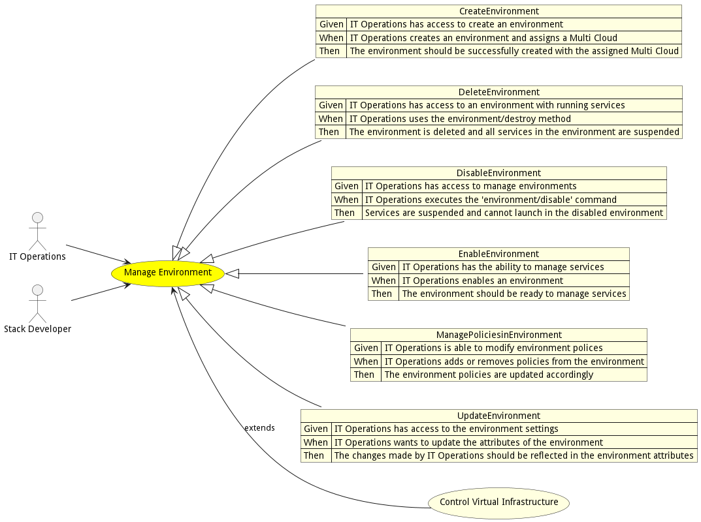
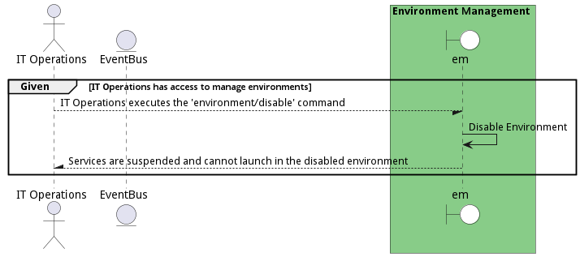

# Manage Environment

Manage Environment allows the actors (IT Operations and Stack Developer) to create environments, and establish policies for services running in the environment.

## Actors

* [IT Operations](actor-itops)
* [Stack Developer](actor-stackdev)

## Extends Use Cases

* [Control Virtual Infrastructure](usecase-ControlVirtualInfrastructure)

## Detail Scenarios

* [CreateEnvironment](#scenario-CreateEnvironment)
* [DeleteEnvironment](#scenario-DeleteEnvironment)
* [DisableEnvironment](#scenario-DisableEnvironment)
* [EnableEnvironment](#scenario-EnableEnvironment)
* [ManagePoliciesinEnvironment](#scenario-ManagePoliciesinEnvironment)
* [UpdateEnvironment](#scenario-UpdateEnvironment)

### Scenario Create Environment

IT Opererations create environments and assigns a Multi Cloud to the Environment

#### Criteria

* Given - IT Operations has access to create an environment
* When - IT Operations creates an environment and assigns a Multi Cloud 
* Then - IT Operations has access to create an environment

#### Steps
1. To Be Defined

#### Actors

* [IT Operations](actor-itops)

### Scenario Delete Environment

Delete Environment allows IT Operations to delete an environment and suspend all services running in the environment.

#### Criteria

* Given - IT Operations has access to an environment with running services
* When - IT Operations uses the environment/destroy method
* Then - IT Operations has access to an environment with running services

#### Steps
1. To Be Defined

#### Actors

* [IT Operations](actor-itops)

### Scenario Disable Environment

IT Operations disables an environment so services are suspended and cannot launch

#### Criteria

* Given - IT Operations has access to manage environments
* When - IT Operations executes the &#39;environment/disable&#39; command
* Then - IT Operations has access to manage environments

#### Steps
1. To Be Defined

#### Actors

* [IT Operations](actor-itops)

### Scenario Enable Environment

IT Operations has the ability to enable an environment to manage services

#### Criteria

* Given - IT Operations has the ability to manage services
* When - IT Operations enables an environment
* Then - IT Operations has the ability to manage services

#### Steps
1. To Be Defined

#### Actors

* [IT Operations](actor-itops)

### Scenario Manage Policies in Environment

IT Operations adds and removes policies from the environment

#### Criteria

* Given - IT Operations is able to modify environment polices
* When - IT Operations adds or removes policies from the environment
* Then - IT Operations is able to modify environment polices

#### Steps
1. To Be Defined

#### Actors

* [IT Operations](actor-itops)

### Scenario Update Environment

IT Operations updates attributes of the environment

#### Criteria

* Given - IT Operations has access to the environment settings
* When - IT Operations wants to update the attributes of the environment
* Then - IT Operations has access to the environment settings

#### Steps
1. To Be Defined

#### Actors

* [IT Operations](actor-itops)

