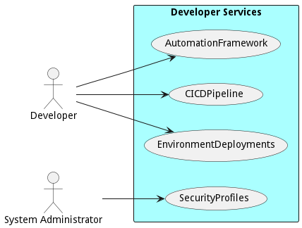
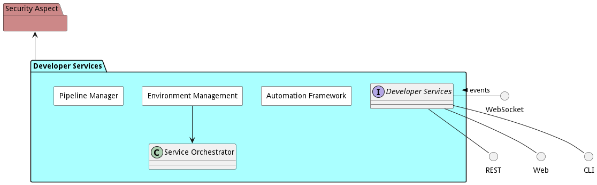
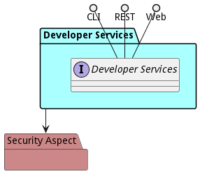

# Developer Services

Developer Services contain services used by developers to develop, test and deploy software into the system.

Developer Services include all of the services and subsystems developers need to develop, deploy and maintain  
applications and services in the system. This includes DevSecOps Services.

## Developer Services High-Level Architecture

  
The subsystems included in the Developer Services include

*   [Automation Frameworks](package--edgemere-aml-ds-af)
*   [CICD Pipeline](package--edgemere-aml-ds-pm)
*   [Security Profiles](package--edgemere-sa-spm)
*   [Environments](package--edgemere-aml-ds-em)

## High-Level Deployment Architecture

The developer services sit on top of the [Service Management Layer,](package--edgemere-sml) which provides a  
multi-hybrid orchestration for the developer services to deploy specific [environments](package--edgemere-aml-ds-em) to  
develop, test and deploy applications and services. The [Multi-Hybrid Cloud](package--edgemere-sml) abstracts IOT,  
Public Clouds, Private Clouds, and Legacy infrastructure this is part of the  
[Software-Defined Infrastructure Layer](package--edgemere-sdi).

## Continuous Integration & Continuous Deliver PipeLine

## Environment centric Deployments

## Use Cases

The following are the use cases of the Developer Services subsystem. Each use case has primary and secondary scenarios
that are elaborated in the use case descriptions.

## Users

The following are the actors of the Developer Services subsystem. This can include people, other subsystems
inside the solution and even external subsystems.

## Interface

The subsystem has a REST, CLI, WebSocket, and Web interface. Use Cases and Scenarios can use any or all
of the interfaces to perform the work that needs to be completed. The following  diagram shows how
users interact with the system.

## Logical Artifacts

The Data Model for the  Developer Services subsystem shows how the different objects and classes of object interact
and their structure.

### Sub Packages

The Developer Services subsystem has sub packages as well. These subsystems are logical components to better
organize the architecture and make it easier to analyze, understand, design, and implement.

* [Automation Framework](package--edgemere-aml-ds-af)
* [Environment Management](package--edgemere-aml-ds-em)
* [Pipeline Manager](package--edgemere-aml-ds-pm)

### Classes

The following are the classes in the data model of the Developer Services subsystem.

## Deployment Architecture

This subsystem is deployed using micro-services as shown in the diagram below. The 'micro' module is
used to implement the micro-services in the system. The subsystem also has an CLI, REST and Web Interface
exposed through a nodejs application. The nodejs application will interface with the micro-services and
can monitor and drive work-flows through the mesh of micro-services. The deployment of the subsystem is
dependent on the environment it is deployed. This subsystem has the following environments:
* [dev](environment--edgemere-aml-ds-dev)
* [test](environment--edgemere-aml-ds-test)
* [prod](environment--edgemere-aml-ds-prod)

## Physical Architecture

The Developer Services subsystem is physically laid out on a hybrid cloud infrastructure. Each microservice belongs
to a secure micro-segmented network. All of the micro-services communicate to each other and the main app through a
REST interface. A Command Line Interface (CLI), REST or Web User interface for the app is how other subsystems or actors
interact. Requests are forwarded to micro-services through the REST interface of each micro-service. The subsystem has
the a unique layout based on the environment the physical space. The following are the environments for this
subsystems.
* [dev](environment--edgemere-aml-ds-dev)
* [test](environment--edgemere-aml-ds-test)
* [prod](environment--edgemere-aml-ds-prod)

## Micro-Services

These are the micro-services for the subsystem. The combination of the micro-services help implement
the subsystem's logic.

### dev

Detail information for the [dev environment](environment--edgemere-aml-ds-dev)
can be found [here](environment--edgemere-aml-ds-dev)

Services in the dev environment

* frontend : aml_ds_web
* gw : aml_ds_gw

### test

Detail information for the [test environment](environment--edgemere-aml-ds-test)
can be found [here](environment--edgemere-aml-ds-test)

Services in the test environment

* frontend : aml_ds_web
* gw : aml_ds_gw

### prod

Detail information for the [prod environment](environment--edgemere-aml-ds-prod)
can be found [here](environment--edgemere-aml-ds-prod)

Services in the prod environment

* frontend : aml_ds_web
* gw : aml_ds_gw

## Activities and Flows
The Developer Services subsystem provides the following activities and flows that help satisfy the use
cases and scenarios of the subsystem.

### Messages Sent

| Event | Description | Emitter |
|-------|-------------|---------|

## Interface Details
The Developer Services subsystem has a well defined interface. This interface can be accessed using a
command line interface (CLI), REST interface, and Web user interface. This interface is how all other
subsystems and actors can access the system.

