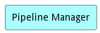
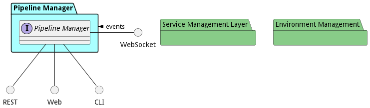
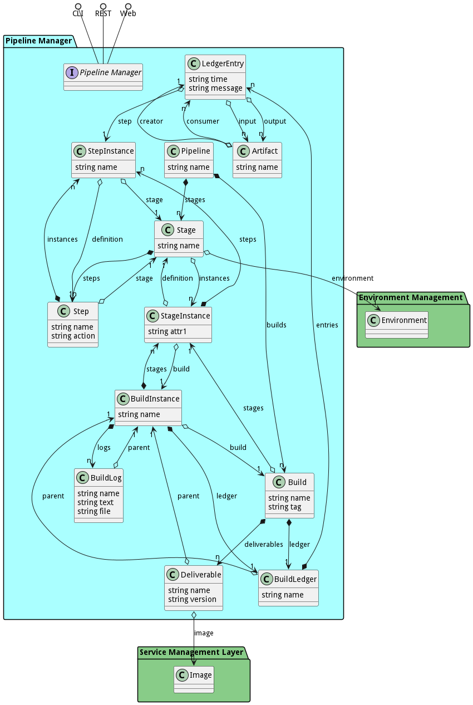

# Pipeline Manager

Pipeline Manager is an abstract pipeline that represent common pipeline tools on the market, including jenkins, CircleCI, gitOps, etc...

## Use Cases

The following are the use cases of the Pipeline Manager subsystem. Each use case has primary and secondary scenarios
that are elaborated in the use case descriptions.

## Users

The following are the actors of the Pipeline Manager subsystem. This can include people, other subsystems
inside the solution and even external subsystems.

## Interface

The subsystem has a REST, CLI, WebSocket, and Web interface. Use Cases and Scenarios can use any or all
of the interfaces to perform the work that needs to be completed. The following  diagram shows how
users interact with the system.

## Logical Artifacts

The Data Model for the  Pipeline Manager subsystem shows how the different objects and classes of object interact
and their structure.

### Sub Packages

The Pipeline Manager subsystem has sub packages as well. These subsystems are logical components to better
organize the architecture and make it easier to analyze, understand, design, and implement.

### Classes

The following are the classes in the data model of the Pipeline Manager subsystem.

* [Artifact](class-Artifact)
* [Build](class-Build)
* [BuildInstance](class-BuildInstance)
* [BuildLedger](class-BuildLedger)
* [BuildLog](class-BuildLog)
* [Deliverable](class-Deliverable)
* [LedgerEntry](class-LedgerEntry)
* [Pipeline](class-Pipeline)
* [Stage](class-Stage)
* [StageInstance](class-StageInstance)
* [Step](class-Step)
* [StepInstance](class-StepInstance)

## Deployment Architecture

This subsystem is deployed using micro-services as shown in the diagram below. The 'micro' module is
used to implement the micro-services in the system. The subsystem also has an CLI, REST and Web Interface
exposed through a nodejs application. The nodejs application will interface with the micro-services and
can monitor and drive work-flows through the mesh of micro-services. The deployment of the subsystem is
dependent on the environment it is deployed. This subsystem has the following environments:
* [dev](environment--edgemere-aml-ds-pm-dev)
* [test](environment--edgemere-aml-ds-pm-test)
* [prod](environment--edgemere-aml-ds-pm-prod)

## Physical Architecture

The Pipeline Manager subsystem is physically laid out on a hybrid cloud infrastructure. Each microservice belongs
to a secure micro-segmented network. All of the micro-services communicate to each other and the main app through a
REST interface. A Command Line Interface (CLI), REST or Web User interface for the app is how other subsystems or actors
interact. Requests are forwarded to micro-services through the REST interface of each micro-service. The subsystem has
the a unique layout based on the environment the physical space. The following are the environments for this
subsystems.
* [dev](environment--edgemere-aml-ds-pm-dev)
* [test](environment--edgemere-aml-ds-pm-test)
* [prod](environment--edgemere-aml-ds-pm-prod)

## Micro-Services

These are the micro-services for the subsystem. The combination of the micro-services help implement
the subsystem's logic.

### dev

Detail information for the [dev environment](environment--edgemere-aml-ds-pm-dev)
can be found [here](environment--edgemere-aml-ds-pm-dev)

Services in the dev environment

* child : child_image:latest
* frontend : a_d_pm_web
* gw : a_d_pm_gw

### test

Detail information for the [test environment](environment--edgemere-aml-ds-pm-test)
can be found [here](environment--edgemere-aml-ds-pm-test)

Services in the test environment

* child : child_image:latest
* frontend : a_d_pm_web
* gw : a_d_pm_gw

### prod

Detail information for the [prod environment](environment--edgemere-aml-ds-pm-prod)
can be found [here](environment--edgemere-aml-ds-pm-prod)

Services in the prod environment

* child : child_image:latest
* frontend : a_d_pm_web
* gw : a_d_pm_gw

## Activities and Flows
The Pipeline Manager subsystem provides the following activities and flows that help satisfy the use
cases and scenarios of the subsystem.

### Messages Sent

| Event | Description | Emitter |
|-------|-------------|---------|
| artifact.create |  When an object of type Artifact is created. | Artifact
| artifact.destroy |  When an object of type Artifact is destroyed. | Artifact
| artifact.updated |  When an object of type Artifact has an attribute or association updated. | Artifact
| build.create |  When an object of type Build is created. | Build
| build.destroy |  When an object of type Build is destroyed. | Build
| build.updated |  When an object of type Build has an attribute or association updated. | Build
| buildinstance.create |  When an object of type BuildInstance is created. | BuildInstance
| buildinstance.destroy |  When an object of type BuildInstance is destroyed. | BuildInstance
| buildinstance.updated |  When an object of type BuildInstance has an attribute or association updated. | BuildInstance
| buildledger.create |  When an object of type BuildLedger is created. | BuildLedger
| buildledger.destroy |  When an object of type BuildLedger is destroyed. | BuildLedger
| buildledger.updated |  When an object of type BuildLedger has an attribute or association updated. | BuildLedger
| buildlog.create |  When an object of type BuildLog is created. | BuildLog
| buildlog.destroy |  When an object of type BuildLog is destroyed. | BuildLog
| buildlog.updated |  When an object of type BuildLog has an attribute or association updated. | BuildLog
| deliverable.create |  When an object of type Deliverable is created. | Deliverable
| deliverable.destroy |  When an object of type Deliverable is destroyed. | Deliverable
| deliverable.updated |  When an object of type Deliverable has an attribute or association updated. | Deliverable
| ledgerentry.create |  When an object of type LedgerEntry is created. | LedgerEntry
| ledgerentry.destroy |  When an object of type LedgerEntry is destroyed. | LedgerEntry
| ledgerentry.updated |  When an object of type LedgerEntry has an attribute or association updated. | LedgerEntry
| pipeline.create |  When an object of type Pipeline is created. | Pipeline
| pipeline.destroy |  When an object of type Pipeline is destroyed. | Pipeline
| pipeline.updated |  When an object of type Pipeline has an attribute or association updated. | Pipeline
| stage.create |  When an object of type Stage is created. | Stage
| stage.destroy |  When an object of type Stage is destroyed. | Stage
| stage.updated |  When an object of type Stage has an attribute or association updated. | Stage
| stageinstance.create |  When an object of type StageInstance is created. | StageInstance
| stageinstance.destroy |  When an object of type StageInstance is destroyed. | StageInstance
| stageinstance.updated |  When an object of type StageInstance has an attribute or association updated. | StageInstance
| step.create |  When an object of type Step is created. | Step
| step.destroy |  When an object of type Step is destroyed. | Step
| step.updated |  When an object of type Step has an attribute or association updated. | Step
| stepinstance.create |  When an object of type StepInstance is created. | StepInstance
| stepinstance.destroy |  When an object of type StepInstance is destroyed. | StepInstance
| stepinstance.updated |  When an object of type StepInstance has an attribute or association updated. | StepInstance

## Interface Details
The Pipeline Manager subsystem has a well defined interface. This interface can be accessed using a
command line interface (CLI), REST interface, and Web user interface. This interface is how all other
subsystems and actors can access the system.

