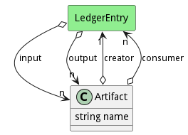

# Artifact

An artifact is a generic element that is created from a build. This could be a libraries, binary, vm, container image, document, or anything that is generated from the build and managed in a repository to be used by an application, service, stack, etc...

## Attributes

* name:string - Name of the artifact

## Associations

| Name | Cardinality | Class | Composition | Owner | Description |
| --- | --- | --- | --- | --- | --- |
| creator | 1 | LedgerEntry | false | false |  |
| consumer | n | LedgerEntry | false | false |  |

## Users of the Model

| Name | Cardinality | Class | Composition | Owner | Description |
| --- | --- | --- | --- | --- | --- |
| input | n | LedgerEntry | false | false |  |
| output | n | LedgerEntry | false | false |  |
| input | n | LedgerEntry | false | false |  |
| output | n | LedgerEntry | false | false |  |
| input | n | LedgerEntry | false | false |  |
| output | n | LedgerEntry | false | false |  |
| input | n | LedgerEntry | false | false |  |
| output | n | LedgerEntry | false | false |  |
| input | n | LedgerEntry | false | false |  |
| output | n | LedgerEntry | false | false |  |
| input | n | LedgerEntry | false | false |  |
| output | n | LedgerEntry | false | false |  |
| input | n | LedgerEntry | false | false |  |
| output | n | LedgerEntry | false | false |  |
| input | n | LedgerEntry | false | false |  |
| output | n | LedgerEntry | false | false |  |
| input | n | LedgerEntry | false | false |  |
| output | n | LedgerEntry | false | false |  |
| input | n | LedgerEntry | false | false |  |
| output | n | LedgerEntry | false | false |  |
| input | n | LedgerEntry | false | false |  |
| output | n | LedgerEntry | false | false |  |
| input | n | LedgerEntry | false | false |  |
| output | n | LedgerEntry | false | false |  |
| input | n | LedgerEntry | false | false |  |
| output | n | LedgerEntry | false | false |  |
| input | n | LedgerEntry | false | false |  |
| output | n | LedgerEntry | false | false |  |
| input | n | LedgerEntry | false | false |  |
| output | n | LedgerEntry | false | false |  |
| input | n | LedgerEntry | false | false |  |
| output | n | LedgerEntry | false | false |  |
| input | n | LedgerEntry | false | false |  |
| output | n | LedgerEntry | false | false |  |
| input | n | LedgerEntry | false | false |  |
| output | n | LedgerEntry | false | false |  |
| input | n | LedgerEntry | false | false |  |
| output | n | LedgerEntry | false | false |  |
| input | n | LedgerEntry | false | false |  |
| output | n | LedgerEntry | false | false |  |
| input | n | LedgerEntry | false | false |  |
| output | n | LedgerEntry | false | false |  |
| input | n | LedgerEntry | false | false |  |
| output | n | LedgerEntry | false | false |  |
| input | n | LedgerEntry | false | false |  |
| output | n | LedgerEntry | false | false |  |
| input | n | LedgerEntry | false | false |  |
| output | n | LedgerEntry | false | false |  |
| input | n | LedgerEntry | false | false |  |
| output | n | LedgerEntry | false | false |  |
| input | n | LedgerEntry | false | false |  |
| output | n | LedgerEntry | false | false |  |
| input | n | LedgerEntry | false | false |  |
| output | n | LedgerEntry | false | false |  |
| input | n | LedgerEntry | false | false |  |
| output | n | LedgerEntry | false | false |  |
| input | n | LedgerEntry | false | false |  |
| output | n | LedgerEntry | false | false |  |
| input | n | LedgerEntry | false | false |  |
| output | n | LedgerEntry | false | false |  |
| input | n | LedgerEntry | false | false |  |
| output | n | LedgerEntry | false | false |  |
| input | n | LedgerEntry | false | false |  |
| output | n | LedgerEntry | false | false |  |
| input | n | LedgerEntry | false | false |  |
| output | n | LedgerEntry | false | false |  |
| input | n | LedgerEntry | false | false |  |
| output | n | LedgerEntry | false | false |  |
| input | n | LedgerEntry | false | false |  |
| output | n | LedgerEntry | false | false |  |
| input | n | LedgerEntry | false | false |  |
| output | n | LedgerEntry | false | false |  |
| input | n | LedgerEntry | false | false |  |
| output | n | LedgerEntry | false | false |  |
| input | n | LedgerEntry | false | false |  |
| output | n | LedgerEntry | false | false |  |
| input | n | LedgerEntry | false | false |  |
| output | n | LedgerEntry | false | false |  |
| input | n | LedgerEntry | false | false |  |
| output | n | LedgerEntry | false | false |  |
| input | n | LedgerEntry | false | false |  |
| output | n | LedgerEntry | false | false |  |
| input | n | LedgerEntry | false | false |  |
| output | n | LedgerEntry | false | false |  |
| input | n | LedgerEntry | false | false |  |
| output | n | LedgerEntry | false | false |  |
| input | n | LedgerEntry | false | false |  |
| output | n | LedgerEntry | false | false |  |

## Methods

<h2>Method Details</h2>
    

