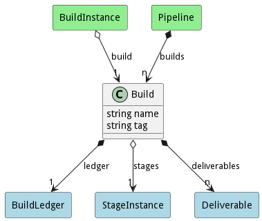

# Build

Build of the application or service contains the steps performed in each stage of development

## Attributes

* name:string - Name of the build
* tag:string - Tag of the build

## Associations

| Name | Cardinality | Class | Composition | Owner | Description |
| --- | --- | --- | --- | --- | --- |
| ledger | 1 | BuildLedger | false | true |  |
| stages | 1 | StageInstance | false | false |  |
| deliverables | n | Deliverable | false | true |  |

## Users of the Model

| Name | Cardinality | Class | Composition | Owner | Description |
| --- | --- | --- | --- | --- | --- |
| build | 1 | BuildInstance | false | false |  |
| builds | n | Pipeline | false | true |  |

## Methods

<h2>Method Details</h2>
    

