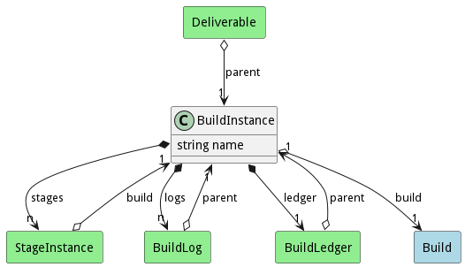

# BuildInstance

When a build is executive a BuildInstance is created to capture the logs and contains a build

## Attributes

* name:string - Name of the build

## Associations

| Name | Cardinality | Class | Composition | Owner | Description |
| --- | --- | --- | --- | --- | --- |
| build | 1 | Build | false | false |  |
| stages | n | StageInstance | false | true |  |
| logs | n | BuildLog | false | true |  |
| ledger | 1 | BuildLedger | false | true |  |

## Users of the Model

| Name | Cardinality | Class | Composition | Owner | Description |
| --- | --- | --- | --- | --- | --- |
| parent | 1 | BuildLedger | false | false |  |
| parent | 1 | BuildLog | false | false |  |
| parent | 1 | Deliverable |  |  |  |
| build | 1 | StageInstance | false | false |  |

## Methods

<h2>Method Details</h2>
    

