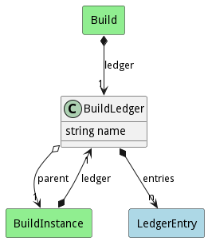

# BuildLedger

The Build Ledger contains a list of the steps performed during the build including the artifacts that went into the step.

## Attributes

* name:string - Name of the ledger

## Associations

| Name | Cardinality | Class | Composition | Owner | Description |
| --- | --- | --- | --- | --- | --- |
| entries | n | LedgerEntry | true | true |  |
| parent | 1 | BuildInstance | false | false |  |

## Users of the Model

| Name | Cardinality | Class | Composition | Owner | Description |
| --- | --- | --- | --- | --- | --- |
| ledger | 1 | Build | false | true |  |
| ledger | 1 | BuildInstance | false | true |  |

## Methods

<h2>Method Details</h2>
    

