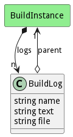

# BuildLog

This is a log for the build instance. Each log represents stdout, stderr, or nay number of named logs

## Attributes

* name:string - Name of the log
* text:string - Text with all of the log information. Used for in memory logs
* file:string - Filename of were to find the log.

## Associations

| Name | Cardinality | Class | Composition | Owner | Description |
| --- | --- | --- | --- | --- | --- |
| parent | 1 | BuildInstance | false | false |  |

## Users of the Model

| Name | Cardinality | Class | Composition | Owner | Description |
| --- | --- | --- | --- | --- | --- |
| logs | n | BuildInstance | false | true |  |

## Methods

<h2>Method Details</h2>
    

