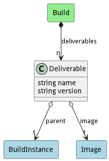

# Deliverable

This is the result of a build. This could be a container image, document, or library

## Attributes

* name:string - Name of the deliverable from the build
* version:string - Version of the the deliverable

## Associations

| Name | Cardinality | Class | Composition | Owner | Description |
| --- | --- | --- | --- | --- | --- |
| parent | 1 | BuildInstance |  |  |  |
| image | 1 | Image |  |  |  |

## Users of the Model

| Name | Cardinality | Class | Composition | Owner | Description |
| --- | --- | --- | --- | --- | --- |
| deliverables | n | Build | false | true |  |
| deliverables | n | Build | false | true |  |
| deliverables | n | Build | false | true |  |
| deliverables | n | Build | false | true |  |
| deliverables | n | Build | false | true |  |
| deliverables | n | Build | false | true |  |
| deliverables | n | Build | false | true |  |
| deliverables | n | Build | false | true |  |
| deliverables | n | Build | false | true |  |
| deliverables | n | Build | false | true |  |
| deliverables | n | Build | false | true |  |
| deliverables | n | Build | false | true |  |
| deliverables | n | Build | false | true |  |
| deliverables | n | Build | false | true |  |
| deliverables | n | Build | false | true |  |
| deliverables | n | Build | false | true |  |
| deliverables | n | Build | false | true |  |
| deliverables | n | Build | false | true |  |
| deliverables | n | Build | false | true |  |
| deliverables | n | Build | false | true |  |
| deliverables | n | Build | false | true |  |
| deliverables | n | Build | false | true |  |
| deliverables | n | Build | false | true |  |
| deliverables | n | Build | false | true |  |
| deliverables | n | Build | false | true |  |
| deliverables | n | Build | false | true |  |
| deliverables | n | Build | false | true |  |
| deliverables | n | Build | false | true |  |
| deliverables | n | Build | false | true |  |
| deliverables | n | Build | false | true |  |
| deliverables | n | Build | false | true |  |
| deliverables | n | Build | false | true |  |
| deliverables | n | Build | false | true |  |
| deliverables | n | Build | false | true |  |
| deliverables | n | Build | false | true |  |
| deliverables | n | Build | false | true |  |
| deliverables | n | Build | false | true |  |
| deliverables | n | Build | false | true |  |
| deliverables | n | Build | false | true |  |
| deliverables | n | Build | false | true |  |
| deliverables | n | Build | false | true |  |
| deliverables | n | Build | false | true |  |
| deliverables | n | Build | false | true |  |
| deliverables | n | Build | false | true |  |

## Methods

<h2>Method Details</h2>
    

