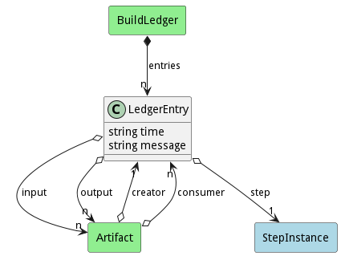

# LedgerEntry

An entry in the build ledger

## Attributes

* time:string - Timestamp of the ledger entry
* message:string - Message for the ledger entry

## Associations

| Name | Cardinality | Class | Composition | Owner | Description |
| --- | --- | --- | --- | --- | --- |
| step | 1 | StepInstance | false | false |  |
| input | n | Artifact | false | false |  |
| output | n | Artifact | false | false |  |

## Users of the Model

| Name | Cardinality | Class | Composition | Owner | Description |
| --- | --- | --- | --- | --- | --- |
| creator | 1 | Artifact | false | false |  |
| consumer | n | Artifact | false | false |  |
| entries | n | BuildLedger | true | true |  |

## Methods

<h2>Method Details</h2>
    

