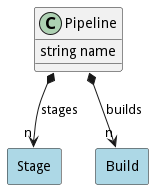

# Pipeline

A pipeline builds, tests, and deploys applications and services in the system

## Attributes

* name:string - Name of the pipeline

## Associations

| Name | Cardinality | Class | Composition | Owner | Description |
| --- | --- | --- | --- | --- | --- |
| stages | n | Stage | true | true |  |
| builds | n | Build | false | true |  |

## Users of the Model

| Name | Cardinality | Class | Composition | Owner | Description |
| --- | --- | --- | --- | --- | --- |

## Methods

<h2>Method Details</h2>
    

