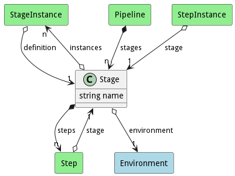

# Stage

Stage of the pipeline contains steps to be performed in an environment

## Attributes

* name:string - Name of the stage

## Associations

| Name | Cardinality | Class | Composition | Owner | Description |
| --- | --- | --- | --- | --- | --- |
| instances | n | StageInstance |  |  |  |
| steps | n | Step | true | true |  |
| environment | 1 | Environment | false | false |  |

## Users of the Model

| Name | Cardinality | Class | Composition | Owner | Description |
| --- | --- | --- | --- | --- | --- |
| stages | n | Pipeline | true | true |  |
| definition | 1 | StageInstance |  |  |  |
| stage | 1 | Step | false |  |  |
| stage | 1 | StepInstance |  |  |  |

## Methods

<h2>Method Details</h2>
    

