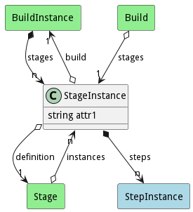

# StageInstance

Description long description

## Attributes

* attr1:string - description long description

## Associations

| Name | Cardinality | Class | Composition | Owner | Description |
| --- | --- | --- | --- | --- | --- |
| build | 1 | BuildInstance | false | false |  |
| definition | 1 | Stage |  |  |  |
| steps | n | StepInstance | false | true |  |

## Users of the Model

| Name | Cardinality | Class | Composition | Owner | Description |
| --- | --- | --- | --- | --- | --- |
| stages | 1 | Build | false | false |  |
| stages | n | BuildInstance | false | true |  |
| instances | n | Stage |  |  |  |

## Methods

<h2>Method Details</h2>
    

