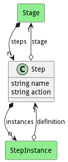

# Step

This is a step in the stage of the build.

## Attributes

* name:string - Name of the step
* action:string - Action to perform for the step.

## Associations

| Name | Cardinality | Class | Composition | Owner | Description |
| --- | --- | --- | --- | --- | --- |
| stage | 1 | Stage | false |  |  |
| instances | n | StepInstance | false | true |  |

## Users of the Model

| Name | Cardinality | Class | Composition | Owner | Description |
| --- | --- | --- | --- | --- | --- |
| steps | n | Stage | true | true |  |
| definition | 1 | StepInstance | false | false |  |
| steps | n | Stage | true | true |  |
| definition | 1 | StepInstance | false | false |  |
| steps | n | Stage | true | true |  |
| definition | 1 | StepInstance | false | false |  |
| steps | n | Stage | true | true |  |
| definition | 1 | StepInstance | false | false |  |
| steps | n | Stage | true | true |  |
| definition | 1 | StepInstance | false | false |  |
| steps | n | Stage | true | true |  |
| definition | 1 | StepInstance | false | false |  |
| steps | n | Stage | true | true |  |
| definition | 1 | StepInstance | false | false |  |
| steps | n | Stage | true | true |  |
| definition | 1 | StepInstance | false | false |  |
| steps | n | Stage | true | true |  |
| definition | 1 | StepInstance | false | false |  |
| steps | n | Stage | true | true |  |
| definition | 1 | StepInstance | false | false |  |
| steps | n | Stage | true | true |  |
| definition | 1 | StepInstance | false | false |  |
| steps | n | Stage | true | true |  |
| definition | 1 | StepInstance | false | false |  |
| steps | n | Stage | true | true |  |
| definition | 1 | StepInstance | false | false |  |
| steps | n | Stage | true | true |  |
| definition | 1 | StepInstance | false | false |  |
| steps | n | Stage | true | true |  |
| definition | 1 | StepInstance | false | false |  |
| steps | n | Stage | true | true |  |
| definition | 1 | StepInstance | false | false |  |
| steps | n | Stage | true | true |  |
| definition | 1 | StepInstance | false | false |  |
| steps | n | Stage | true | true |  |
| definition | 1 | StepInstance | false | false |  |
| steps | n | Stage | true | true |  |
| definition | 1 | StepInstance | false | false |  |
| steps | n | Stage | true | true |  |
| definition | 1 | StepInstance | false | false |  |
| steps | n | Stage | true | true |  |
| definition | 1 | StepInstance | false | false |  |
| steps | n | Stage | true | true |  |
| definition | 1 | StepInstance | false | false |  |
| steps | n | Stage | true | true |  |
| definition | 1 | StepInstance | false | false |  |
| steps | n | Stage | true | true |  |
| definition | 1 | StepInstance | false | false |  |
| steps | n | Stage | true | true |  |
| definition | 1 | StepInstance | false | false |  |
| steps | n | Stage | true | true |  |
| definition | 1 | StepInstance | false | false |  |
| steps | n | Stage | true | true |  |
| definition | 1 | StepInstance | false | false |  |
| steps | n | Stage | true | true |  |
| definition | 1 | StepInstance | false | false |  |
| steps | n | Stage | true | true |  |
| definition | 1 | StepInstance | false | false |  |
| steps | n | Stage | true | true |  |
| definition | 1 | StepInstance | false | false |  |
| steps | n | Stage | true | true |  |
| definition | 1 | StepInstance | false | false |  |
| steps | n | Stage | true | true |  |
| definition | 1 | StepInstance | false | false |  |
| steps | n | Stage | true | true |  |
| definition | 1 | StepInstance | false | false |  |
| steps | n | Stage | true | true |  |
| definition | 1 | StepInstance | false | false |  |
| steps | n | Stage | true | true |  |
| definition | 1 | StepInstance | false | false |  |
| steps | n | Stage | true | true |  |
| definition | 1 | StepInstance | false | false |  |
| steps | n | Stage | true | true |  |
| definition | 1 | StepInstance | false | false |  |
| steps | n | Stage | true | true |  |
| definition | 1 | StepInstance | false | false |  |
| steps | n | Stage | true | true |  |
| definition | 1 | StepInstance | false | false |  |
| steps | n | Stage | true | true |  |
| definition | 1 | StepInstance | false | false |  |
| steps | n | Stage | true | true |  |
| definition | 1 | StepInstance | false | false |  |
| steps | n | Stage | true | true |  |
| definition | 1 | StepInstance | false | false |  |
| steps | n | Stage | true | true |  |
| definition | 1 | StepInstance | false | false |  |
| steps | n | Stage | true | true |  |
| definition | 1 | StepInstance | false | false |  |

## Methods

<h2>Method Details</h2>
    

