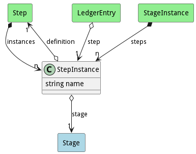

# StepInstance

This is the step instance for a step in a stage of a build. It contains all of the information on what happend during the execution of the build stage step.

## Attributes

* name:string - Name of the step instance

## Associations

| Name | Cardinality | Class | Composition | Owner | Description |
| --- | --- | --- | --- | --- | --- |
| definition | 1 | Step | false | false |  |
| stage | 1 | Stage |  |  |  |

## Users of the Model

| Name | Cardinality | Class | Composition | Owner | Description |
| --- | --- | --- | --- | --- | --- |
| step | 1 | LedgerEntry | false | false |  |
| steps | n | StageInstance | false | true |  |
| instances | n | Step | false | true |  |

## Methods

<h2>Method Details</h2>
    

