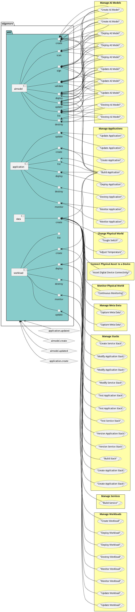
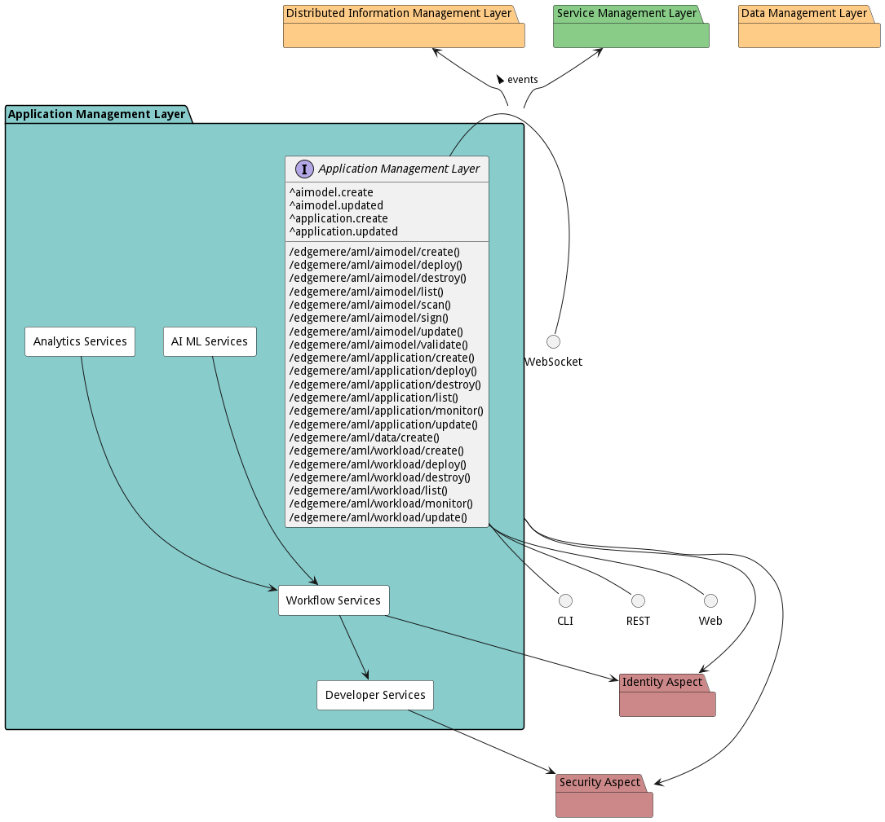
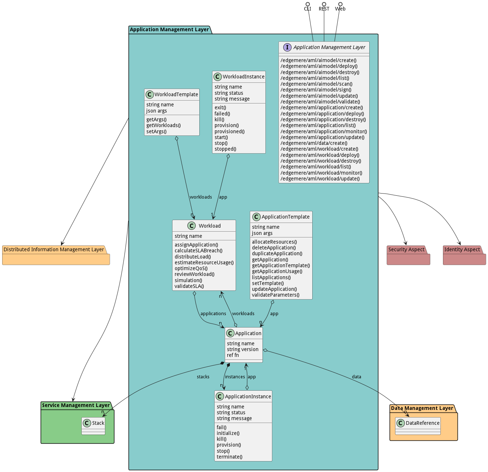

# Application Management Layer

The Application Management Layer (AML) is a comprehensive package that provides classes and workflows for managing AI models, applications and workloads, facilitating interaction between various IT professionals such as DevOps Engineers, Application Developers, Data Engineers, and Data Scientists.

The package documentation elaborates on the Application Management Layer (AML) which forms an important component in managing complex workflows and applications through the application development lifecycle. 

Based on the identified use cases, the AML contains key functionalities for managing AI models, applications, and workloads. IT professionals such as DevOps engineers, application developers, data engineers, and data scientists are the primary actors who interact with the AML, utilizing different methods to perform distinct use cases. 

The use case 'Manage AI Models' outlines how a Data Scientist manages AI models in coordination with DevOps to ensure that both the AI models and applications are updated together. The scenarios within this use case cover actions like creating, deploying, destroying, and updating AI models. 

In the 'Manage Applications' use case, DevOps Engineers and Application Developers collaborate to manage applications across multiple platforms. The operations within this use case include building, creating, deploying, destroying, monitoring, and updating the applications.

The use case 'Manage Workloads' enables Application Developers to interconnect applications through workflows, thereby automating complex data interactions between various applications across a hybrid infrastructure. The included operations are creating, deploying, destroying, monitoring, and updating the workloads. 

Within the AML package, we have several key classes including Application, Application Instance, Application Template, Workload, Workload Instance, and Workload Template. Each of these classes provides methods for managing their instances, including operations like creating, destroying, adding to, updating, and removing from the instances. 

Furthermore, there are defined workflows for managing AI models, applications, and workloads. These workflows illustrate the sequential actions, conditions, and transitions between different states for each operation, specifying the actors responsible for each action and the outcome of their activities. 

Overall, the AML provides a comprehensive management system for AI models, applications, and workloads, connecting different users and their actions in an organized, modular manner.

## Use Cases

The following are the use cases of the Application Management Layer subsystem. Each use case has primary and secondary scenarios
that are elaborated in the use case descriptions.

* [Manage AI Models](usecase-ManageAIModels)
* [Manage Applications](usecase-ManageApplications)
* [Manage Workloads](usecase-ManageWorkloads)

## Users

The following are the actors of the Application Management Layer subsystem. This can include people, other subsystems
inside the solution and even external subsystems.

* [DataScientist](actor-datascientist)
* [DevOpsEngineer](actor-devops)
* [ApplicationDeveloper](actor-applicationdeveloper)
* [DataEngineer](actor-dataengineer)

## Interface

The subsystem has a REST, CLI, WebSocket, and Web interface. Use Cases and Scenarios can use any or all
of the interfaces to perform the work that needs to be completed. The following  diagram shows how
users interact with the system.

* [ edgemere aml aimodel create](#action--edgemere-aml-aimodel-create)
* [ edgemere aml aimodel deploy](#action--edgemere-aml-aimodel-deploy)
* [ edgemere aml aimodel destroy](#action--edgemere-aml-aimodel-destroy)
* [ edgemere aml aimodel list](#action--edgemere-aml-aimodel-list)
* [ edgemere aml aimodel scan](#action--edgemere-aml-aimodel-scan)
* [ edgemere aml aimodel sign](#action--edgemere-aml-aimodel-sign)
* [ edgemere aml aimodel update](#action--edgemere-aml-aimodel-update)
* [ edgemere aml aimodel validate](#action--edgemere-aml-aimodel-validate)
* [ edgemere aml application create](#action--edgemere-aml-application-create)
* [ edgemere aml application deploy](#action--edgemere-aml-application-deploy)
* [ edgemere aml application destroy](#action--edgemere-aml-application-destroy)
* [ edgemere aml application list](#action--edgemere-aml-application-list)
* [ edgemere aml application monitor](#action--edgemere-aml-application-monitor)
* [ edgemere aml application update](#action--edgemere-aml-application-update)
* [ edgemere aml data create](#action--edgemere-aml-data-create)
* [ edgemere aml workload create](#action--edgemere-aml-workload-create)
* [ edgemere aml workload deploy](#action--edgemere-aml-workload-deploy)
* [ edgemere aml workload destroy](#action--edgemere-aml-workload-destroy)
* [ edgemere aml workload list](#action--edgemere-aml-workload-list)
* [ edgemere aml workload monitor](#action--edgemere-aml-workload-monitor)
* [ edgemere aml workload update](#action--edgemere-aml-workload-update)

## Logical Artifacts

The Data Model for the  Application Management Layer subsystem shows how the different objects and classes of object interact
and their structure.

### Sub Packages

The Application Management Layer subsystem has sub packages as well. These subsystems are logical components to better
organize the architecture and make it easier to analyze, understand, design, and implement.

* [AI ML Services](package--edgemere-aml-ams)
* [Analytics Services](package--edgemere-aml-as)
* [Developer Services](package--edgemere-aml-ds)
* [Workflow Services](package--edgemere-aml-ws)

### Classes

The following are the classes in the data model of the Application Management Layer subsystem.

* [Application](class-Application)
* [ApplicationInstance](class-ApplicationInstance)
* [ApplicationTemplate](class-ApplicationTemplate)
* [Workload](class-Workload)
* [WorkloadInstance](class-WorkloadInstance)
* [WorkloadTemplate](class-WorkloadTemplate)

## Deployment Architecture

This subsystem is deployed using micro-services as shown in the diagram below. The 'micro' module is
used to implement the micro-services in the system. The subsystem also has an CLI, REST and Web Interface
exposed through a nodejs application. The nodejs application will interface with the micro-services and
can monitor and drive work-flows through the mesh of micro-services. The deployment of the subsystem is
dependent on the environment it is deployed. This subsystem has the following environments:
* [dev](environment--edgemere-aml-dev)
* [test](environment--edgemere-aml-test)
* [prod](environment--edgemere-aml-prod)

## Physical Architecture

The Application Management Layer subsystem is physically laid out on a hybrid cloud infrastructure. Each microservice belongs
to a secure micro-segmented network. All of the micro-services communicate to each other and the main app through a
REST interface. A Command Line Interface (CLI), REST or Web User interface for the app is how other subsystems or actors
interact. Requests are forwarded to micro-services through the REST interface of each micro-service. The subsystem has
the a unique layout based on the environment the physical space. The following are the environments for this
subsystems.
* [dev](environment--edgemere-aml-dev)
* [test](environment--edgemere-aml-test)
* [prod](environment--edgemere-aml-prod)

## Micro-Services

These are the micro-services for the subsystem. The combination of the micro-services help implement
the subsystem's logic.

### dev

Detail information for the [dev environment](environment--edgemere-aml-dev)
can be found [here](environment--edgemere-aml-dev)

Services in the dev environment

* aml_web : aml_web
* aml_as : aml_as
* aml_ds : aml_ds
* aml_ws : aml_ws
* aml_ams : aml_ams

### test

Detail information for the [test environment](environment--edgemere-aml-test)
can be found [here](environment--edgemere-aml-test)

Services in the test environment

* aml_web : aml_web
* aml_as : aml_as
* aml_ds : aml_ds
* aml_ws : aml_ws
* aml_ams : aml_ams

### prod

Detail information for the [prod environment](environment--edgemere-aml-prod)
can be found [here](environment--edgemere-aml-prod)

Services in the prod environment

* aml_web : aml_web
* aml_as : aml_as
* aml_ds : aml_ds
* aml_ws : aml_ws
* aml_ams : aml_ams

## Activities and Flows
The Application Management Layer subsystem provides the following activities and flows that help satisfy the use
cases and scenarios of the subsystem.

### Messages Handled

The Application Management Layer subsystem is an event driven architecture and handle several events. The following
events are handled by this subsystem. Please note that this subsystem is not the only subsystem that handles
these events.

| Message | Action | Description |
| --- | --- | --- |
| aimodel.create | Custom Action |  |
| aimodel.updated | Custom Action |  |
| application.create | Custom Action |  |
| application.updated | Custom Action |  |

### Messages Sent

| Event | Description | Emitter |
|-------|-------------|---------|
| application.create |  When an object of type Application is created. | Application
| application.destroy |  When an object of type Application is destroyed. | Application
| application.updated |  When an object of type Application has an attribute or association updated. | Application
| applicationinstance.create |  When an object of type ApplicationInstance is created. | ApplicationInstance
| applicationinstance.destroy |  When an object of type ApplicationInstance is destroyed. | ApplicationInstance
| applicationinstance.updated |  When an object of type ApplicationInstance has an attribute or association updated. | ApplicationInstance
| applicationtemplate.create |  When an object of type ApplicationTemplate is created. | ApplicationTemplate
| applicationtemplate.destroy |  When an object of type ApplicationTemplate is destroyed. | ApplicationTemplate
| applicationtemplate.updated |  When an object of type ApplicationTemplate has an attribute or association updated. | ApplicationTemplate
| workload.create |  When an object of type Workload is created. | Workload
| workload.destroy |  When an object of type Workload is destroyed. | Workload
| workload.updated |  When an object of type Workload has an attribute or association updated. | Workload
| workloadinstance.create |  When an object of type WorkloadInstance is created. | WorkloadInstance
| workloadinstance.destroy |  When an object of type WorkloadInstance is destroyed. | WorkloadInstance
| workloadinstance.updated |  When an object of type WorkloadInstance has an attribute or association updated. | WorkloadInstance
| workloadtemplate.create |  When an object of type WorkloadTemplate is created. | WorkloadTemplate
| workloadtemplate.destroy |  When an object of type WorkloadTemplate is destroyed. | WorkloadTemplate
| workloadtemplate.updated |  When an object of type WorkloadTemplate has an attribute or association updated. | WorkloadTemplate

## Interface Details
The Application Management Layer subsystem has a well defined interface. This interface can be accessed using a
command line interface (CLI), REST interface, and Web user interface. This interface is how all other
subsystems and actors can access the system.

### Action  edgemere aml aimodel create

* REST - /edgemere/aml/aimodel/create?
* bin -  edgemere aml aimodel create 
* js - .edgemere.aml.aimodel.create({  })

#### Description
Creates a new AI model

#### Parameters

No parameters

### Action  edgemere aml aimodel deploy

* REST - /edgemere/aml/aimodel/deploy?
* bin -  edgemere aml aimodel deploy 
* js - .edgemere.aml.aimodel.deploy({  })

#### Description
Deploys a specified AI model

#### Parameters

No parameters

### Action  edgemere aml aimodel destroy

* REST - /edgemere/aml/aimodel/destroy?
* bin -  edgemere aml aimodel destroy 
* js - .edgemere.aml.aimodel.destroy({  })

#### Description
Destroys a specified AI model

#### Parameters

No parameters

### Action  edgemere aml aimodel list

* REST - /edgemere/aml/aimodel/list?
* bin -  edgemere aml aimodel list 
* js - .edgemere.aml.aimodel.list({  })

#### Description
Returns a list of AI models

#### Parameters

No parameters

### Action  edgemere aml aimodel scan

* REST - /edgemere/aml/aimodel/scan?appName=string
* bin -  edgemere aml aimodel scan --appName string
* js - .edgemere.aml.aimodel.scan({ appName:string })

#### Description
An interface designed to scan the AI model for potential malware or viruses.

#### Parameters

| Name | Type | Required | Description |
|---|---|---|---|
| appName | string | | The name of the AI model to scan. |

### Action  edgemere aml aimodel sign

* REST - /edgemere/aml/aimodel/sign?appName=string
* bin -  edgemere aml aimodel sign --appName string
* js - .edgemere.aml.aimodel.sign({ appName:string })

#### Description
This interface is used to add a digital signature to the AI model to confirm its authenticity.

#### Parameters

| Name | Type | Required | Description |
|---|---|---|---|
| appName | string | | The name of the AI model that needs to be digitally signed. |

### Action  edgemere aml aimodel update

* REST - /edgemere/aml/aimodel/update?
* bin -  edgemere aml aimodel update 
* js - .edgemere.aml.aimodel.update({  })

#### Description
Updates a specified AI model

#### Parameters

No parameters

### Action  edgemere aml aimodel validate

* REST - /edgemere/aml/aimodel/validate?appName=string&amp;SLA=string
* bin -  edgemere aml aimodel validate --appName string --SLA string
* js - .edgemere.aml.aimodel.validate({ appName:string,SLA:string })

#### Description
An interface to validate AI model based on SLA Pass Rate

#### Parameters

| Name | Type | Required | Description |
|---|---|---|---|
| appName | string | | The unique identifier for the AI model to be validated. |
| SLA | string | | The Service Level Agreement details defining the expected performance and pass rates for the AI model |

### Action  edgemere aml application create

* REST - /edgemere/aml/application/create?
* bin -  edgemere aml application create 
* js - .edgemere.aml.application.create({  })

#### Description
Creates a new application

#### Parameters

No parameters

### Action  edgemere aml application deploy

* REST - /edgemere/aml/application/deploy?
* bin -  edgemere aml application deploy 
* js - .edgemere.aml.application.deploy({  })

#### Description
Deploys a specified application

#### Parameters

No parameters

### Action  edgemere aml application destroy

* REST - /edgemere/aml/application/destroy?
* bin -  edgemere aml application destroy 
* js - .edgemere.aml.application.destroy({  })

#### Description
Destroys a specified application

#### Parameters

No parameters

### Action  edgemere aml application list

* REST - /edgemere/aml/application/list?
* bin -  edgemere aml application list 
* js - .edgemere.aml.application.list({  })

#### Description
Returns a list of applications

#### Parameters

No parameters

### Action  edgemere aml application monitor

* REST - /edgemere/aml/application/monitor?attr1=string
* bin -  edgemere aml application monitor --attr1 string
* js - .edgemere.aml.application.monitor({ attr1:string })

#### Description
Description of the action

#### Parameters

| Name | Type | Required | Description |
|---|---|---|---|
| attr1 | string |false | Description for the parameter |

### Action  edgemere aml application update

* REST - /edgemere/aml/application/update?
* bin -  edgemere aml application update 
* js - .edgemere.aml.application.update({  })

#### Description
Updates a specified application

#### Parameters

No parameters

### Action  edgemere aml data create

* REST - /edgemere/aml/data/create?attr1=string
* bin -  edgemere aml data create --attr1 string
* js - .edgemere.aml.data.create({ attr1:string })

#### Description
Description of the action

#### Parameters

| Name | Type | Required | Description |
|---|---|---|---|
| attr1 | string |false | Description for the parameter |

### Action  edgemere aml workload create

* REST - /edgemere/aml/workload/create?
* bin -  edgemere aml workload create 
* js - .edgemere.aml.workload.create({  })

#### Description
Creates a new workload

#### Parameters

No parameters

### Action  edgemere aml workload deploy

* REST - /edgemere/aml/workload/deploy?
* bin -  edgemere aml workload deploy 
* js - .edgemere.aml.workload.deploy({  })

#### Description
Deploys a specified workload

#### Parameters

No parameters

### Action  edgemere aml workload destroy

* REST - /edgemere/aml/workload/destroy?
* bin -  edgemere aml workload destroy 
* js - .edgemere.aml.workload.destroy({  })

#### Description
Destroys a specified workload

#### Parameters

No parameters

### Action  edgemere aml workload list

* REST - /edgemere/aml/workload/list?
* bin -  edgemere aml workload list 
* js - .edgemere.aml.workload.list({  })

#### Description
Returns a list of workloads

#### Parameters

No parameters

### Action  edgemere aml workload monitor

* REST - /edgemere/aml/workload/monitor?attr1=string
* bin -  edgemere aml workload monitor --attr1 string
* js - .edgemere.aml.workload.monitor({ attr1:string })

#### Description
Description of the action

#### Parameters

| Name | Type | Required | Description |
|---|---|---|---|
| attr1 | string |false | Description for the parameter |

### Action  edgemere aml workload update

* REST - /edgemere/aml/workload/update?
* bin -  edgemere aml workload update 
* js - .edgemere.aml.workload.update({  })

#### Description
Updates a specified workload

#### Parameters

No parameters

