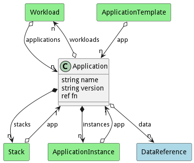
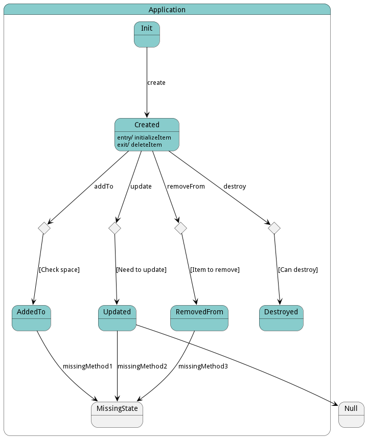

# Application

The &#34;Application&#34; class, part of the &#34;aml&#34; package, represents an application that contains multiple SABRs, essentially creating capabilities, and provides methods for creation, destruction, updating, adding to, and removing from; it also contains attributes for name, version, and function bundle instance, and associations with workloads, stacks, data references, and application instances.

## Attributes

* name:string - Unique identifier for the application
* version:string - Specific version of the application
* fn:ref - Function for bundle instance run

## Associations

| Name | Cardinality | Class | Composition | Owner | Description |
| --- | --- | --- | --- | --- | --- |
| workloads | n | Workload | false | false |  |
| stacks | n | Stack | true | true |  |
| data | n | DataReference | false | false |  |
| instances | n | ApplicationInstance | true | true |  |

## Users of the Model

| Name | Cardinality | Class | Composition | Owner | Description |
| --- | --- | --- | --- | --- | --- |
| app | 1 | ApplicationInstance | false | false |  |
| app | n | ApplicationTemplate | false | false |  |
| applications | n | Workload | false | false |  |
| app | 1 | Stack | false | false | Applications of the stacks |

## State Net
The Application has a state net corresponding to instances of the class. Each state transistion will emit an 
event that can be caught with a websocket client. The name of the event is the name of the state in all lower case.
The following diagram is the state net for this class.

| Name | Description | Events |
| --- | --- | --- |
| Init | Initial state of the application | create-&gt;Created,  |
| Created | State after application is created | addTo-&gt;AddedTo, update-&gt;Updated, removeFrom-&gt;RemovedFrom, destroy-&gt;Destroyed,  |
| AddedTo | State after something is added to the application | missingMethod1-&gt;MissingState,  |
| Updated | State after the application is updated | missingMethod2-&gt;MissingState,  |
| RemovedFrom | State after something is removed from the application | missingMethod3-&gt;MissingState,  |
| Destroyed | State after application is destroyed |  |

## Methods

<h2>Method Details</h2>
    

