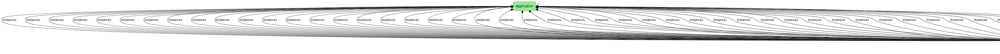
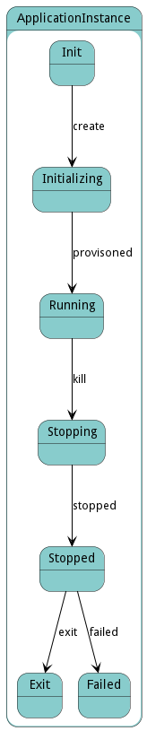

# ApplicationInstance

The &#34;ApplicationInstance&#34; class, part of the &#34;aml&#34; package, represents a running instance of an application in the ecosystem, providing methods to create, modify, and destroy these instances, as well as manage their associations with Applications.

## Attributes

* name:string - Name of the application instance
* status:string - Name of the application instance
* message:string - Last message in the application instance

## Associations

| Name | Cardinality | Class | Composition | Owner | Description |
| --- | --- | --- | --- | --- | --- |
| app | 1 | Application | false | false |  |

## Users of the Model

| Name | Cardinality | Class | Composition | Owner | Description |
| --- | --- | --- | --- | --- | --- |
| instances | n | Application | true | true |  |
| app | 1 | StackInstance | false | false | Application Instance of the stack instance |

## State Net
The ApplicationInstance has a state net corresponding to instances of the class. Each state transistion will emit an 
event that can be caught with a websocket client. The name of the event is the name of the state in all lower case.
The following diagram is the state net for this class.

| Name | Description | Events |
| --- | --- | --- |
| Init |  | create-&gt;Initializing,  |
| Initializing |  | provisoned-&gt;Running,  |
| Running |  | kill-&gt;Stopping,  |
| Stopping |  | stopped-&gt;Stopped,  |
| Stopped |  | exit-&gt;Exit, failed-&gt;Failed,  |
| Exit |  |  |
| Failed |  |  |

## Methods
* [fail() - Method to change the state of the application instance to Failed from Stopped as per state net](#action-fail)
* [initialize() - Method to initialize the application instance from the Init state as per the state net](#action-initialize)
* [kill() - Method to initiate a stop action on the running application instance as per the state net](#action-kill)
* [provision() - Method to provision the application instance from the Initializing state to the Running state as per the state net](#action-provision)
* [stop() - Method to stop the application instance from the Stopping state to the Stopped state as per the state net](#action-stop)
* [terminate() - Method to terminate the application instance from Stopped state to Exit as per state net](#action-terminate)

<h2>Method Details</h2>
    
### Action applicationinstance fail

* REST - applicationinstance/fail?appInstanceName=string&amp;errorMessage=string
* bin - applicationinstance fail --appInstanceName string --errorMessage string
* js - applicationinstance.fail({ appInstanceName:string,errorMessage:string })

#### Description
Method to change the state of the application instance to Failed from Stopped as per state net

#### Parameters

| Name | Type | Required | Description |
|---|---|---|---|
| appInstanceName | string | | Name of the application instance to be moved to Failed state |
| errorMessage | string | | Error message when moving to failed state |

### Action applicationinstance initialize

* REST - applicationinstance/initialize?appName=string
* bin - applicationinstance initialize --appName string
* js - applicationinstance.initialize({ appName:string })

#### Description
Method to initialize the application instance from the Init state as per the state net

#### Parameters

| Name | Type | Required | Description |
|---|---|---|---|
| appName | string | | Name of the application to initialize |

### Action applicationinstance kill

* REST - applicationinstance/kill?appInstanceName=string
* bin - applicationinstance kill --appInstanceName string
* js - applicationinstance.kill({ appInstanceName:string })

#### Description
Method to initiate a stop action on the running application instance as per the state net

#### Parameters

| Name | Type | Required | Description |
|---|---|---|---|
| appInstanceName | string | | Name of the application instance to be stopped |

### Action applicationinstance provision

* REST - applicationinstance/provision?appInstanceName=string
* bin - applicationinstance provision --appInstanceName string
* js - applicationinstance.provision({ appInstanceName:string })

#### Description
Method to provision the application instance from the Initializing state to the Running state as per the state net

#### Parameters

| Name | Type | Required | Description |
|---|---|---|---|
| appInstanceName | string | | Name of the application instance for which the provisioning has been done |

### Action applicationinstance stop

* REST - applicationinstance/stop?appInstanceName=string
* bin - applicationinstance stop --appInstanceName string
* js - applicationinstance.stop({ appInstanceName:string })

#### Description
Method to stop the application instance from the Stopping state to the Stopped state as per the state net

#### Parameters

| Name | Type | Required | Description |
|---|---|---|---|
| appInstanceName | string | | Name of the application instance to be stopped |

### Action applicationinstance terminate

* REST - applicationinstance/terminate?appInstanceName=string
* bin - applicationinstance terminate --appInstanceName string
* js - applicationinstance.terminate({ appInstanceName:string })

#### Description
Method to terminate the application instance from Stopped state to Exit as per state net

#### Parameters

| Name | Type | Required | Description |
|---|---|---|---|
| appInstanceName | string | | Name of the application instance to be terminated |

