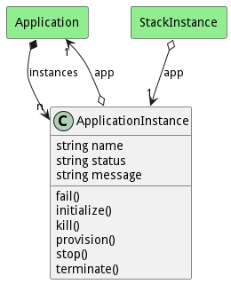
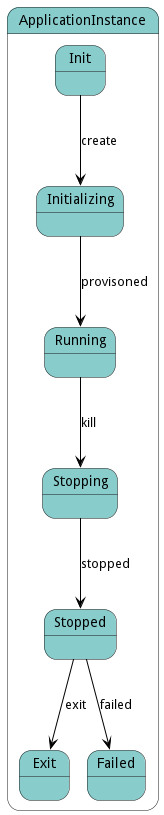

# ApplicationInstance

Application Instance that is running in the ecosystem

## Attributes

* name:string - Name of the application instance
* status:string - Name of the application instance
* message:string - Last message in the application instance

## Associations

| Name | Cardinality | Class | Composition | Owner | Description |
| --- | --- | --- | --- | --- | --- |
| app | 1 | Application | false | false |  |

## Users of the Model

| Name | Cardinality | Class | Composition | Owner | Description |
| --- | --- | --- | --- | --- | --- |
| instances | n | Application | true | true |  |
| app | 1 | StackInstance | false | false | Application Instance of the stack instance |

## State Net
The ApplicationInstance has a state net corresponding to instances of the class. Each state transistion will emit an 
event that can be caught with a websocket client. The name of the event is the name of the state in all lower case.
The following diagram is the state net for this class.

| Name | Description | Events |
| --- | --- | --- |
| Init |  | create-&gt;Initializing,  |
| Initializing |  | provisoned-&gt;Running,  |
| Running |  | kill-&gt;Stopping,  |
| Stopping |  | stopped-&gt;Stopped,  |
| Stopped |  | exit-&gt;Exit, failed-&gt;Failed,  |
| Exit |  |  |
| Failed |  |  |

## Methods

<h2>Method Details</h2>
    

