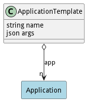

# ApplicationTemplate

An ApplicationTemplate provides a template to create applications based on parameters passed into the template when it is being used to create an application.

## Attributes

* name:string - Name of the Application Template
* args:json - Name value pairs used for the creation of applications from the template.

## Associations

| Name | Cardinality | Class | Composition | Owner | Description |
| --- | --- | --- | --- | --- | --- |
| app | n | Application | false | false |  |

## Methods

<h2>Method Details</h2>
    

