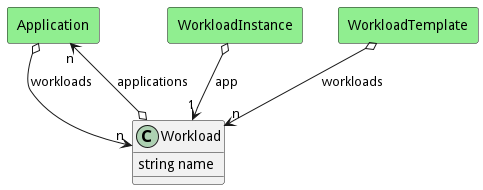

# Workload

A Workload contains a group of applications that interact based on business rules under specific SLA and QoS

## Attributes

* name:string - Name of the workload

## Associations

| Name | Cardinality | Class | Composition | Owner | Description |
| --- | --- | --- | --- | --- | --- |
| applications | n | Application | false | false |  |

## Users of the Model

| Name | Cardinality | Class | Composition | Owner | Description |
| --- | --- | --- | --- | --- | --- |
| workloads | n | Application | false | false |  |
| app | 1 | WorkloadInstance | false | false |  |
| workloads | n | WorkloadTemplate | false | false |  |

## Methods

<h2>Method Details</h2>
    

