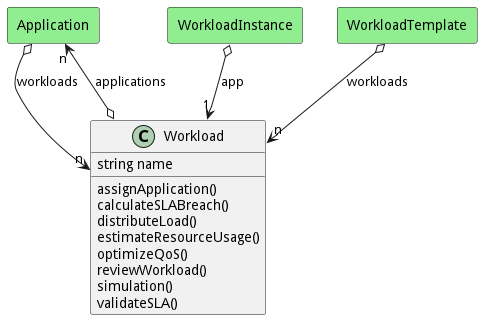

# Workload

A Workload contains a group of applications that interact based on business rules under specific SLA and QoS

## Attributes

* name:string - Name of the workload

## Associations

| Name | Cardinality | Class | Composition | Owner | Description |
| --- | --- | --- | --- | --- | --- |
| applications | n | Application | false | false |  |

## Users of the Model

| Name | Cardinality | Class | Composition | Owner | Description |
| --- | --- | --- | --- | --- | --- |
| workloads | n | Application | false | false |  |
| app | 1 | WorkloadInstance | false | false |  |
| workloads | n | WorkloadTemplate | false | false |  |

## Methods
* [assignApplication() - Assigns an application to the workload](#action-assignApplication)
* [calculateSLABreach() - Calculates the probability of breaching of the Service Level Agreements](#action-calculateSLABreach)
* [distributeLoad() - Distributes the workload among different applications](#action-distributeLoad)
* [estimateResourceUsage() - Estimates the resources usage of the workload](#action-estimateResourceUsage)
* [optimizeQoS() - Optimizes the Quality of Service of the workload](#action-optimizeQoS)
* [reviewWorkload() - Reviews and analyses applications performances within the workload](#action-reviewWorkload)
* [simulation() - Simulates workload according to different scenarios](#action-simulation)
* [validateSLA() - Validates the Service Level Agreements of the workload](#action-validateSLA)

<h2>Method Details</h2>
    
### Action workload assignApplication

* REST - workload/assignApplication?application=Application
* bin - workload assignApplication --application Application
* js - workload.assignApplication({ application:Application })

#### Description
Assigns an application to the workload

#### Parameters

| Name | Type | Required | Description |
|---|---|---|---|
| application | Application | | Application to be assigned |

### Action workload calculateSLABreach

* REST - workload/calculateSLABreach?
* bin - workload calculateSLABreach 
* js - workload.calculateSLABreach({  })

#### Description
Calculates the probability of breaching of the Service Level Agreements

#### Parameters

No parameters

### Action workload distributeLoad

* REST - workload/distributeLoad?
* bin - workload distributeLoad 
* js - workload.distributeLoad({  })

#### Description
Distributes the workload among different applications

#### Parameters

No parameters

### Action workload estimateResourceUsage

* REST - workload/estimateResourceUsage?
* bin - workload estimateResourceUsage 
* js - workload.estimateResourceUsage({  })

#### Description
Estimates the resources usage of the workload

#### Parameters

No parameters

### Action workload optimizeQoS

* REST - workload/optimizeQoS?
* bin - workload optimizeQoS 
* js - workload.optimizeQoS({  })

#### Description
Optimizes the Quality of Service of the workload

#### Parameters

No parameters

### Action workload reviewWorkload

* REST - workload/reviewWorkload?
* bin - workload reviewWorkload 
* js - workload.reviewWorkload({  })

#### Description
Reviews and analyses applications performances within the workload

#### Parameters

No parameters

### Action workload simulation

* REST - workload/simulation?scenario=Scenario
* bin - workload simulation --scenario Scenario
* js - workload.simulation({ scenario:Scenario })

#### Description
Simulates workload according to different scenarios

#### Parameters

| Name | Type | Required | Description |
|---|---|---|---|
| scenario | Scenario | | The scenario of the simulation |

### Action workload validateSLA

* REST - workload/validateSLA?
* bin - workload validateSLA 
* js - workload.validateSLA({  })

#### Description
Validates the Service Level Agreements of the workload

#### Parameters

No parameters

