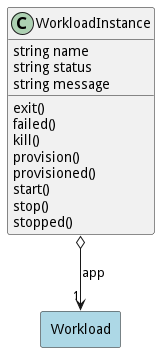

# WorkloadInstance

Workload Instance that is running in the ecosystem

## Attributes

* name:string - Name of the application instance
* status:string - Name of the application instance
* message:string - Last message in the application instance

## Associations

| Name | Cardinality | Class | Composition | Owner | Description |
| --- | --- | --- | --- | --- | --- |
| app | 1 | Workload | false | false |  |

## Users of the Model

| Name | Cardinality | Class | Composition | Owner | Description |
| --- | --- | --- | --- | --- | --- |

## State Net

| Name | Description | Events |
| --- | --- | --- |
| Init |  | create-&gt;Initializing,  |
| Initializing |  | provisoned-&gt;Running,  |
| Running |  | kill-&gt;Stopping,  |
| Stopping |  | stopped-&gt;Stopped,  |
| Stopped |  | exit-&gt;Exit, failed-&gt;Failed,  |
| Exit |  |  |
| Failed |  |  |

## Methods

<h2>Method Details</h2>
    

