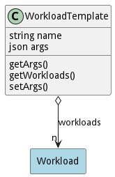

# WorkloadTemplate

A WorkloadTemplate allows developers to paramaterize workloads so they can be reused in several different areas. Workloads are created based on arguments passed into the template for creation of a Workload.

## Attributes

* name:string - name of the workload template
* args:json - Name value pairs used for the creation of applications from the template.

## Associations

| Name | Cardinality | Class | Composition | Owner | Description |
| --- | --- | --- | --- | --- | --- |
| workloads | n | Workload | false | false |  |

## Methods

<h2>Method Details</h2>
    

