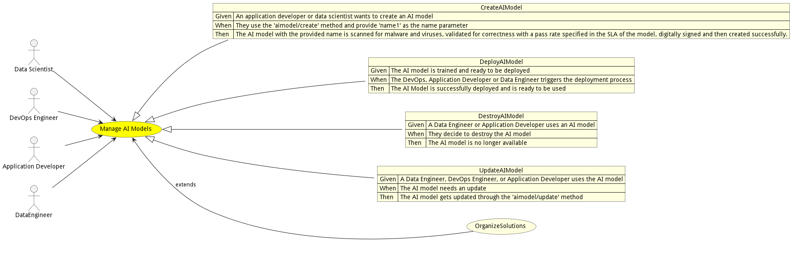
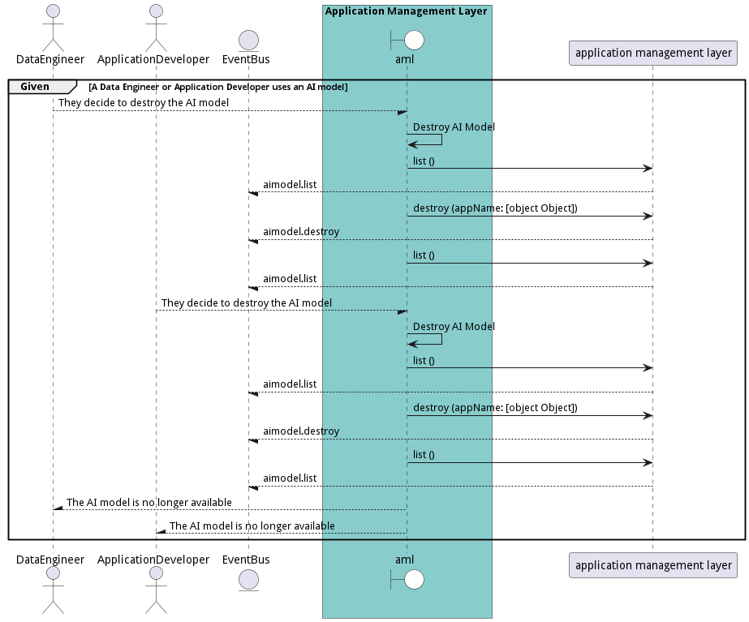

# Manage AI Models

Data Scientist manages AI models and ties them to and application and data set. DevOps will make sure when applications and AI models are updated that they are updatedtogether.

## Actors

* [Data Scientist](actor-datascientist)
* [DevOps Engineer](actor-devops)
* [Application Developer](actor-applicationdeveloper)
* [DataEngineer](actor-dataengineer)

## Extends Use Cases

* [OrganizeSolutions](usecase-OrganizeSolutions)

## Detail Scenarios

* [CreateAIModel](#scenario-CreateAIModel)
* [DeployAIModel](#scenario-DeployAIModel)
* [DestroyAIModel](#scenario-DestroyAIModel)
* [UpdateAIModel](#scenario-UpdateAIModel)

### Scenario Create AI Model

In this scenario, an application developer or data scientist is using the &#34;Create AI Model&#34; utility to successfully create an AI model named &#39;name1&#39; by invoking the &#39;aimodel/create&#39; method.

#### Criteria

* Given - An application developer or data scientist wants to create an AI model
* When - They use the &#39;aimodel/create&#39; method and provide &#39;name1&#39; as the name parameter
* Then - An application developer or data scientist wants to create an AI model

#### Steps
1. [ edgemere/aml/aimodel/create ](#action--edgemere-aml-aimodel-create)
1. [ edgemere/aml/aimodel/scan --appName name1](#action--edgemere-aml-aimodel-scan)
1. [ edgemere/aml/aimodel/validate --appName name1 --SLA specified SLA details](#action--edgemere-aml-aimodel-validate)
1. [ edgemere/aml/aimodel/sign --appName name1](#action--edgemere-aml-aimodel-sign)
1. [ edgemere/aml/aimodel/create --appName name1](#action--edgemere-aml-aimodel-create)

#### Actors

* [Application Developer](actor-applicationdeveloper)
* [Data Scientist](actor-datascientist)

### Scenario Deploy AI Model

Deploy AI Model is the description

#### Criteria

* Given - The AI model is trained and ready to be deployed
* When - The DevOps, Application Developer or Data Engineer triggers the deployment process
* Then - The AI model is trained and ready to be deployed

#### Steps
1. [ edgemere/aml/aimodel/create ](#action--edgemere-aml-aimodel-create)
1. [ edgemere/aml/aimodel/sign --appName [object Object]](#action--edgemere-aml-aimodel-sign)
1. [ edgemere/aml/aimodel/validate --appName [object Object] --SLA [object Object]](#action--edgemere-aml-aimodel-validate)
1. [ edgemere/aml/aimodel/deploy ](#action--edgemere-aml-aimodel-deploy)
1. [ edgemere/aml/aimodel/scan --appName [object Object]](#action--edgemere-aml-aimodel-scan)

#### Actors

* [DevOps Engineer](actor-devops)
* [Application Developer](actor-applicationdeveloper)
* [DataEngineer](actor-dataengineer)

### Scenario Destroy AI Model

Destroy AI Model is the description

#### Criteria

* Given - A Data Engineer or Application Developer uses an AI model
* When - They decide to destroy the AI model
* Then - A Data Engineer or Application Developer uses an AI model

#### Steps
1. [ edgemere/aml/aimodel/list ](#action--edgemere-aml-aimodel-list)
1. [ edgemere/aml/aimodel/destroy --appName [object Object]](#action--edgemere-aml-aimodel-destroy)
1. [ edgemere/aml/aimodel/list ](#action--edgemere-aml-aimodel-list)

#### Actors

* [DataEngineer](actor-dataengineer)
* [Application Developer](actor-applicationdeveloper)

### Scenario Update AI Model

Update AI Model is the description

#### Criteria

* Given - A Data Engineer, DevOps Engineer, or Application Developer uses the AI model
* When - The AI model needs an update
* Then - A Data Engineer, DevOps Engineer, or Application Developer uses the AI model

#### Steps
1. [ edgemere/aml/aimodel/list ](#action--edgemere-aml-aimodel-list)
1. [ edgemere/aml/aimodel/update --appName desired AI model name](#action--edgemere-aml-aimodel-update)
1. [ edgemere/aml/aimodel/validate --appName desired AI model name --SLA provided Service Level Agreement](#action--edgemere-aml-aimodel-validate)
1. [ edgemere/aml/aimodel/sign --appName desired AI model name](#action--edgemere-aml-aimodel-sign)
1. [ edgemere/aml/aimodel/deploy ](#action--edgemere-aml-aimodel-deploy)

#### Actors

* [DataEngineer](actor-dataengineer)
* [DevOps Engineer](actor-devops)
* [Application Developer](actor-applicationdeveloper)

