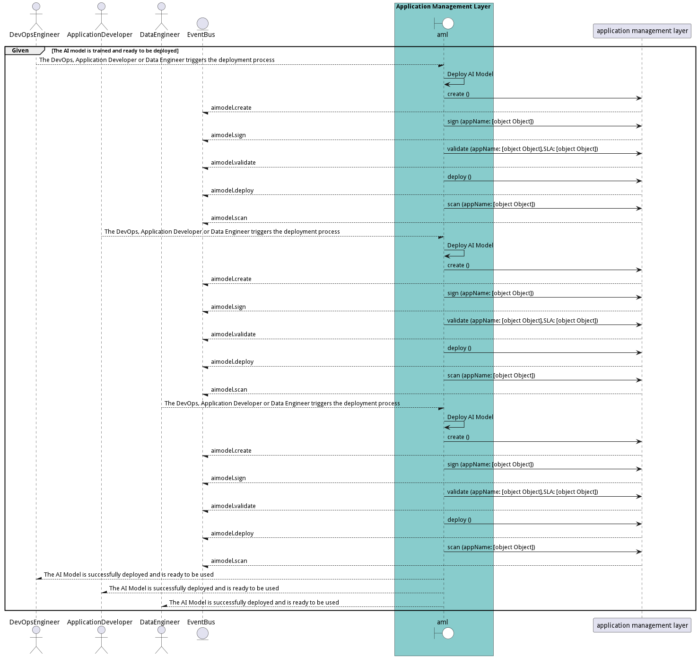
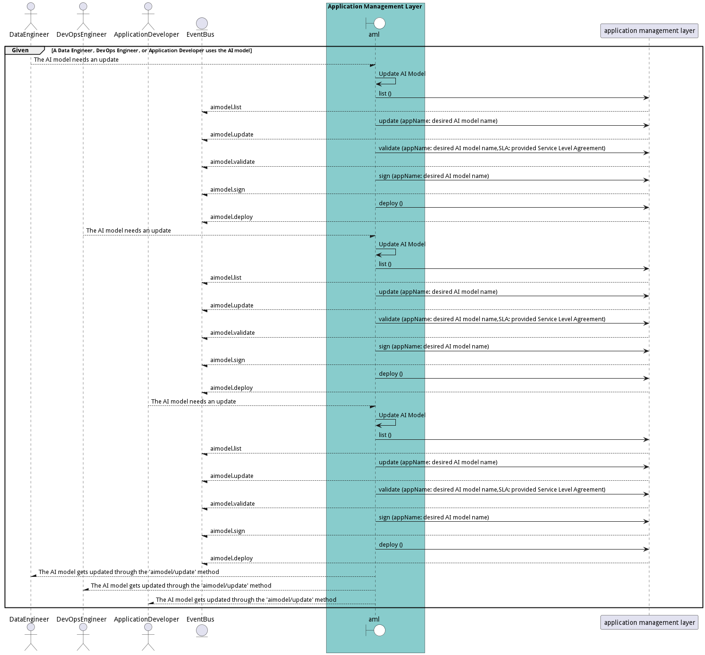

# Manage AI Models

Data Scientist manages AI models and ties them to and application and data set. DevOps will make sure when applications and AI models are updated that they are updatedtogether.

## Actors

* [Data Scientist](actor-datascientist)
* [DevOps Engineer](actor-devops)
* [Application Developer](actor-applicationdeveloper)
* [DataEngineer](actor-dataengineer)

## Extends Use Cases

* [OrganizeSolutions](usecase-OrganizeSolutions)

## Detail Scenarios

* [CreateAIModel](#scenario-CreateAIModel)
* [DeployAIModel](#scenario-DeployAIModel)
* [DestroyAIModel](#scenario-DestroyAIModel)
* [UpdateAIModel](#scenario-UpdateAIModel)

### Scenario Create AI Model

Create AI Model is the description

#### Criteria

* Given - An application developer or data scientist wants to create an AI model
* When - They use the &#39;aimodel/create&#39; method and provide &#39;name1&#39; as the name parameter
* Then - An application developer or data scientist wants to create an AI model

#### Steps
1. [aimodel create --name name1](#action-aimodel-create)

#### Actors

* [Application Developer](actor-applicationdeveloper)
* [Data Scientist](actor-datascientist)

### Scenario Deploy AI Model

Deploy AI Model is the description

#### Criteria

* Given - The AI model is trained and ready to be deployed
* When - The DevOps, Application Developer or Data Engineer triggers the deployment process
* Then - The AI model is trained and ready to be deployed

#### Steps
1. To Be Defined

#### Actors

* [DevOps Engineer](actor-devops)
* [Application Developer](actor-applicationdeveloper)
* [DataEngineer](actor-dataengineer)

### Scenario Destroy AI Model

Destroy AI Model is the description

#### Criteria

* Given - A Data Engineer or Application Developer uses an AI model
* When - They decide to destroy the AI model
* Then - A Data Engineer or Application Developer uses an AI model

#### Steps
1. To Be Defined

#### Actors

* [DataEngineer](actor-dataengineer)
* [Application Developer](actor-applicationdeveloper)

### Scenario Update AI Model

Update AI Model is the description

#### Criteria

* Given - A Data Engineer, DevOps Engineer, or Application Developer uses the AI model
* When - The AI model needs an update
* Then - A Data Engineer, DevOps Engineer, or Application Developer uses the AI model

#### Steps
1. To Be Defined

#### Actors

* [DataEngineer](actor-dataengineer)
* [DevOps Engineer](actor-devops)
* [Application Developer](actor-applicationdeveloper)

