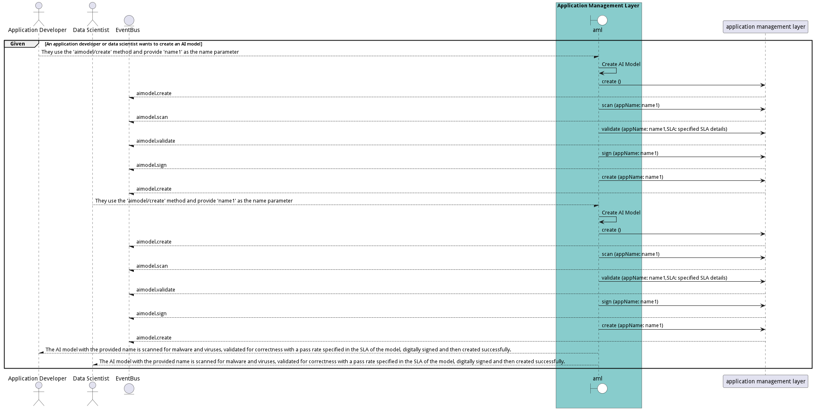

# Manage AI Models

Data Scientist manages AI models and ties them to and application and data set. DevOps will make sure when applications and AI models are updated that they are updatedtogether.

## Actors

* [Data Scientist](actor-datascientist)
* [DevOps Engineer](actor-devops)
* [Application Developer](actor-applicationdeveloper)
* [DataEngineer](actor-dataengineer)

## Detail Scenarios

* [CreateAIModel](#scenario-CreateAIModel)
* [DeployAIModel](#scenario-DeployAIModel)
* [DestroyAIModel](#scenario-DestroyAIModel)
* [UpdateAIModel](#scenario-UpdateAIModel)

### Scenario Create AI Model

Create AI Model is the description

#### Steps
1. [aimodel create --name name1](#action-aimodel-create)

#### Actors

* [Application Developer](actor-applicationdeveloper)
* [Data Scientist](actor-datascientist)

### Scenario Deploy AI Model

Deploy AI Model is the description

#### Steps
1. To Be Defined

#### Actors

* [DevOps Engineer](actor-devops)
* [Application Developer](actor-applicationdeveloper)
* [DataEngineer](actor-dataengineer)

### Scenario Destroy AI Model

Destroy AI Model is the description

#### Steps
1. To Be Defined

#### Actors

* [DataEngineer](actor-dataengineer)
* [Application Developer](actor-applicationdeveloper)

### Scenario Update AI Model

Update AI Model is the description

#### Steps
1. To Be Defined

#### Actors

* [DataEngineer](actor-dataengineer)
* [DevOps Engineer](actor-devops)
* [Application Developer](actor-applicationdeveloper)

