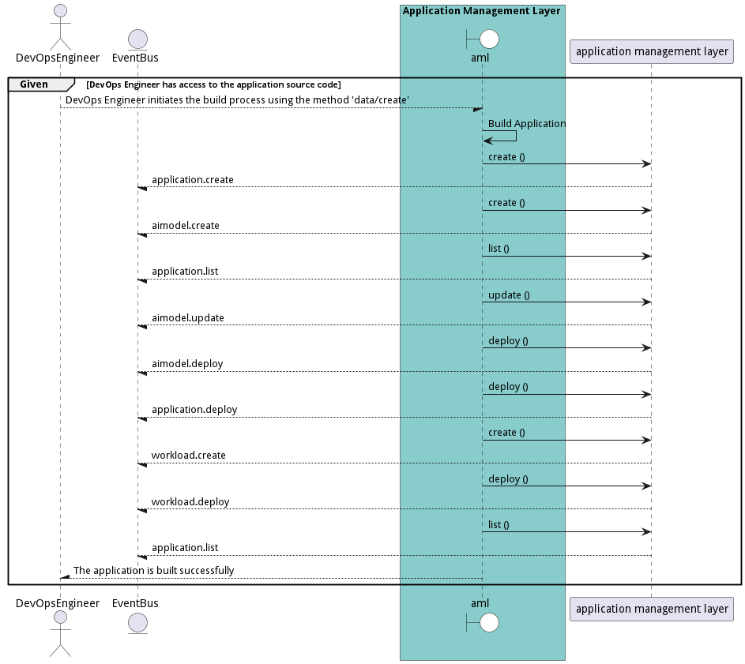

# Manage Applications

DevOps Engineers and Application Developers need the ability to manage applications across multiple environments, clouds, and types of infrastructure.

## Actors

* [DevOps Engineer](actor-devops)
* [Application Developer](actor-applicationdeveloper)

## Extends Use Cases

* [OrganizeSolutions](usecase-OrganizeSolutions)

## Detail Scenarios

* [BuildApplication](#scenario-BuildApplication)
* [CreateApplication](#scenario-CreateApplication)
* [DeployApplication](#scenario-DeployApplication)
* [DestroyApplication](#scenario-DestroyApplication)
* [MonitorApplication](#scenario-MonitorApplication)
* [UpdateApplication](#scenario-UpdateApplication)

### Scenario Build Application

Build Application is the description

#### Steps
1. [data list --name hello --file ./templates/world.yml](#action-data-list)
1. [data list --name hello --file ./templates/world.yml](#action-data-list)

#### Actors

* [DevOps Engineer](actor-devops)

### Scenario Create Application

Create Application is the description

#### Steps
1. To Be Defined

#### Actors

* [Application Developer](actor-applicationdeveloper)

### Scenario Deploy Application

Deploy Application is the description

#### Steps
1. To Be Defined

#### Actors

* [DevOps Engineer](actor-devops)

### Scenario Destroy Application

Destroy Application is the description

#### Steps
1. To Be Defined

#### Actors

* [DevOps Engineer](actor-devops)

### Scenario Monitor Application

Monitor Application is the description

#### Steps
1. To Be Defined

#### Actors

* [DevOps Engineer](actor-devops)
* [Application Developer](actor-applicationdeveloper)

### Scenario Update Application

Update Application is the description

#### Steps
1. To Be Defined

#### Actors

* [Application Developer](actor-applicationdeveloper)
* [DevOps Engineer](actor-devops)

