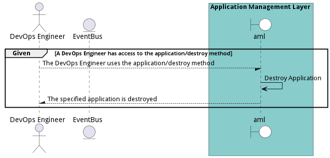
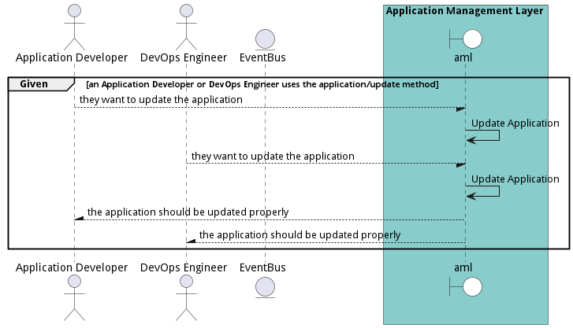

# Manage Applications

DevOps Engineers and Application Developers need the ability to manage applications across multiple environments, clouds, and types of infrastructure.

## Actors

* [DevOps Engineer](actor-devops)
* [Application Developer](actor-applicationdeveloper)

## Extends Use Cases

* [OrganizeSolutions](usecase-OrganizeSolutions)

## Detail Scenarios

* [BuildApplication](#scenario-BuildApplication)
* [CreateApplication](#scenario-CreateApplication)
* [DeployApplication](#scenario-DeployApplication)
* [DestroyApplication](#scenario-DestroyApplication)
* [MonitorApplication](#scenario-MonitorApplication)
* [UpdateApplication](#scenario-UpdateApplication)

### Scenario Build Application

A DevOps Engineer initiates the build process using the &#39;data/create&#39; method and performs a series of actions, including creating and deploying an AI model, thereby successfully building the application &#39;helloWorldApp&#39;.

#### Criteria

* Given - DevOps Engineer has access to the application source code
* When - DevOps Engineer initiates the build process using the method &#39;data/create&#39;
* Then - DevOps Engineer has access to the application source code

#### Steps
1. [ edgemere/aml/application/create ](#action--edgemere-aml-application-create)
1. [ edgemere/aml/aimodel/create ](#action--edgemere-aml-aimodel-create)
1. [ edgemere/aml/application/list ](#action--edgemere-aml-application-list)
1. [ edgemere/aml/aimodel/update ](#action--edgemere-aml-aimodel-update)
1. [ edgemere/aml/aimodel/deploy ](#action--edgemere-aml-aimodel-deploy)
1. [ edgemere/aml/application/deploy ](#action--edgemere-aml-application-deploy)
1. [ edgemere/aml/workload/create ](#action--edgemere-aml-workload-create)
1. [ edgemere/aml/workload/deploy ](#action--edgemere-aml-workload-deploy)
1. [ edgemere/aml/application/list ](#action--edgemere-aml-application-list)

#### Actors

* [DevOps Engineer](actor-devops)

### Scenario Create Application

Create Application is the description

#### Criteria

* Given - Application Developer wants to create a new application
* When - Application Developer uses &#39;application/create&#39; method
* Then - Application Developer wants to create a new application

#### Steps
1. To Be Defined

#### Actors

* [Application Developer](actor-applicationdeveloper)

### Scenario Deploy Application

Deploy Application is the description

#### Criteria

* Given - DevOps Engineer has access to deploy application
* When - DevOps Engineer uses the application/deploy method
* Then - DevOps Engineer has access to deploy application

#### Steps
1. To Be Defined

#### Actors

* [DevOps Engineer](actor-devops)

### Scenario Destroy Application

Destroy Application is the description

#### Criteria

* Given - A DevOps Engineer has access to the application/destroy method
* When - The DevOps Engineer uses the application/destroy method
* Then - A DevOps Engineer has access to the application/destroy method

#### Steps
1. To Be Defined

#### Actors

* [DevOps Engineer](actor-devops)

### Scenario Monitor Application

Monitor Application is the description

#### Criteria

* Given - DevOps Engineer and Application Developer have access to the Monitor Application
* When - They use the Monitor Application
* Then - DevOps Engineer and Application Developer have access to the Monitor Application

#### Steps
1. To Be Defined

#### Actors

* [DevOps Engineer](actor-devops)
* [Application Developer](actor-applicationdeveloper)

### Scenario Update Application

Update Application is the description

#### Criteria

* Given - an Application Developer or DevOps Engineer uses the application/update method
* When - they want to update the application
* Then - an Application Developer or DevOps Engineer uses the application/update method

#### Steps
1. To Be Defined

#### Actors

* [Application Developer](actor-applicationdeveloper)
* [DevOps Engineer](actor-devops)

