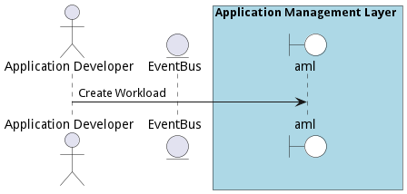
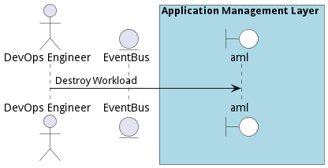
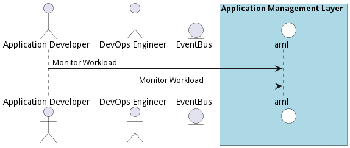

# Manage Workloads

Application Developers need the ability to connect applications together through Workflows. This gives the organization the automate complex data interactions between legacy and modern applications across a hybrid infrastructure (Multi-Hybrid Cloud).

## Actors

* [Application Developer](actor-applicationdeveloper)
* [DevOps Engineer](actor-devops)

## Detail Scenarios

* [Manage Workloads](#scenario-CreateWorkload)
* [Manage Workloads](#scenario-DeployWorkload)
* [Manage Workloads](#scenario-DestroyWorkload)
* [Manage Workloads](#scenario-MonitorWorkload)
* [Manage Workloads](#scenario-UpdateWorkload)

### Scenario Create Workload

Create Workload is the description

#### Steps

1. To Be Defined

#### Actors

* [Application Developer](actor-applicationdeveloper)

### Scenario Deploy Workload

Deploy Workload is the description

#### Steps

1. To Be Defined

#### Actors

* [Application Developer](actor-applicationdeveloper)
* [DevOps Engineer](actor-devops)

### Scenario Destroy Workload

Destroy Workload is the description

#### Steps

1. To Be Defined

#### Actors

* [DevOps Engineer](actor-devops)

### Scenario Monitor Workload

Monitor Workload is the description

#### Steps

1. To Be Defined

#### Actors

* [Application Developer](actor-applicationdeveloper)
* [DevOps Engineer](actor-devops)

### Scenario Update Workload

Update Workload is the description

#### Steps

1. To Be Defined

#### Actors

* [Application Developer](actor-applicationdeveloper)
* [DevOps Engineer](actor-devops)

