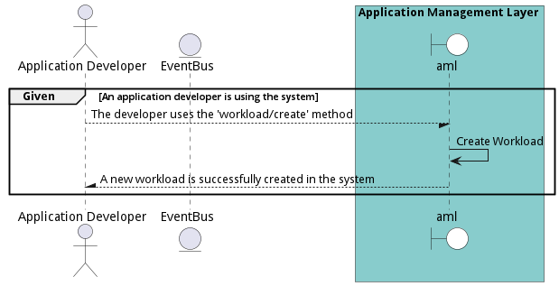
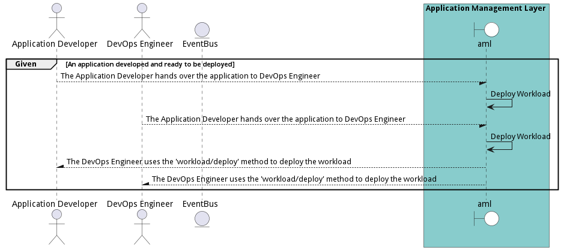
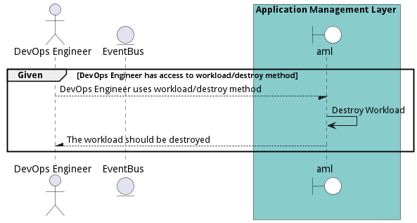
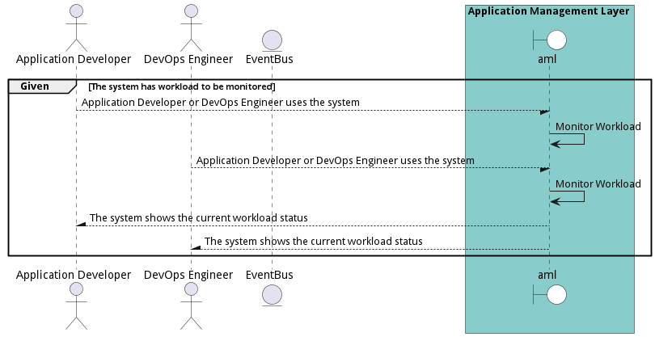

# Manage Workloads

Application Developers need the ability to connect applications together through Workflows. This gives the organization the automate complex data interactions between legacy and modern applications across a hybrid infrastructure (Multi-Hybrid Cloud).

## Actors

* [Application Developer](actor-applicationdeveloper)
* [DevOps Engineer](actor-devops)

## Extends Use Cases

* [OrganizeSolutions](usecase-OrganizeSolutions)

## Detail Scenarios

* [CreateWorkload](#scenario-CreateWorkload)
* [DeployWorkload](#scenario-DeployWorkload)
* [DestroyWorkload](#scenario-DestroyWorkload)
* [MonitorWorkload](#scenario-MonitorWorkload)
* [UpdateWorkload](#scenario-UpdateWorkload)

### Scenario Create Workload

Create Workload is the description

#### Criteria

* Given - An application developer is using the system
* When - The developer uses the &#39;workload/create&#39; method
* Then - An application developer is using the system

#### Steps
1. To Be Defined

#### Actors

* [Application Developer](actor-applicationdeveloper)

### Scenario Deploy Workload

Deploy Workload is the description

#### Criteria

* Given - An application developed and ready to be deployed
* When - The Application Developer hands over the application to DevOps Engineer
* Then - An application developed and ready to be deployed

#### Steps
1. To Be Defined

#### Actors

* [Application Developer](actor-applicationdeveloper)
* [DevOps Engineer](actor-devops)

### Scenario Destroy Workload

Destroy Workload is the description

#### Criteria

* Given - DevOps Engineer has access to workload/destroy method
* When - DevOps Engineer uses workload/destroy method
* Then - DevOps Engineer has access to workload/destroy method

#### Steps
1. To Be Defined

#### Actors

* [DevOps Engineer](actor-devops)

### Scenario Monitor Workload

Monitor Workload is the description

#### Criteria

* Given - The system has workload to be monitored
* When - Application Developer or DevOps Engineer uses the system
* Then - The system has workload to be monitored

#### Steps
1. To Be Defined

#### Actors

* [Application Developer](actor-applicationdeveloper)
* [DevOps Engineer](actor-devops)

### Scenario Update Workload

Update Workload is the description

#### Criteria

* Given - Application Developer or DevOps Engineer is using the system
* When - They try to update the workload
* Then - Application Developer or DevOps Engineer is using the system

#### Steps
1. To Be Defined

#### Actors

* [Application Developer](actor-applicationdeveloper)
* [DevOps Engineer](actor-devops)

