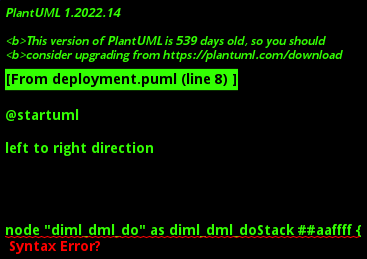
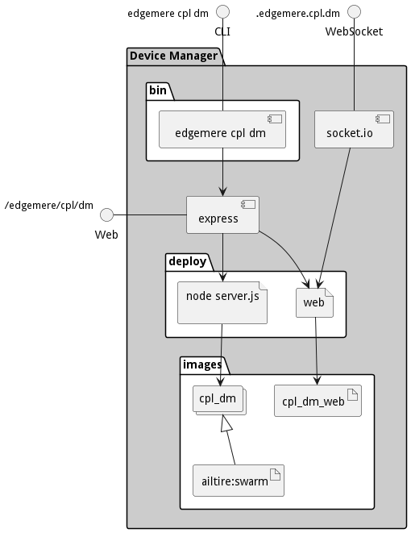

### prod

#### Deployment
This subsystem is deployed using micro-services as shown in the diagram below.
The subsystem also has an CLI, REST and Web Interface exposed through frontend service that routes
all paths to the appropriate microservices.

#### Physical Architecture
The Device Manager subsystem is physically laid out on a hybrid cloud infrastructure.
Each micro-service communicates with each other through overlay networks as defined in the diagram
above. Each micro-service has three interfaces exposed Command Line Interface (CLI), Websocket (socket.io),
and a REST interface. This allows for scripting, event programing and connectivity through a common
REST interface.

#### Micro-Services
These are the micro-services for the deployment of the subsystem. The combination of the micro-services help implement
the subsystem's logic.

| Name | Image | Mapping | Ports | Network |
| --- | --- | --- | --- | --- |
| data_orchestrator | diml_dml_do:latest |  |  | children,parent |
| policy_engine | sa_pe:latest |  |  | children,parent |
| service_orchestrator | sml_so:latest |  |  | children,parent |
| telemetry_aggregator | cpl_ta:latest |  |  | children,parent |
| portal | cpl_dm_web | /admin | 3000 | sibling |

#### Networks

The networks connect the microservices of this stack together in a micro-segmented network.
There are also Ingress and Egress networks for connected to the stack (ingress) and connected from
the stack (egress). Most of the egress networks are for substacks in the stack itself. This enables
the creation of aggregation of stacks and substacks and still keep the microsegmentation of each
stack in a layer of networks.

| Name | Type | External Name | Ports |
| --- | --- | --- | --- |
| children | egress | ailtire_appname_cpl_dm_family |
| sibling | internal |  |
| parent | ingress | ailtire_appname_cpl_family |

The Stack is micro-segmented off and there are a set of ports that are open for the ingress networks. The following
table shows the ports available and the internal port mappings and services on those ports.

| External Access Port | To Port | Service |
| --- | --- | --- |

