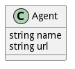

# Agent

This is the Device Agent that the Device Manager connects to

## Attributes

* name:string - Name of the device Agent
* url:string - URL of the Device Agent

## Associations

No associations

## Methods

<h2>Method Details</h2>
    

