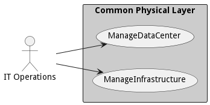

# Common Physical Layer

Common Physical Layer is a package that contains...

The Common Physical Layer (CPL) contains abstractions that allow for better management across an ecosystem inside the  
data center, in the cloud, and on the edge devices. These abstractions give the ability to manage a highly variable  
hardware configurations by describing the common operating and taxonomy of the devices. This architectural layer has the  
the goal of addressing the following characteristics:

*   Common Taxonomy
*   Portability and Interoperability
*   Security and Root of Trust
*   Common Management Control Plane
*   Performance Optimization
*   Stability and Reliability
*   Flexibility and Agility

The CPL sits at the bottom of the Architectural stack and is the foundation for all of the other layers of the  
architecture. It relies on [Security](package--edgemere-sa) and [Identifying](package--edgemere-ia) aspects to  
establish the hardware root of trust, identity, and data encryption at the lowest levels.

The CPL establishes a taxonomy of generalized hardware devices. This makes it easier to create standard services  
and operating models for the devices. This includes devices in Public Clouds, Private Clouds, Legacy Infrastructure, and  
Edge Devices. These devices have standard [hardware](class-hardware): [compute](class-computehardware), [storage](class-storagehardware), [network](class-networkhardware), and [accelerators](class-acceleratorshardware). Understanding that each [device](class-device) can have a unique set of capabilities delivered from the device's special hardware is key to establishing a common management control plane.

The critical element in this layer is the [Device](class-device). It is represented by a model that contains  
several [hardware](class-hardware) elements. The [device](class-device) has a profile that shows the device's capabilities [device](class-device) and [hardware,](class-hardware) as well as the current capacity of  
the [device](class-device). The [device](class-device) is has a simple interface for control and telemetry up to  
the [software-defined infrastructure layer - SDI](package--edgemere-sdi) so [applications](class-application)  
and [services](class-service) can be deployed to the [device](class-device) and its (hardware)\[class-hardware\].

With the explosion of IoT devices, the complexity of managing the devices in conjunction with devices in the  
cloud and the data center. Addressing a large number of devices can become overwhelming for  
[IT operations engineer](actor-itops) as well as any automated IT management system. For this reason, the architect has  
created an element called the [Aggregated Device](class-aggregateddevice). That allows for grouping devices into  
collections to be managed and controlled as a group instead of as individual  
devices. [Aggregated devices](class-aggregateddevice) can contain [devices](class-device) or  
other [aggregated devices](class-aggregatedevice), giving the ability to have an infinite number of layers in the hierarchy of devices.

In this example, a topology of devices has been established to give the [IT operations engineer](actor-itops)  
the ability to manage all of the devices connected to a data center. In "Data Center 1"  
there are 4 Edge Devices; Data Center 2 has 4 Edge Devices, and Data Center 3 has an Aggregated Edge Device and a normal  
Device. Aggregation of devices can happen along with geographic, device capabilities, security profiles, etc... The key is  
that the topology is established to help with the physical management of the devices.

Many times organizations combine the physical management and the logical management of devices. Combining the  
Cloud topology and the Control Topology together. This architecture separates the two topologies giving the flexibility  
to establish clouds that span multiple physical domains. Including setting a cloud that spans resources in data  
centers, public clouds, and edge devices. Providing the ability to schedule and manage applications and services across  
traditional boundaries.

This example shows three clouds that share devices and span the control topology established for  
optimized IT operations. This flexibility allows clouds (logical devices) to adapt to changing environments. Theses  
changes can include everything from cyber threats, physical disasters, partial connectivity of edge devices, or even  
someone tripping over a network connection in the data center.

## Use Cases

The following are the use cases of the Common Physical Layer subsystem. Each use case has primary and secondary scenarios
that are elaborated in the use case descriptions.

* [Manage Data Center](usecase-ManageDataCenter)
* [Manage Infrastructure](usecase-ManageInfrastructure)

## Users

The following are the actors of the Common Physical Layer subsystem. This can include people, other subsystems
inside the solution and even external subsystems.

* [ITOperations](actor-itops)

## Interface

The subsystem has a REST, CLI, WebSocket, and Web interface. Use Cases and Scenarios can use any or all
of the interfaces to perform the work that needs to be completed. The following  diagram shows how
users interact with the system.

* [ edgemere cpl adddevices](#action--edgemere-cpl-adddevices)
* [ edgemere cpl provision](#action--edgemere-cpl-provision)
* [ edgemere cpl reserve](#action--edgemere-cpl-reserve)
* [ edgemere cpl data govern](#action--edgemere-cpl-data-govern)
* [ edgemere cpl data source](#action--edgemere-cpl-data-source)
* [ edgemere cpl datacenter create](#action--edgemere-cpl-datacenter-create)
* [ edgemere cpl datacenter disable](#action--edgemere-cpl-datacenter-disable)
* [ edgemere cpl datacenter enable](#action--edgemere-cpl-datacenter-enable)
* [ edgemere cpl datacenter list](#action--edgemere-cpl-datacenter-list)
* [ edgemere cpl datacenter remove](#action--edgemere-cpl-datacenter-remove)
* [ edgemere cpl datacenter update](#action--edgemere-cpl-datacenter-update)
* [ edgemere cpl device disable](#action--edgemere-cpl-device-disable)
* [ edgemere cpl device enable](#action--edgemere-cpl-device-enable)

## Logical Artifacts

The Data Model for the  Common Physical Layer subsystem shows how the different objects and classes of object interact
and their structure.

### Sub Packages

The Common Physical Layer subsystem has sub packages as well. These subsystems are logical components to better
organize the architecture and make it easier to analyze, understand, design, and implement.

* [Device Agent](package--edgemere-cpl-da)
* [Device Manager](package--edgemere-cpl-dm)
* [Telemetry Aggregator](package--edgemere-cpl-ta)
* [Telemetry Consumer](package--edgemere-cpl-tc)
* [Telemetry Producer](package--edgemere-cpl-tp)

### Classes

The following are the classes in the data model of the Common Physical Layer subsystem.

* [Device](class-Device)
* [AggregatedDevice](class-AggregatedDevice)
* [Metric](class-Metric)
* [MetricAttribute](class-MetricAttribute)
* [MetricComposite](class-MetricComposite)
* [MetricConsumeable](class-MetricConsumeable)
* [PhysicalProfile](class-PhysicalProfile)
* [Hardware](class-Hardware)
* [ComputeHardware](class-ComputeHardware)
* [NetworkHardware](class-NetworkHardware)
* [StorageHardware](class-StorageHardware)
* [AcceleratorHardware](class-AcceleratorHardware)

## Deployment Architecture

This subsystem is deployed using micro-services as shown in the diagram below. The 'micro' module is
used to implement the micro-services in the system. The subsystem also has an CLI, REST and Web Interface
exposed through a nodejs application. The nodejs application will interface with the micro-services and
can monitor and drive work-flows through the mesh of micro-services. The deployment of the subsystem is
dependent on the environment it is deployed. This subsystem has the following environments:
* [dev](environment--edgemere-cpl-dev)
* [test](environment--edgemere-cpl-test)
* [prod](environment--edgemere-cpl-prod)

## Physical Architecture

The Common Physical Layer subsystem is physically laid out on a hybrid cloud infrastructure. Each microservice belongs
to a secure micro-segmented network. All of the micro-services communicate to each other and the main app through a
REST interface. A Command Line Interface (CLI), REST or Web User interface for the app is how other subsystems or actors
interact. Requests are forwarded to micro-services through the REST interface of each micro-service. The subsystem has
the a unique layout based on the environment the physical space. The following are the environments for this
subsystems.
* [dev](environment--edgemere-cpl-dev)
* [test](environment--edgemere-cpl-test)
* [prod](environment--edgemere-cpl-prod)

## Micro-Services

These are the micro-services for the subsystem. The combination of the micro-services help implement
the subsystem's logic.

### dev

Detail information for the [dev environment](environment--edgemere-cpl-dev)
can be found [here](environment--edgemere-cpl-dev)

Services in the dev environment

* web : aml_web
* deviceagent : cpl_da
* devicemanager : cpl_dm
* telemetry : cpl_tc

### test

Detail information for the [test environment](environment--edgemere-cpl-test)
can be found [here](environment--edgemere-cpl-test)

Services in the test environment

* web : aml_web
* deviceagent : cpl_da
* devicemanager : cpl_dm
* telemetry : cpl_tc

### prod

Detail information for the [prod environment](environment--edgemere-cpl-prod)
can be found [here](environment--edgemere-cpl-prod)

Services in the prod environment

* web : aml_web
* deviceagent : cpl_da
* devicemanager : cpl_dm
* telemetry : cpl_tc

## Activities and Flows
The Common Physical Layer subsystem provides the following activities and flows that help satisfy the use
cases and scenarios of the subsystem.

### Messages Handled

The Common Physical Layer subsystem is an event driven architecture and handle several events. The following
events are handled by this subsystem. Please note that this subsystem is not the only subsystem that handles
these events.

| Message | Action | Description |
| --- | --- | --- |
| request.needed | /cpl/reserve |  |
| reservation.rejected | Custom Action |  |
| resource.provisioning | /cpl/provision |  |

### Messages Sent

| Event | Description | Emitter |
|-------|-------------|---------|
| device.create |  When an object of type Device is created. | Device
| device.destroy |  When an object of type Device is destroyed. | Device
| device.updated |  When an object of type Device has an attribute or association updated. | Device
| aggregateddevice.create |  When an object of type AggregatedDevice is created. | AggregatedDevice
| aggregateddevice.destroy |  When an object of type AggregatedDevice is destroyed. | AggregatedDevice
| aggregateddevice.updated |  When an object of type AggregatedDevice has an attribute or association updated. | AggregatedDevice
| metric.create |  When an object of type Metric is created. | Metric
| metric.destroy |  When an object of type Metric is destroyed. | Metric
| metric.updated |  When an object of type Metric has an attribute or association updated. | Metric
| metricattribute.create |  When an object of type MetricAttribute is created. | MetricAttribute
| metricattribute.destroy |  When an object of type MetricAttribute is destroyed. | MetricAttribute
| metricattribute.updated |  When an object of type MetricAttribute has an attribute or association updated. | MetricAttribute
| metriccomposite.create |  When an object of type MetricComposite is created. | MetricComposite
| metriccomposite.destroy |  When an object of type MetricComposite is destroyed. | MetricComposite
| metriccomposite.updated |  When an object of type MetricComposite has an attribute or association updated. | MetricComposite
| metricconsumeable.create |  When an object of type MetricConsumeable is created. | MetricConsumeable
| metricconsumeable.destroy |  When an object of type MetricConsumeable is destroyed. | MetricConsumeable
| metricconsumeable.updated |  When an object of type MetricConsumeable has an attribute or association updated. | MetricConsumeable
| physicalprofile.create |  When an object of type PhysicalProfile is created. | PhysicalProfile
| physicalprofile.destroy |  When an object of type PhysicalProfile is destroyed. | PhysicalProfile
| physicalprofile.updated |  When an object of type PhysicalProfile has an attribute or association updated. | PhysicalProfile
| hardware.create |  When an object of type Hardware is created. | Hardware
| hardware.destroy |  When an object of type Hardware is destroyed. | Hardware
| hardware.updated |  When an object of type Hardware has an attribute or association updated. | Hardware
| computehardware.create |  When an object of type ComputeHardware is created. | ComputeHardware
| computehardware.destroy |  When an object of type ComputeHardware is destroyed. | ComputeHardware
| computehardware.updated |  When an object of type ComputeHardware has an attribute or association updated. | ComputeHardware
| networkhardware.create |  When an object of type NetworkHardware is created. | NetworkHardware
| networkhardware.destroy |  When an object of type NetworkHardware is destroyed. | NetworkHardware
| networkhardware.updated |  When an object of type NetworkHardware has an attribute or association updated. | NetworkHardware
| storagehardware.create |  When an object of type StorageHardware is created. | StorageHardware
| storagehardware.destroy |  When an object of type StorageHardware is destroyed. | StorageHardware
| storagehardware.updated |  When an object of type StorageHardware has an attribute or association updated. | StorageHardware
| acceleratorhardware.create |  When an object of type AcceleratorHardware is created. | AcceleratorHardware
| acceleratorhardware.destroy |  When an object of type AcceleratorHardware is destroyed. | AcceleratorHardware
| acceleratorhardware.updated |  When an object of type AcceleratorHardware has an attribute or association updated. | AcceleratorHardware

## Interface Details
The Common Physical Layer subsystem has a well defined interface. This interface can be accessed using a
command line interface (CLI), REST interface, and Web user interface. This interface is how all other
subsystems and actors can access the system.

### Action  edgemere cpl adddevices

* REST - /edgemere/cpl/adddevices?item=object
* bin -  edgemere cpl adddevices --item object
* js - .edgemere.cpl.adddevices({ item:object })

#### Description
add devices to the data center

#### Parameters

| Name | Type | Required | Description |
|---|---|---|---|
| item | object |true | devices to add to the data center |

### Action  edgemere cpl provision

* REST - /edgemere/cpl/provision?resource=object
* bin -  edgemere cpl provision --resource object
* js - .edgemere.cpl.provision({ resource:object })

#### Description
Provision the resources on the devices

#### Parameters

| Name | Type | Required | Description |
|---|---|---|---|
| resource | object |true | Resource to provision |

### Action  edgemere cpl reserve

* REST - /edgemere/cpl/reserve?request=object
* bin -  edgemere cpl reserve --request object
* js - .edgemere.cpl.reserve({ request:object })

#### Description
Get Reservations from Devices, Aggregate Deivces, and DataCenters

#### Parameters

| Name | Type | Required | Description |
|---|---|---|---|
| request | object |true | Request for the reservation |

### Action  edgemere cpl data govern

* REST - /edgemere/cpl/data/govern?attr1=string
* bin -  edgemere cpl data govern --attr1 string
* js - .edgemere.cpl.data.govern({ attr1:string })

#### Description
Description of the action

#### Parameters

| Name | Type | Required | Description |
|---|---|---|---|
| attr1 | string |false | Description for the parameter |

### Action  edgemere cpl data source

* REST - /edgemere/cpl/data/source?attr1=string
* bin -  edgemere cpl data source --attr1 string
* js - .edgemere.cpl.data.source({ attr1:string })

#### Description
Description of the action

#### Parameters

| Name | Type | Required | Description |
|---|---|---|---|
| attr1 | string |false | Description for the parameter |

### Action  edgemere cpl datacenter create

* REST - /edgemere/cpl/datacenter/create?attr1=string
* bin -  edgemere cpl datacenter create --attr1 string
* js - .edgemere.cpl.datacenter.create({ attr1:string })

#### Description
Description of the action

#### Parameters

| Name | Type | Required | Description |
|---|---|---|---|
| attr1 | string |false | Description for the parameter |

### Action  edgemere cpl datacenter disable

* REST - /edgemere/cpl/datacenter/disable?attr1=string
* bin -  edgemere cpl datacenter disable --attr1 string
* js - .edgemere.cpl.datacenter.disable({ attr1:string })

#### Description
Description of the action

#### Parameters

| Name | Type | Required | Description |
|---|---|---|---|
| attr1 | string |false | Description for the parameter |

### Action  edgemere cpl datacenter enable

* REST - /edgemere/cpl/datacenter/enable?attr1=string
* bin -  edgemere cpl datacenter enable --attr1 string
* js - .edgemere.cpl.datacenter.enable({ attr1:string })

#### Description
Description of the action

#### Parameters

| Name | Type | Required | Description |
|---|---|---|---|
| attr1 | string |false | Description for the parameter |

### Action  edgemere cpl datacenter list

* REST - /edgemere/cpl/datacenter/list?attr1=string
* bin -  edgemere cpl datacenter list --attr1 string
* js - .edgemere.cpl.datacenter.list({ attr1:string })

#### Description
Description of the action

#### Parameters

| Name | Type | Required | Description |
|---|---|---|---|
| attr1 | string |false | Description for the parameter |

### Action  edgemere cpl datacenter remove

* REST - /edgemere/cpl/datacenter/remove?attr1=string
* bin -  edgemere cpl datacenter remove --attr1 string
* js - .edgemere.cpl.datacenter.remove({ attr1:string })

#### Description
Description of the action

#### Parameters

| Name | Type | Required | Description |
|---|---|---|---|
| attr1 | string |false | Description for the parameter |

### Action  edgemere cpl datacenter update

* REST - /edgemere/cpl/datacenter/update?attr1=string
* bin -  edgemere cpl datacenter update --attr1 string
* js - .edgemere.cpl.datacenter.update({ attr1:string })

#### Description
Description of the action

#### Parameters

| Name | Type | Required | Description |
|---|---|---|---|
| attr1 | string |false | Description for the parameter |

### Action  edgemere cpl device disable

* REST - /edgemere/cpl/device/disable?name=string&amp;id=string
* bin -  edgemere cpl device disable --name string --id string
* js - .edgemere.cpl.device.disable({ name:string,id:string })

#### Description
Disable Device and all of its hardware

#### Parameters

| Name | Type | Required | Description |
|---|---|---|---|
| name | string |false | Name of the device |
| id | string |false | ID of the device |

### Action  edgemere cpl device enable

* REST - /edgemere/cpl/device/enable?name=string&amp;id=string
* bin -  edgemere cpl device enable --name string --id string
* js - .edgemere.cpl.device.enable({ name:string,id:string })

#### Description
Enable Device and all of its hardware

#### Parameters

| Name | Type | Required | Description |
|---|---|---|---|
| name | string |false | Name of the device |
| id | string |false | ID of the device |

