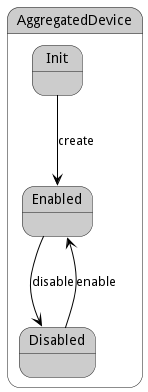

# AggregatedDevice

This is a construct that has other devices under it

## Attributes

* name:string - Name of the aggregated device
* ename:string - Extended name of the aggregated device
* hostname:string - Hostname of the device
* type:string - Type of the Device

## Associations

| Name | Cardinality | Class | Composition | Owner | Description |
| --- | --- | --- | --- | --- | --- |
| devices | n | Device | false | true |  |
| profile | 1 | PhysicalProfile | true |  |  |
| datacenter | 1 | DataCenter | false | false |  |
| hardware | n | Hardware | false | true |  |
| parent | 1 | AggregatedDevice | false | false |  |

## Users of the Model

| Name | Cardinality | Class | Composition | Owner | Description |
| --- | --- | --- | --- | --- | --- |
| parent | 1 | AggregatedDevice | false | false |  |
| adevices | n | DataCenter | false | true |  |
| parent | 1 | Device | false | false |  |
| adevices | n | Cloud | false | false |  |
| aggregates | n | Request | false | false |  |

## State Net
The AggregatedDevice has a state net corresponding to instances of the class. Each state transistion will emit an 
event that can be caught with a websocket client. The name of the event is the name of the state in all lower case.
The following diagram is the state net for this class.

| Name | Description | Events |
| --- | --- | --- |
| Init |  | create-&gt;Enabled,  |
| Enabled |  | disable-&gt;Disabled,  |
| Disabled |  | enable-&gt;Enabled,  |

## Methods
* [addDevices() - Add Devices to the Aggregated Device](#action-addDevices)
* [disable() - Disable Device and its hardware](#action-disable)
* [enable() - Enable Device to be used.](#action-enable)
* [reserve() - Reserve a resource](#action-reserve)
* [addToHardware() - Create a Device](#action-addToHardware)
* [archiveData() - Archive all data related to this device](#action-archiveData)
* [create() - Create a Device](#action-create)
* [disableAllFunctions() - Disable all functions of this device](#action-disableAllFunctions)
* [displayReservations() - Display all the reservations for this device](#action-displayReservations)
* [enableAllFunctions() - Enable all functions of this device](#action-enableAllFunctions)
* [getReservations() - Get reservation from the requirements](#action-getReservations)
* [initiateDevice() - Initiate the device after creation](#action-initiateDevice)
* [logDeviceStatus() - Log the status of the device when moving from this state](#action-logDeviceStatus)
* [provision() - Provision Hardware to meet the requirements](#action-provision)
* [reserveResource() - Reserve a resource through this device](#action-reserveResource)
* [setupHardware() - Setup the hardware according to the provision](#action-setupHardware)
* [updateDeviceGroup() - Update the device group after a new device is added or removed](#action-updateDeviceGroup)
* [updateHardware() - Update the hardware after a device is added](#action-updateHardware)
* [updateStatus() - Update the status of device after an update](#action-updateStatus)

<h2>Method Details</h2>
    
### Action aggregateddevice addDevices

* REST - aggregateddevice/addDevices?item=object
* bin - aggregateddevice addDevices --item object
* js - aggregateddevice.addDevices({ item:object })

#### Description
Add Devices to the Aggregated Device

#### Parameters

| Name | Type | Required | Description |
|---|---|---|---|
| item | object |true | Devices to add to the Aggregated Device |

### Action aggregateddevice disable

* REST - aggregateddevice/disable?
* bin - aggregateddevice disable 
* js - aggregateddevice.disable({  })

#### Description
Disable Device and its hardware

#### Parameters

No parameters

### Action aggregateddevice enable

* REST - aggregateddevice/enable?
* bin - aggregateddevice enable 
* js - aggregateddevice.enable({  })

#### Description
Enable Device to be used.

#### Parameters

No parameters

### Action aggregateddevice reserve

* REST - aggregateddevice/reserve?request=object
* bin - aggregateddevice reserve --request object
* js - aggregateddevice.reserve({ request:object })

#### Description
Reserve a resource

#### Parameters

| Name | Type | Required | Description |
|---|---|---|---|
| request | object |true | Request for the reservation |

### Action aggregateddevice addToHardware

* REST - aggregateddevice/addToHardware?
* bin - aggregateddevice addToHardware 
* js - aggregateddevice.addToHardware({  })

#### Description
Create a Device

#### Parameters

No parameters

### Action aggregateddevice archiveData

* REST - aggregateddevice/archiveData?deviceName=string
* bin - aggregateddevice archiveData --deviceName string
* js - aggregateddevice.archiveData({ deviceName:string })

#### Description
Archive all data related to this device

#### Parameters

| Name | Type | Required | Description |
|---|---|---|---|
| deviceName | string | | Name of the device |

### Action aggregateddevice create

* REST - aggregateddevice/create?name=string&amp;file=YAML
* bin - aggregateddevice create --name string --file YAML
* js - aggregateddevice.create({ name:string,file:YAML })

#### Description
Create a Device

#### Parameters

| Name | Type | Required | Description |
|---|---|---|---|
| name | string |true | name of the device |
| file | YAML |false | file with the definition |

### Action aggregateddevice disableAllFunctions

* REST - aggregateddevice/disableAllFunctions?
* bin - aggregateddevice disableAllFunctions 
* js - aggregateddevice.disableAllFunctions({  })

#### Description
Disable all functions of this device

#### Parameters

No parameters

### Action aggregateddevice displayReservations

* REST - aggregateddevice/displayReservations?deviceName=string
* bin - aggregateddevice displayReservations --deviceName string
* js - aggregateddevice.displayReservations({ deviceName:string })

#### Description
Display all the reservations for this device

#### Parameters

| Name | Type | Required | Description |
|---|---|---|---|
| deviceName | string | | Name of the device |

### Action aggregateddevice enableAllFunctions

* REST - aggregateddevice/enableAllFunctions?
* bin - aggregateddevice enableAllFunctions 
* js - aggregateddevice.enableAllFunctions({  })

#### Description
Enable all functions of this device

#### Parameters

No parameters

### Action aggregateddevice getReservations

* REST - aggregateddevice/getReservations?requirements=YAML
* bin - aggregateddevice getReservations --requirements YAML
* js - aggregateddevice.getReservations({ requirements:YAML })

#### Description
Get reservation from the requirements

#### Parameters

| Name | Type | Required | Description |
|---|---|---|---|
| requirements | YAML |true | Requirements for the Reservation |

### Action aggregateddevice initiateDevice

* REST - aggregateddevice/initiateDevice?deviceName=string
* bin - aggregateddevice initiateDevice --deviceName string
* js - aggregateddevice.initiateDevice({ deviceName:string })

#### Description
Initiate the device after creation

#### Parameters

| Name | Type | Required | Description |
|---|---|---|---|
| deviceName | string | | Name of the device |

### Action aggregateddevice logDeviceStatus

* REST - aggregateddevice/logDeviceStatus?deviceName=string
* bin - aggregateddevice logDeviceStatus --deviceName string
* js - aggregateddevice.logDeviceStatus({ deviceName:string })

#### Description
Log the status of the device when moving from this state

#### Parameters

| Name | Type | Required | Description |
|---|---|---|---|
| deviceName | string | | Name of the device |

### Action aggregateddevice provision

* REST - aggregateddevice/provision?requirements=json
* bin - aggregateddevice provision --requirements json
* js - aggregateddevice.provision({ requirements:json })

#### Description
Provision Hardware to meet the requirements

#### Parameters

| Name | Type | Required | Description |
|---|---|---|---|
| requirements | json |true | Requirements for the Provision |

### Action aggregateddevice reserveResource

* REST - aggregateddevice/reserveResource?deviceName=string&amp;resource=string
* bin - aggregateddevice reserveResource --deviceName string --resource string
* js - aggregateddevice.reserveResource({ deviceName:string,resource:string })

#### Description
Reserve a resource through this device

#### Parameters

| Name | Type | Required | Description |
|---|---|---|---|
| deviceName | string | | Name of the device |
| resource | string | | Resource to reserve |

### Action aggregateddevice setupHardware

* REST - aggregateddevice/setupHardware?deviceName=string&amp;hardwareConfig=json
* bin - aggregateddevice setupHardware --deviceName string --hardwareConfig json
* js - aggregateddevice.setupHardware({ deviceName:string,hardwareConfig:json })

#### Description
Setup the hardware according to the provision

#### Parameters

| Name | Type | Required | Description |
|---|---|---|---|
| deviceName | string | | Name of the device |
| hardwareConfig | json | | Hardware configuration |

### Action aggregateddevice updateDeviceGroup

* REST - aggregateddevice/updateDeviceGroup?deviceName=string&amp;groupName=string
* bin - aggregateddevice updateDeviceGroup --deviceName string --groupName string
* js - aggregateddevice.updateDeviceGroup({ deviceName:string,groupName:string })

#### Description
Update the device group after a new device is added or removed

#### Parameters

| Name | Type | Required | Description |
|---|---|---|---|
| deviceName | string | | Name of the device |
| groupName | string | | Name of the device group |

### Action aggregateddevice updateHardware

* REST - aggregateddevice/updateHardware?deviceName=string
* bin - aggregateddevice updateHardware --deviceName string
* js - aggregateddevice.updateHardware({ deviceName:string })

#### Description
Update the hardware after a device is added

#### Parameters

| Name | Type | Required | Description |
|---|---|---|---|
| deviceName | string | | Name of the device |

### Action aggregateddevice updateStatus

* REST - aggregateddevice/updateStatus?deviceName=string
* bin - aggregateddevice updateStatus --deviceName string
* js - aggregateddevice.updateStatus({ deviceName:string })

#### Description
Update the status of device after an update

#### Parameters

| Name | Type | Required | Description |
|---|---|---|---|
| deviceName | string | | Name of the device |

