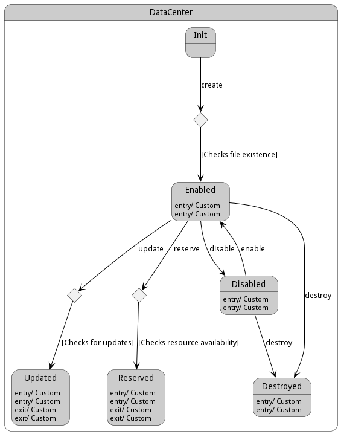

# DataCenter

The &#34;DataCenter&#34; class, belonging to the CPL package, facilitates the management of physical data centers, including operations such as creating, updating, disabling, enabling, and destroying data centers, managing devices within the data center, capacity planning, and handling device reservations.

## Attributes

* name:string - Name of the Datacenter

## Associations

| Name | Cardinality | Class | Composition | Owner | Description |
| --- | --- | --- | --- | --- | --- |
| profile | 1 | PhysicalProfile | true |  |  |
| devices | n | Device | false | true |  |
| adevices | n | AggregatedDevice | false | true |  |

## Users of the Model

| Name | Cardinality | Class | Composition | Owner | Description |
| --- | --- | --- | --- | --- | --- |
| datacenter | 1 | AggregatedDevice | false | false |  |
| datacenter | 1 | Device | false | false |  |
| datacenters | n | Cloud | false | false |  |
| datacenters | n | Request | false | false |  |

## State Net
The DataCenter has a state net corresponding to instances of the class. Each state transistion will emit an 
event that can be caught with a websocket client. The name of the event is the name of the state in all lower case.
The following diagram is the state net for this class.

| Name | Description | Events |
| --- | --- | --- |
| Init | Data Center is not created | create-&gt;Enabled,  |
| Enabled | Data Center is enabled | disable-&gt;Disabled, destroy-&gt;Destroyed, update-&gt;Updated, reserve-&gt;Reserved,  |
| Disabled | Data Center is disabled | enable-&gt;Enabled, destroy-&gt;Destroyed,  |
| Destroyed | Data Center is destroyed |  |
| Updated | Data Center is updated |  |
| Reserved | Resource is reserved |  |

## Methods
* [addAdevices() - Add Adevices to the Data Center](#action-addAdevices)
* [addDevices() - Add Devices to the Data Center](#action-addDevices)
* [create() - Create a Data Center](#action-create)
* [disable() - Disable Device and its hardware](#action-disable)
* [enable() - Enable Device to be used.](#action-enable)
* [getAdevices() - Get all Aggregated Devices associated with the Data Center](#action-getAdevices)
* [getDevice() - Get specific device details in the Data Center](#action-getDevice)
* [getDevices() - Get all devices associated with the Data Center](#action-getDevices)
* [getReservedResources() - Get List of all reserved resources in the Data Center](#action-getReservedResources)
* [removeAdevices() - Remove Aggregated Devices from the data center](#action-removeAdevices)
* [removeDevices() - Remove Devices from the data center](#action-removeDevices)
* [reserve() - Reserve a resource](#action-reserve)

<h2>Method Details</h2>
    
### Action datacenter addAdevices

* REST - datacenter/addAdevices?item=object
* bin - datacenter addAdevices --item object
* js - datacenter.addAdevices({ item:object })

#### Description
Add Adevices to the Data Center

#### Parameters

| Name | Type | Required | Description |
|---|---|---|---|
| item | object |true | Adevices to add to the Data Center |

### Action datacenter addDevices

* REST - datacenter/addDevices?datacenter=string&amp;parentDevice=string&amp;file=YAML
* bin - datacenter addDevices --datacenter string --parentDevice string --file YAML
* js - datacenter.addDevices({ datacenter:string,parentDevice:string,file:YAML })

#### Description
Add Devices to the Data Center

#### Parameters

| Name | Type | Required | Description |
|---|---|---|---|
| datacenter | string |false | Name of the Data Center |
| parentDevice | string |false | Name of the Parent Device |
| file | YAML |false | file with the definition |

### Action datacenter create

* REST - datacenter/create?name=string&amp;file=YAML
* bin - datacenter create --name string --file YAML
* js - datacenter.create({ name:string,file:YAML })

#### Description
Create a Data Center

#### Parameters

| Name | Type | Required | Description |
|---|---|---|---|
| name | string |true | name of the DataCenter |
| file | YAML |false | file with the definition |

### Action datacenter disable

* REST - datacenter/disable?
* bin - datacenter disable 
* js - datacenter.disable({  })

#### Description
Disable Device and its hardware

#### Parameters

No parameters

### Action datacenter enable

* REST - datacenter/enable?
* bin - datacenter enable 
* js - datacenter.enable({  })

#### Description
Enable Device to be used.

#### Parameters

No parameters

### Action datacenter getAdevices

* REST - datacenter/getAdevices?dataCenterName=string
* bin - datacenter getAdevices --dataCenterName string
* js - datacenter.getAdevices({ dataCenterName:string })

#### Description
Get all Aggregated Devices associated with the Data Center

#### Parameters

| Name | Type | Required | Description |
|---|---|---|---|
| dataCenterName | string | | Name of the Data Center |

### Action datacenter getDevice

* REST - datacenter/getDevice?dataCenterName=string&amp;deviceName=string
* bin - datacenter getDevice --dataCenterName string --deviceName string
* js - datacenter.getDevice({ dataCenterName:string,deviceName:string })

#### Description
Get specific device details in the Data Center

#### Parameters

| Name | Type | Required | Description |
|---|---|---|---|
| dataCenterName | string | | Name of the Data Center |
| deviceName | string | | Name of the Device |

### Action datacenter getDevices

* REST - datacenter/getDevices?dataCenterName=string
* bin - datacenter getDevices --dataCenterName string
* js - datacenter.getDevices({ dataCenterName:string })

#### Description
Get all devices associated with the Data Center

#### Parameters

| Name | Type | Required | Description |
|---|---|---|---|
| dataCenterName | string | | Name of the Data Center |

### Action datacenter getReservedResources

* REST - datacenter/getReservedResources?dataCenterName=string
* bin - datacenter getReservedResources --dataCenterName string
* js - datacenter.getReservedResources({ dataCenterName:string })

#### Description
Get List of all reserved resources in the Data Center

#### Parameters

| Name | Type | Required | Description |
|---|---|---|---|
| dataCenterName | string | | Name of the Data Center |

### Action datacenter removeAdevices

* REST - datacenter/removeAdevices?dataCenterName=string&amp;adevices=array
* bin - datacenter removeAdevices --dataCenterName string --adevices array
* js - datacenter.removeAdevices({ dataCenterName:string,adevices:array })

#### Description
Remove Aggregated Devices from the data center

#### Parameters

| Name | Type | Required | Description |
|---|---|---|---|
| dataCenterName | string | | Name of the Data Center |
| adevices | array | | List of aggregated device names to be removed |

### Action datacenter removeDevices

* REST - datacenter/removeDevices?dataCenterName=string&amp;devices=array
* bin - datacenter removeDevices --dataCenterName string --devices array
* js - datacenter.removeDevices({ dataCenterName:string,devices:array })

#### Description
Remove Devices from the data center

#### Parameters

| Name | Type | Required | Description |
|---|---|---|---|
| dataCenterName | string | | Name of the Data Center |
| devices | array | | List of device names to be removed |

### Action datacenter reserve

* REST - datacenter/reserve?request=object
* bin - datacenter reserve --request object
* js - datacenter.reserve({ request:object })

#### Description
Reserve a resource

#### Parameters

| Name | Type | Required | Description |
|---|---|---|---|
| request | object |true | Request for the reservation |

