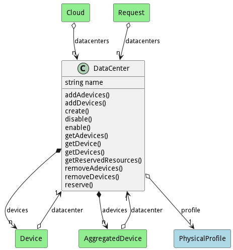

# DataCenter

This represent the physical data center and contains several devices

## Attributes

* name:string - Name of the Datacenter

## Associations

| Name | Cardinality | Class | Composition | Owner | Description |
| --- | --- | --- | --- | --- | --- |
| profile | 1 | PhysicalProfile | true |  |  |
| devices | n | Device | false | true |  |
| adevices | n | AggregatedDevice | false | true |  |

## Users of the Model

| Name | Cardinality | Class | Composition | Owner | Description |
| --- | --- | --- | --- | --- | --- |
| datacenter | 1 | AggregatedDevice | false | false |  |
| datacenter | 1 | Device | false | false |  |
| datacenters | n | Cloud | false | false |  |
| datacenters | n | Request | false | false |  |

## State Net
The DataCenter has a state net corresponding to instances of the class. Each state transistion will emit an 
event that can be caught with a websocket client. The name of the event is the name of the state in all lower case.
The following diagram is the state net for this class.

| Name | Description | Events |
| --- | --- | --- |
| Init |  | create-&gt;Enabled,  |
| Enabled |  | disable-&gt;Disabled,  |
| Disabled |  | enable-&gt;Enabled,  |

## Methods
* [addAdevices() - Add Adevices to the Data Center](#action-addAdevices)
* [addDevices() - Add Devices to the Data Center](#action-addDevices)
* [create() - Create a Data Center](#action-create)
* [disable() - Disable Device and its hardware](#action-disable)
* [enable() - Enable Device to be used.](#action-enable)
* [reserve() - Reserve a resource](#action-reserve)

<h2>Method Details</h2>
    
### Action datacenter addAdevices

* REST - datacenter/addAdevices?item=object
* bin - datacenter addAdevices --item object
* js - datacenter.addAdevices({ item:object })

#### Description
Add Adevices to the Data Center

#### Parameters

| Name | Type | Required | Description |
|---|---|---|---|
| item | object |true | Adevices to add to the Data Center |

### Action datacenter addDevices

* REST - datacenter/addDevices?datacenter=string&amp;parentDevice=string&amp;file=YAML
* bin - datacenter addDevices --datacenter string --parentDevice string --file YAML
* js - datacenter.addDevices({ datacenter:string,parentDevice:string,file:YAML })

#### Description
Add Devices to the Data Center

#### Parameters

| Name | Type | Required | Description |
|---|---|---|---|
| datacenter | string |false | Name of the Data Center |
| parentDevice | string |false | Name of the Parent Device |
| file | YAML |false | file with the definition |

### Action datacenter create

* REST - datacenter/create?name=string&amp;file=YAML
* bin - datacenter create --name string --file YAML
* js - datacenter.create({ name:string,file:YAML })

#### Description
Create a Data Center

#### Parameters

| Name | Type | Required | Description |
|---|---|---|---|
| name | string |true | name of the DataCenter |
| file | YAML |false | file with the definition |

### Action datacenter disable

* REST - datacenter/disable?
* bin - datacenter disable 
* js - datacenter.disable({  })

#### Description
Disable Device and its hardware

#### Parameters

No parameters

### Action datacenter enable

* REST - datacenter/enable?
* bin - datacenter enable 
* js - datacenter.enable({  })

#### Description
Enable Device to be used.

#### Parameters

No parameters

### Action datacenter reserve

* REST - datacenter/reserve?request=object
* bin - datacenter reserve --request object
* js - datacenter.reserve({ request:object })

#### Description
Reserve a resource

#### Parameters

| Name | Type | Required | Description |
|---|---|---|---|
| request | object |true | Request for the reservation |

