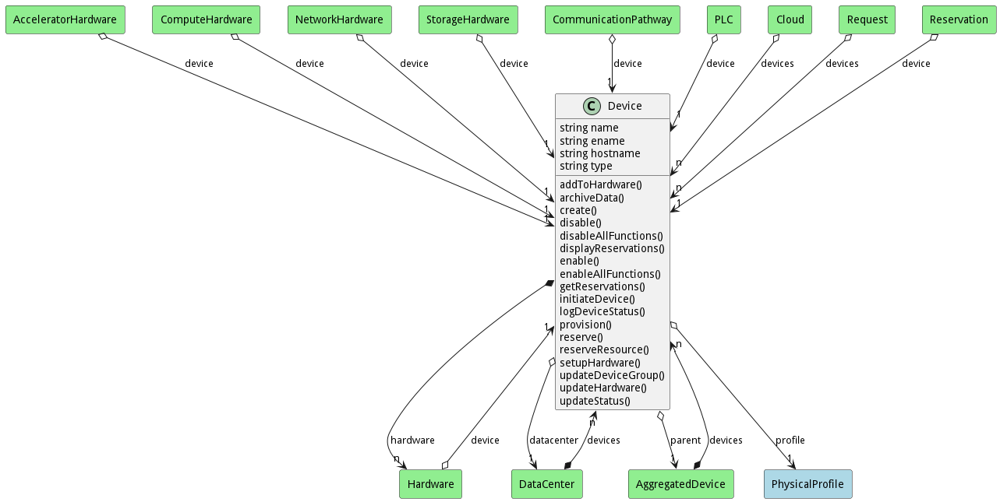

# Device

Representation of a device in a datacenter

## Attributes

* name:string - Name of the device
* ename:string - Extended Name of the device
* hostname:string - Hostname of the device
* type:string - Type of the Device

## Associations

| Name | Cardinality | Class | Composition | Owner | Description |
| --- | --- | --- | --- | --- | --- |
| profile | 1 | PhysicalProfile | true |  |  |
| hardware | n | Hardware | false | true |  |
| datacenter | 1 | DataCenter | false | false |  |
| parent | 1 | AggregatedDevice | false | false |  |

## Users of the Model

| Name | Cardinality | Class | Composition | Owner | Description |
| --- | --- | --- | --- | --- | --- |
| devices | n | AggregatedDevice | false | true |  |
| devices | n | DataCenter | false | true |  |
| device | 1 | Hardware | false | false |  |
| devices | n | Cloud | false | false |  |
| devices | n | Request | false | false |  |
| device | 1 | Reservation | false | false |  |
| device | 1 | AcceleratorHardware | false | false |  |
| device | 1 | ComputeHardware | false | false |  |
| device | 1 | NetworkHardware | false | false |  |
| device | 1 | StorageHardware | false | false |  |

## State Net
The Device has a state net corresponding to instances of the class. Each state transistion will emit an 
event that can be caught with a websocket client. The name of the event is the name of the state in all lower case.
The following diagram is the state net for this class.

| Name | Description | Events |
| --- | --- | --- |
| Init |  | create-&gt;Enabled, reserve-&gt;Enabled,  |
| Enabled |  | disable-&gt;Disabled,  |
| Disabled |  | enable-&gt;Enabled,  |

## Methods

* [addToHardware() - Create a Device](#action-addToHardware)

* [create() - Create a Device](#action-create)

* [disable() - Disable Device and its hardware](#action-disable)

* [enable() - Enable Device to be used.](#action-enable)

* [getReservations() - Get reservation from the requirements](#action-getReservations)

* [provision() - Provision Hardware to meet the requirements](#action-provision)

* [reserve() - Reserve a resource](#action-reserve)

<h2>Method Details</h2>
    
### Action device addToHardware

* REST - device/addToHardware?
* bin - device addToHardware 
* js - device.addToHardware({  })

#### Description
Create a Device

#### Parameters

No parameters

### Action device create

* REST - device/create?name=string&amp;file=YAML
* bin - device create --name string --file YAML
* js - device.create({ name:string,file:YAML })

#### Description
Create a Device

#### Parameters

| Name | Type | Required | Description |
|---|---|---|---|
| name | string |true | name of the device |
| file | YAML |false | file with the definition |

### Action device disable

* REST - device/disable?
* bin - device disable 
* js - device.disable({  })

#### Description
Disable Device and its hardware

#### Parameters

No parameters

### Action device enable

* REST - device/enable?
* bin - device enable 
* js - device.enable({  })

#### Description
Enable Device to be used.

#### Parameters

No parameters

### Action device getReservations

* REST - device/getReservations?requirements=YAML
* bin - device getReservations --requirements YAML
* js - device.getReservations({ requirements:YAML })

#### Description
Get reservation from the requirements

#### Parameters

| Name | Type | Required | Description |
|---|---|---|---|
| requirements | YAML |true | Requirements for the Reservation |

### Action device provision

* REST - device/provision?requirements=json
* bin - device provision --requirements json
* js - device.provision({ requirements:json })

#### Description
Provision Hardware to meet the requirements

#### Parameters

| Name | Type | Required | Description |
|---|---|---|---|
| requirements | json |true | Requirements for the Provision |

### Action device reserve

* REST - device/reserve?request=object
* bin - device reserve --request object
* js - device.reserve({ request:object })

#### Description
Reserve a resource

#### Parameters

| Name | Type | Required | Description |
|---|---|---|---|
| request | object |true | Request for the reservation |

