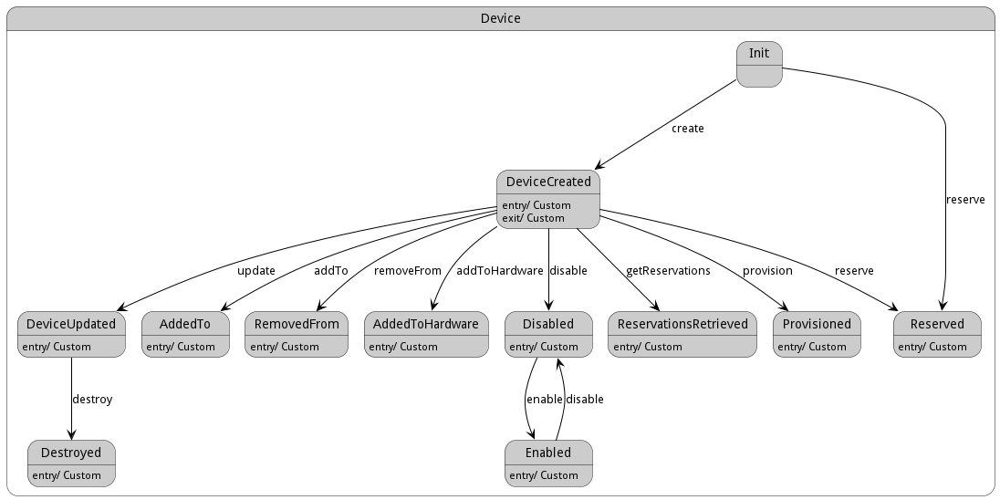

# Device

The &#34;Device&#34; class in the &#34;cpl&#34; package represents a device in a data center and provides functions for device management such as creation, update, addition to hardware, enabling, disabling, and reserving resources, along with key attributes like device name, hostname, and type.

## Attributes

* name:string - Name of the device
* ename:string - Extended Name of the device
* hostname:string - Hostname of the device
* type:string - Type of the Device

## Associations

| Name | Cardinality | Class | Composition | Owner | Description |
| --- | --- | --- | --- | --- | --- |
| profile | 1 | PhysicalProfile | true |  |  |
| hardware | n | Hardware | false | true |  |
| datacenter | 1 | DataCenter | false | false |  |
| parent | 1 | AggregatedDevice | false | false |  |

## Users of the Model

| Name | Cardinality | Class | Composition | Owner | Description |
| --- | --- | --- | --- | --- | --- |
| device | 1 | AcceleratorHardware | false | false |  |
| devices | n | AggregatedDevice | false | true |  |
| device | 1 | ComputeHardware | false | false |  |
| devices | n | DataCenter | false | true |  |
| device | 1 | Hardware | false | false |  |
| device | 1 | NetworkHardware | false | false |  |
| device | 1 | StorageHardware | false | false |  |
| device | 1 | CommunicationPathway | false | false |  |
| device | 1 | PLC | false | false | Association with Device |
| devices | n | Cloud | false | false |  |
| devices | n | Request | false | false |  |
| device | 1 | Reservation | false | false |  |

## State Net
The Device has a state net corresponding to instances of the class. Each state transistion will emit an 
event that can be caught with a websocket client. The name of the event is the name of the state in all lower case.
The following diagram is the state net for this class.

| Name | Description | Events |
| --- | --- | --- |
| Init | In the initial state | create-&gt;DeviceCreated, reserve-&gt;Reserved,  |
| DeviceCreated | Device has been created | update-&gt;DeviceUpdated, addTo-&gt;AddedTo, removeFrom-&gt;RemovedFrom, addToHardware-&gt;AddedToHardware, disable-&gt;Disabled, getReservations-&gt;ReservationsRetrieved, provision-&gt;Provisioned, reserve-&gt;Reserved,  |
| DeviceUpdated | Device has been updated | destroy-&gt;Destroyed,  |
| AddedTo | Device has been added to a device group |  |
| RemovedFrom | Device has been removed from a device group |  |
| AddedToHardware | Device has been added to hardware |  |
| Disabled | Device is inactive | enable-&gt;Enabled,  |
| ReservationsRetrieved | Retrieved reservations for the device |  |
| Provisioned | Hardware has been provisioned to meet specific requirements |  |
| Reserved | A resource have been reserved through this device |  |
| Destroyed | Device has been terminated |  |
| Enabled | Device is active | disable-&gt;Disabled,  |

## Methods
* [addToHardware() - Create a Device](#action-addToHardware)
* [archiveData() - Archive all data related to this device](#action-archiveData)
* [create() - Create a Device](#action-create)
* [disable() - Disable Device and its hardware](#action-disable)
* [disableAllFunctions() - Disable all functions of this device](#action-disableAllFunctions)
* [displayReservations() - Display all the reservations for this device](#action-displayReservations)
* [enable() - Enable Device to be used.](#action-enable)
* [enableAllFunctions() - Enable all functions of this device](#action-enableAllFunctions)
* [getReservations() - Get reservation from the requirements](#action-getReservations)
* [initiateDevice() - Initiate the device after creation](#action-initiateDevice)
* [logDeviceStatus() - Log the status of the device when moving from this state](#action-logDeviceStatus)
* [provision() - Provision Hardware to meet the requirements](#action-provision)
* [reserve() - Reserve a resource](#action-reserve)
* [reserveResource() - Reserve a resource through this device](#action-reserveResource)
* [setupHardware() - Setup the hardware according to the provision](#action-setupHardware)
* [updateDeviceGroup() - Update the device group after a new device is added or removed](#action-updateDeviceGroup)
* [updateHardware() - Update the hardware after a device is added](#action-updateHardware)
* [updateStatus() - Update the status of device after an update](#action-updateStatus)

<h2>Method Details</h2>
    
### Action device addToHardware

* REST - device/addToHardware?
* bin - device addToHardware 
* js - device.addToHardware({  })

#### Description
Create a Device

#### Parameters

No parameters

### Action device archiveData

* REST - device/archiveData?deviceName=string
* bin - device archiveData --deviceName string
* js - device.archiveData({ deviceName:string })

#### Description
Archive all data related to this device

#### Parameters

| Name | Type | Required | Description |
|---|---|---|---|
| deviceName | string | | Name of the device |

### Action device create

* REST - device/create?name=string&amp;file=YAML
* bin - device create --name string --file YAML
* js - device.create({ name:string,file:YAML })

#### Description
Create a Device

#### Parameters

| Name | Type | Required | Description |
|---|---|---|---|
| name | string |true | name of the device |
| file | YAML |false | file with the definition |

### Action device disable

* REST - device/disable?
* bin - device disable 
* js - device.disable({  })

#### Description
Disable Device and its hardware

#### Parameters

No parameters

### Action device disableAllFunctions

* REST - device/disableAllFunctions?
* bin - device disableAllFunctions 
* js - device.disableAllFunctions({  })

#### Description
Disable all functions of this device

#### Parameters

No parameters

### Action device displayReservations

* REST - device/displayReservations?deviceName=string
* bin - device displayReservations --deviceName string
* js - device.displayReservations({ deviceName:string })

#### Description
Display all the reservations for this device

#### Parameters

| Name | Type | Required | Description |
|---|---|---|---|
| deviceName | string | | Name of the device |

### Action device enable

* REST - device/enable?
* bin - device enable 
* js - device.enable({  })

#### Description
Enable Device to be used.

#### Parameters

No parameters

### Action device enableAllFunctions

* REST - device/enableAllFunctions?
* bin - device enableAllFunctions 
* js - device.enableAllFunctions({  })

#### Description
Enable all functions of this device

#### Parameters

No parameters

### Action device getReservations

* REST - device/getReservations?requirements=YAML
* bin - device getReservations --requirements YAML
* js - device.getReservations({ requirements:YAML })

#### Description
Get reservation from the requirements

#### Parameters

| Name | Type | Required | Description |
|---|---|---|---|
| requirements | YAML |true | Requirements for the Reservation |

### Action device initiateDevice

* REST - device/initiateDevice?deviceName=string
* bin - device initiateDevice --deviceName string
* js - device.initiateDevice({ deviceName:string })

#### Description
Initiate the device after creation

#### Parameters

| Name | Type | Required | Description |
|---|---|---|---|
| deviceName | string | | Name of the device |

### Action device logDeviceStatus

* REST - device/logDeviceStatus?deviceName=string
* bin - device logDeviceStatus --deviceName string
* js - device.logDeviceStatus({ deviceName:string })

#### Description
Log the status of the device when moving from this state

#### Parameters

| Name | Type | Required | Description |
|---|---|---|---|
| deviceName | string | | Name of the device |

### Action device provision

* REST - device/provision?requirements=json
* bin - device provision --requirements json
* js - device.provision({ requirements:json })

#### Description
Provision Hardware to meet the requirements

#### Parameters

| Name | Type | Required | Description |
|---|---|---|---|
| requirements | json |true | Requirements for the Provision |

### Action device reserve

* REST - device/reserve?request=object
* bin - device reserve --request object
* js - device.reserve({ request:object })

#### Description
Reserve a resource

#### Parameters

| Name | Type | Required | Description |
|---|---|---|---|
| request | object |true | Request for the reservation |

### Action device reserveResource

* REST - device/reserveResource?deviceName=string&amp;resource=string
* bin - device reserveResource --deviceName string --resource string
* js - device.reserveResource({ deviceName:string,resource:string })

#### Description
Reserve a resource through this device

#### Parameters

| Name | Type | Required | Description |
|---|---|---|---|
| deviceName | string | | Name of the device |
| resource | string | | Resource to reserve |

### Action device setupHardware

* REST - device/setupHardware?deviceName=string&amp;hardwareConfig=json
* bin - device setupHardware --deviceName string --hardwareConfig json
* js - device.setupHardware({ deviceName:string,hardwareConfig:json })

#### Description
Setup the hardware according to the provision

#### Parameters

| Name | Type | Required | Description |
|---|---|---|---|
| deviceName | string | | Name of the device |
| hardwareConfig | json | | Hardware configuration |

### Action device updateDeviceGroup

* REST - device/updateDeviceGroup?deviceName=string&amp;groupName=string
* bin - device updateDeviceGroup --deviceName string --groupName string
* js - device.updateDeviceGroup({ deviceName:string,groupName:string })

#### Description
Update the device group after a new device is added or removed

#### Parameters

| Name | Type | Required | Description |
|---|---|---|---|
| deviceName | string | | Name of the device |
| groupName | string | | Name of the device group |

### Action device updateHardware

* REST - device/updateHardware?deviceName=string
* bin - device updateHardware --deviceName string
* js - device.updateHardware({ deviceName:string })

#### Description
Update the hardware after a device is added

#### Parameters

| Name | Type | Required | Description |
|---|---|---|---|
| deviceName | string | | Name of the device |

### Action device updateStatus

* REST - device/updateStatus?deviceName=string
* bin - device updateStatus --deviceName string
* js - device.updateStatus({ deviceName:string })

#### Description
Update the status of device after an update

#### Parameters

| Name | Type | Required | Description |
|---|---|---|---|
| deviceName | string | | Name of the device |

