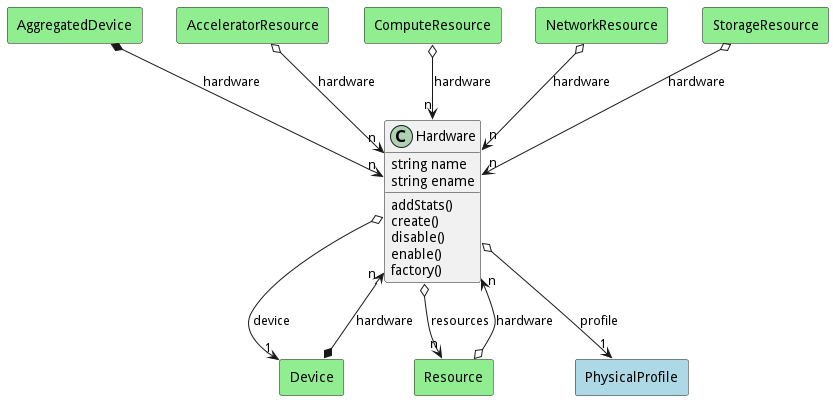

# Hardware

This represents physical hardware in a device

## Attributes

* name:string - Name of the hardware
* ename:string - Extended Name of the hardware

## Associations

| Name | Cardinality | Class | Composition | Owner | Description |
| --- | --- | --- | --- | --- | --- |
| profile | 1 | PhysicalProfile | true |  |  |
| device | 1 | Device | false | false |  |
| resources | n | Resource | false | false |  |

## Users of the Model

| Name | Cardinality | Class | Composition | Owner | Description |
| --- | --- | --- | --- | --- | --- |
| hardware | n | Device | false | true |  |
| hardware | n | Resource | false | false |  |
| hardware | n | AggregatedDevice | false | true |  |
| hardware | n | AcceleratorResource | false | false |  |
| hardware | n | ComputeResource | false | false |  |
| hardware | n | NetworkResource | false | false |  |
| hardware | n | StorageResource | false | false |  |

## State Net
The Hardware has a state net corresponding to instances of the class. Each state transistion will emit an 
event that can be caught with a websocket client. The name of the event is the name of the state in all lower case.
The following diagram is the state net for this class.

| Name | Description | Events |
| --- | --- | --- |
| Init |  | create-&gt;Enabled,  |
| Enabled |  | disable-&gt;Disabled,  |
| Disabled |  | enable-&gt;Enabled,  |

## Methods

* [addStats() - Add Stats to the Hardware](#action-addStats)

* [create() - Create Hardware](#action-create)

* [disable() - Disable Device and its hardware](#action-disable)

* [enable() - Enable Device to be used.](#action-enable)

* [factory() - Create Hardware based on properties](#action-factory)

<h2>Method Details</h2>
    
### Action hardware addStats

* REST - hardware/addStats?stats=json
* bin - hardware addStats --stats json
* js - hardware.addStats({ stats:json })

#### Description
Add Stats to the Hardware

#### Parameters

| Name | Type | Required | Description |
|---|---|---|---|
| stats | json |true | Object Map of the stats |

### Action hardware create

* REST - hardware/create?name=string&amp;capabilities=json
* bin - hardware create --name string --capabilities json
* js - hardware.create({ name:string,capabilities:json })

#### Description
Create Hardware

#### Parameters

| Name | Type | Required | Description |
|---|---|---|---|
| name | string |true | name of the hardware |
| capabilities | json |true | capabilities of the hardware |

### Action hardware disable

* REST - hardware/disable?
* bin - hardware disable 
* js - hardware.disable({  })

#### Description
Disable Device and its hardware

#### Parameters

No parameters

### Action hardware enable

* REST - hardware/enable?
* bin - hardware enable 
* js - hardware.enable({  })

#### Description
Enable Device to be used.

#### Parameters

No parameters

### Action hardware factory

* REST - hardware/factory?name=string&amp;type=string&amp;capabilities=json
* bin - hardware factory --name string --type string --capabilities json
* js - hardware.factory({ name:string,type:string,capabilities:json })

#### Description
Create Hardware based on properties

#### Parameters

| Name | Type | Required | Description |
|---|---|---|---|
| name | string |true | name of the hardware |
| type | string |true | type of the hardware |
| capabilities | json |true | definition of the hardware |

