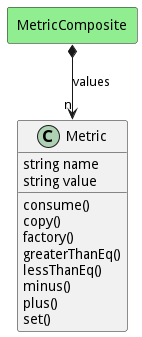

# Metric

Metric stores information about the physical profile. 

## Attributes

* name:string - This is the name of the metric
* value:string - This is the value of the metric

## Associations

No associations

## Users of the Model

| Name | Cardinality | Class | Composition | Owner | Description |
| --- | --- | --- | --- | --- | --- |
| values | n | MetricComposite | true | true |  |

## Methods

* [consume() - Consume value from a metric](#action-consume)

* [copy() - Copy Metric](#action-copy)

* [factory() - Create a metric based on the metrictype table](#action-factory)

* [greaterThanEq() - Test greater than or equal to the value passed in](#action-greaterThanEq)

* [lessThanEq() - Test less than or equal to the value passed in](#action-lessThanEq)

* [minus() - Add value to a metric](#action-minus)

* [plus() - Add value to a metric](#action-plus)

* [set() - Add value to a metric](#action-set)

<h2>Method Details</h2>
    
### Action metric consume

* REST - metric/consume?value=number
* bin - metric consume --value number
* js - metric.consume({ value:number })

#### Description
Consume value from a metric

#### Parameters

| Name | Type | Required | Description |
|---|---|---|---|
| value | number |true | Value to consume from the metric |

### Action metric copy

* REST - metric/copy?
* bin - metric copy 
* js - metric.copy({  })

#### Description
Copy Metric

#### Parameters

No parameters

### Action metric factory

* REST - metric/factory?name=string&amp;value=json
* bin - metric factory --name string --value json
* js - metric.factory({ name:string,value:json })

#### Description
Create a metric based on the metrictype table

#### Parameters

| Name | Type | Required | Description |
|---|---|---|---|
| name | string |true | name of the metric |
| value | json |true | value of the metric |

### Action metric greaterThanEq

* REST - metric/greaterThanEq?value=object
* bin - metric greaterThanEq --value object
* js - metric.greaterThanEq({ value:object })

#### Description
Test greater than or equal to the value passed in

#### Parameters

| Name | Type | Required | Description |
|---|---|---|---|
| value | object |true | Value to test against the metric |

### Action metric lessThanEq

* REST - metric/lessThanEq?value=object
* bin - metric lessThanEq --value object
* js - metric.lessThanEq({ value:object })

#### Description
Test less than or equal to the value passed in

#### Parameters

| Name | Type | Required | Description |
|---|---|---|---|
| value | object |true | Value to test against the metric |

### Action metric minus

* REST - metric/minus?value=number
* bin - metric minus --value number
* js - metric.minus({ value:number })

#### Description
Add value to a metric

#### Parameters

| Name | Type | Required | Description |
|---|---|---|---|
| value | number |true | Value to add to the metric |

### Action metric plus

* REST - metric/plus?value=number
* bin - metric plus --value number
* js - metric.plus({ value:number })

#### Description
Add value to a metric

#### Parameters

| Name | Type | Required | Description |
|---|---|---|---|
| value | number |true | Value to add to the metric |

### Action metric set

* REST - metric/set?value=number
* bin - metric set --value number
* js - metric.set({ value:number })

#### Description
Add value to a metric

#### Parameters

| Name | Type | Required | Description |
|---|---|---|---|
| value | number |true | Value to add to the metric |

