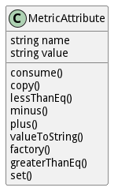

# MetricAttribute

Attribute type of Metric. This is for metrics that are descriptiive not consumable

## Attributes

* name:string - This is the name of the metric
* value:string - This is the value of the metric

## Associations

No associations

## Methods

* [consume() - Consume attribute metric to the current value](#action-consume)

* [copy() - Copy Metric](#action-copy)

* [lessThanEq() - Test less than or equal to the value passed in](#action-lessThanEq)

* [minus() - Add attribute metric to the current value](#action-minus)

* [plus() - Add attribute metric to the current value](#action-plus)

* [valueToString() - Change to string Metric Consumeable](#action-valueToString)

* [factory() - Create a metric based on the metrictype table](#action-factory)

* [greaterThanEq() - Test greater than or equal to the value passed in](#action-greaterThanEq)

* [set() - Add value to a metric](#action-set)

<h2>Method Details</h2>
    
### Action metricattribute consume

* REST - metricattribute/consume?value=object
* bin - metricattribute consume --value object
* js - metricattribute.consume({ value:object })

#### Description
Consume attribute metric to the current value

#### Parameters

| Name | Type | Required | Description |
|---|---|---|---|
| value | object |true | Value to add to the metric |

### Action metricattribute copy

* REST - metricattribute/copy?
* bin - metricattribute copy 
* js - metricattribute.copy({  })

#### Description
Copy Metric

#### Parameters

No parameters

### Action metricattribute lessThanEq

* REST - metricattribute/lessThanEq?value=object
* bin - metricattribute lessThanEq --value object
* js - metricattribute.lessThanEq({ value:object })

#### Description
Test less than or equal to the value passed in

#### Parameters

| Name | Type | Required | Description |
|---|---|---|---|
| value | object |true | Value to test against the metric |

### Action metricattribute minus

* REST - metricattribute/minus?value=object
* bin - metricattribute minus --value object
* js - metricattribute.minus({ value:object })

#### Description
Add attribute metric to the current value

#### Parameters

| Name | Type | Required | Description |
|---|---|---|---|
| value | object |true | Value to add to the metric |

### Action metricattribute plus

* REST - metricattribute/plus?value=object
* bin - metricattribute plus --value object
* js - metricattribute.plus({ value:object })

#### Description
Add attribute metric to the current value

#### Parameters

| Name | Type | Required | Description |
|---|---|---|---|
| value | object |true | Value to add to the metric |

### Action metricattribute valueToString

* REST - metricattribute/valueToString?
* bin - metricattribute valueToString 
* js - metricattribute.valueToString({  })

#### Description
Change to string Metric Consumeable

#### Parameters

No parameters

### Action metricattribute factory

* REST - metricattribute/factory?name=string&amp;value=json
* bin - metricattribute factory --name string --value json
* js - metricattribute.factory({ name:string,value:json })

#### Description
Create a metric based on the metrictype table

#### Parameters

| Name | Type | Required | Description |
|---|---|---|---|
| name | string |true | name of the metric |
| value | json |true | value of the metric |

### Action metricattribute greaterThanEq

* REST - metricattribute/greaterThanEq?value=object
* bin - metricattribute greaterThanEq --value object
* js - metricattribute.greaterThanEq({ value:object })

#### Description
Test greater than or equal to the value passed in

#### Parameters

| Name | Type | Required | Description |
|---|---|---|---|
| value | object |true | Value to test against the metric |

### Action metricattribute set

* REST - metricattribute/set?value=number
* bin - metricattribute set --value number
* js - metricattribute.set({ value:number })

#### Description
Add value to a metric

#### Parameters

| Name | Type | Required | Description |
|---|---|---|---|
| value | number |true | Value to add to the metric |

