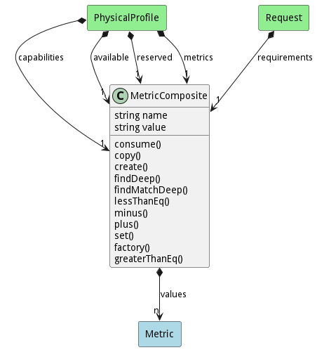

# MetricComposite

Composite type of Metric. This is for metrics that are a group of metrics

## Attributes

* name:string - This is the name of the metric
* value:string - This is the value of the metric

## Associations

| Name | Cardinality | Class | Composition | Owner | Description |
| --- | --- | --- | --- | --- | --- |
| values | n | Metric | true | true |  |

## Users of the Model

| Name | Cardinality | Class | Composition | Owner | Description |
| --- | --- | --- | --- | --- | --- |
| capabilities | 1 | PhysicalProfile |  | true | Capabilities of the element |
| available | 1 | PhysicalProfile |  | true | Availability of the element |
| reserved | 1 | PhysicalProfile |  | true | Reservations of the element |
| metrics | 1 | PhysicalProfile |  | true | Metrics of the element |
| requirements | 1 | Request | true | true |  |
| capabilities | 1 | PhysicalProfile |  | true | Capabilities of the element |
| available | 1 | PhysicalProfile |  | true | Availability of the element |
| reserved | 1 | PhysicalProfile |  | true | Reservations of the element |
| metrics | 1 | PhysicalProfile |  | true | Metrics of the element |
| requirements | 1 | Request | true | true |  |
| capabilities | 1 | PhysicalProfile |  | true | Capabilities of the element |
| available | 1 | PhysicalProfile |  | true | Availability of the element |
| reserved | 1 | PhysicalProfile |  | true | Reservations of the element |
| metrics | 1 | PhysicalProfile |  | true | Metrics of the element |
| requirements | 1 | Request | true | true |  |
| capabilities | 1 | PhysicalProfile |  | true | Capabilities of the element |
| available | 1 | PhysicalProfile |  | true | Availability of the element |
| reserved | 1 | PhysicalProfile |  | true | Reservations of the element |
| metrics | 1 | PhysicalProfile |  | true | Metrics of the element |
| requirements | 1 | Request | true | true |  |
| capabilities | 1 | PhysicalProfile |  | true | Capabilities of the element |
| available | 1 | PhysicalProfile |  | true | Availability of the element |
| reserved | 1 | PhysicalProfile |  | true | Reservations of the element |
| metrics | 1 | PhysicalProfile |  | true | Metrics of the element |
| requirements | 1 | Request | true | true |  |
| capabilities | 1 | PhysicalProfile |  | true | Capabilities of the element |
| available | 1 | PhysicalProfile |  | true | Availability of the element |
| reserved | 1 | PhysicalProfile |  | true | Reservations of the element |
| metrics | 1 | PhysicalProfile |  | true | Metrics of the element |
| requirements | 1 | Request | true | true |  |
| capabilities | 1 | PhysicalProfile |  | true | Capabilities of the element |
| available | 1 | PhysicalProfile |  | true | Availability of the element |
| reserved | 1 | PhysicalProfile |  | true | Reservations of the element |
| metrics | 1 | PhysicalProfile |  | true | Metrics of the element |
| requirements | 1 | Request | true | true |  |
| capabilities | 1 | PhysicalProfile |  | true | Capabilities of the element |
| available | 1 | PhysicalProfile |  | true | Availability of the element |
| reserved | 1 | PhysicalProfile |  | true | Reservations of the element |
| metrics | 1 | PhysicalProfile |  | true | Metrics of the element |
| requirements | 1 | Request | true | true |  |
| capabilities | 1 | PhysicalProfile |  | true | Capabilities of the element |
| available | 1 | PhysicalProfile |  | true | Availability of the element |
| reserved | 1 | PhysicalProfile |  | true | Reservations of the element |
| metrics | 1 | PhysicalProfile |  | true | Metrics of the element |
| requirements | 1 | Request | true | true |  |
| capabilities | 1 | PhysicalProfile |  | true | Capabilities of the element |
| available | 1 | PhysicalProfile |  | true | Availability of the element |
| reserved | 1 | PhysicalProfile |  | true | Reservations of the element |
| metrics | 1 | PhysicalProfile |  | true | Metrics of the element |
| requirements | 1 | Request | true | true |  |
| capabilities | 1 | PhysicalProfile |  | true | Capabilities of the element |
| available | 1 | PhysicalProfile |  | true | Availability of the element |
| reserved | 1 | PhysicalProfile |  | true | Reservations of the element |
| metrics | 1 | PhysicalProfile |  | true | Metrics of the element |
| requirements | 1 | Request | true | true |  |
| capabilities | 1 | PhysicalProfile |  | true | Capabilities of the element |
| available | 1 | PhysicalProfile |  | true | Availability of the element |
| reserved | 1 | PhysicalProfile |  | true | Reservations of the element |
| metrics | 1 | PhysicalProfile |  | true | Metrics of the element |
| requirements | 1 | Request | true | true |  |
| capabilities | 1 | PhysicalProfile |  | true | Capabilities of the element |
| available | 1 | PhysicalProfile |  | true | Availability of the element |
| reserved | 1 | PhysicalProfile |  | true | Reservations of the element |
| metrics | 1 | PhysicalProfile |  | true | Metrics of the element |
| requirements | 1 | Request | true | true |  |
| capabilities | 1 | PhysicalProfile |  | true | Capabilities of the element |
| available | 1 | PhysicalProfile |  | true | Availability of the element |
| reserved | 1 | PhysicalProfile |  | true | Reservations of the element |
| metrics | 1 | PhysicalProfile |  | true | Metrics of the element |
| requirements | 1 | Request | true | true |  |
| capabilities | 1 | PhysicalProfile |  | true | Capabilities of the element |
| available | 1 | PhysicalProfile |  | true | Availability of the element |
| reserved | 1 | PhysicalProfile |  | true | Reservations of the element |
| metrics | 1 | PhysicalProfile |  | true | Metrics of the element |
| requirements | 1 | Request | true | true |  |
| capabilities | 1 | PhysicalProfile |  | true | Capabilities of the element |
| available | 1 | PhysicalProfile |  | true | Availability of the element |
| reserved | 1 | PhysicalProfile |  | true | Reservations of the element |
| metrics | 1 | PhysicalProfile |  | true | Metrics of the element |
| requirements | 1 | Request | true | true |  |
| capabilities | 1 | PhysicalProfile |  | true | Capabilities of the element |
| available | 1 | PhysicalProfile |  | true | Availability of the element |
| reserved | 1 | PhysicalProfile |  | true | Reservations of the element |
| metrics | 1 | PhysicalProfile |  | true | Metrics of the element |
| requirements | 1 | Request | true | true |  |
| capabilities | 1 | PhysicalProfile |  | true | Capabilities of the element |
| available | 1 | PhysicalProfile |  | true | Availability of the element |
| reserved | 1 | PhysicalProfile |  | true | Reservations of the element |
| metrics | 1 | PhysicalProfile |  | true | Metrics of the element |
| requirements | 1 | Request | true | true |  |
| capabilities | 1 | PhysicalProfile |  | true | Capabilities of the element |
| available | 1 | PhysicalProfile |  | true | Availability of the element |
| reserved | 1 | PhysicalProfile |  | true | Reservations of the element |
| metrics | 1 | PhysicalProfile |  | true | Metrics of the element |
| requirements | 1 | Request | true | true |  |
| capabilities | 1 | PhysicalProfile |  | true | Capabilities of the element |
| available | 1 | PhysicalProfile |  | true | Availability of the element |
| reserved | 1 | PhysicalProfile |  | true | Reservations of the element |
| metrics | 1 | PhysicalProfile |  | true | Metrics of the element |
| requirements | 1 | Request | true | true |  |
| capabilities | 1 | PhysicalProfile |  | true | Capabilities of the element |
| available | 1 | PhysicalProfile |  | true | Availability of the element |
| reserved | 1 | PhysicalProfile |  | true | Reservations of the element |
| metrics | 1 | PhysicalProfile |  | true | Metrics of the element |
| requirements | 1 | Request | true | true |  |
| capabilities | 1 | PhysicalProfile |  | true | Capabilities of the element |
| available | 1 | PhysicalProfile |  | true | Availability of the element |
| reserved | 1 | PhysicalProfile |  | true | Reservations of the element |
| metrics | 1 | PhysicalProfile |  | true | Metrics of the element |
| requirements | 1 | Request | true | true |  |
| capabilities | 1 | PhysicalProfile |  | true | Capabilities of the element |
| available | 1 | PhysicalProfile |  | true | Availability of the element |
| reserved | 1 | PhysicalProfile |  | true | Reservations of the element |
| metrics | 1 | PhysicalProfile |  | true | Metrics of the element |
| requirements | 1 | Request | true | true |  |
| capabilities | 1 | PhysicalProfile |  | true | Capabilities of the element |
| available | 1 | PhysicalProfile |  | true | Availability of the element |
| reserved | 1 | PhysicalProfile |  | true | Reservations of the element |
| metrics | 1 | PhysicalProfile |  | true | Metrics of the element |
| requirements | 1 | Request | true | true |  |
| capabilities | 1 | PhysicalProfile |  | true | Capabilities of the element |
| available | 1 | PhysicalProfile |  | true | Availability of the element |
| reserved | 1 | PhysicalProfile |  | true | Reservations of the element |
| metrics | 1 | PhysicalProfile |  | true | Metrics of the element |
| requirements | 1 | Request | true | true |  |
| capabilities | 1 | PhysicalProfile |  | true | Capabilities of the element |
| available | 1 | PhysicalProfile |  | true | Availability of the element |
| reserved | 1 | PhysicalProfile |  | true | Reservations of the element |
| metrics | 1 | PhysicalProfile |  | true | Metrics of the element |
| requirements | 1 | Request | true | true |  |
| capabilities | 1 | PhysicalProfile |  | true | Capabilities of the element |
| available | 1 | PhysicalProfile |  | true | Availability of the element |
| reserved | 1 | PhysicalProfile |  | true | Reservations of the element |
| metrics | 1 | PhysicalProfile |  | true | Metrics of the element |
| requirements | 1 | Request | true | true |  |
| capabilities | 1 | PhysicalProfile |  | true | Capabilities of the element |
| available | 1 | PhysicalProfile |  | true | Availability of the element |
| reserved | 1 | PhysicalProfile |  | true | Reservations of the element |
| metrics | 1 | PhysicalProfile |  | true | Metrics of the element |
| requirements | 1 | Request | true | true |  |
| capabilities | 1 | PhysicalProfile |  | true | Capabilities of the element |
| available | 1 | PhysicalProfile |  | true | Availability of the element |
| reserved | 1 | PhysicalProfile |  | true | Reservations of the element |
| metrics | 1 | PhysicalProfile |  | true | Metrics of the element |
| requirements | 1 | Request | true | true |  |
| capabilities | 1 | PhysicalProfile |  | true | Capabilities of the element |
| available | 1 | PhysicalProfile |  | true | Availability of the element |
| reserved | 1 | PhysicalProfile |  | true | Reservations of the element |
| metrics | 1 | PhysicalProfile |  | true | Metrics of the element |
| requirements | 1 | Request | true | true |  |
| capabilities | 1 | PhysicalProfile |  | true | Capabilities of the element |
| available | 1 | PhysicalProfile |  | true | Availability of the element |
| reserved | 1 | PhysicalProfile |  | true | Reservations of the element |
| metrics | 1 | PhysicalProfile |  | true | Metrics of the element |
| requirements | 1 | Request | true | true |  |
| capabilities | 1 | PhysicalProfile |  | true | Capabilities of the element |
| available | 1 | PhysicalProfile |  | true | Availability of the element |
| reserved | 1 | PhysicalProfile |  | true | Reservations of the element |
| metrics | 1 | PhysicalProfile |  | true | Metrics of the element |
| requirements | 1 | Request | true | true |  |
| capabilities | 1 | PhysicalProfile |  | true | Capabilities of the element |
| available | 1 | PhysicalProfile |  | true | Availability of the element |
| reserved | 1 | PhysicalProfile |  | true | Reservations of the element |
| metrics | 1 | PhysicalProfile |  | true | Metrics of the element |
| requirements | 1 | Request | true | true |  |
| capabilities | 1 | PhysicalProfile |  | true | Capabilities of the element |
| available | 1 | PhysicalProfile |  | true | Availability of the element |
| reserved | 1 | PhysicalProfile |  | true | Reservations of the element |
| metrics | 1 | PhysicalProfile |  | true | Metrics of the element |
| requirements | 1 | Request | true | true |  |
| capabilities | 1 | PhysicalProfile |  | true | Capabilities of the element |
| available | 1 | PhysicalProfile |  | true | Availability of the element |
| reserved | 1 | PhysicalProfile |  | true | Reservations of the element |
| metrics | 1 | PhysicalProfile |  | true | Metrics of the element |
| requirements | 1 | Request | true | true |  |
| capabilities | 1 | PhysicalProfile |  | true | Capabilities of the element |
| available | 1 | PhysicalProfile |  | true | Availability of the element |
| reserved | 1 | PhysicalProfile |  | true | Reservations of the element |
| metrics | 1 | PhysicalProfile |  | true | Metrics of the element |
| requirements | 1 | Request | true | true |  |
| capabilities | 1 | PhysicalProfile |  | true | Capabilities of the element |
| available | 1 | PhysicalProfile |  | true | Availability of the element |
| reserved | 1 | PhysicalProfile |  | true | Reservations of the element |
| metrics | 1 | PhysicalProfile |  | true | Metrics of the element |
| requirements | 1 | Request | true | true |  |
| capabilities | 1 | PhysicalProfile |  | true | Capabilities of the element |
| available | 1 | PhysicalProfile |  | true | Availability of the element |
| reserved | 1 | PhysicalProfile |  | true | Reservations of the element |
| metrics | 1 | PhysicalProfile |  | true | Metrics of the element |
| requirements | 1 | Request | true | true |  |
| capabilities | 1 | PhysicalProfile |  | true | Capabilities of the element |
| available | 1 | PhysicalProfile |  | true | Availability of the element |
| reserved | 1 | PhysicalProfile |  | true | Reservations of the element |
| metrics | 1 | PhysicalProfile |  | true | Metrics of the element |
| requirements | 1 | Request | true | true |  |
| capabilities | 1 | PhysicalProfile |  | true | Capabilities of the element |
| available | 1 | PhysicalProfile |  | true | Availability of the element |
| reserved | 1 | PhysicalProfile |  | true | Reservations of the element |
| metrics | 1 | PhysicalProfile |  | true | Metrics of the element |
| requirements | 1 | Request | true | true |  |
| capabilities | 1 | PhysicalProfile |  | true | Capabilities of the element |
| available | 1 | PhysicalProfile |  | true | Availability of the element |
| reserved | 1 | PhysicalProfile |  | true | Reservations of the element |
| metrics | 1 | PhysicalProfile |  | true | Metrics of the element |
| requirements | 1 | Request | true | true |  |
| capabilities | 1 | PhysicalProfile |  | true | Capabilities of the element |
| available | 1 | PhysicalProfile |  | true | Availability of the element |
| reserved | 1 | PhysicalProfile |  | true | Reservations of the element |
| metrics | 1 | PhysicalProfile |  | true | Metrics of the element |
| requirements | 1 | Request | true | true |  |
| capabilities | 1 | PhysicalProfile |  | true | Capabilities of the element |
| available | 1 | PhysicalProfile |  | true | Availability of the element |
| reserved | 1 | PhysicalProfile |  | true | Reservations of the element |
| metrics | 1 | PhysicalProfile |  | true | Metrics of the element |
| requirements | 1 | Request | true | true |  |
| capabilities | 1 | PhysicalProfile |  | true | Capabilities of the element |
| available | 1 | PhysicalProfile |  | true | Availability of the element |
| reserved | 1 | PhysicalProfile |  | true | Reservations of the element |
| metrics | 1 | PhysicalProfile |  | true | Metrics of the element |
| requirements | 1 | Request | true | true |  |

## Methods

* [consume() - Substract metric to the current value up to zero](#action-consume)

* [copy() - Copy Metric](#action-copy)

* [create() - Create Composite Metric](#action-create)

* [findDeep() - Find Metric with name](#action-findDeep)

* [findMatchDeep() - Find Metric with name](#action-findMatchDeep)

* [lessThanEq() - Test less than or equal to the value passed in](#action-lessThanEq)

* [minus() - Substract metric to the current value](#action-minus)

* [plus() - Add metric to the current value](#action-plus)

* [set() - Set metric to the current value](#action-set)

* [factory() - Create a metric based on the metrictype table](#action-factory)

* [greaterThanEq() - Test greater than or equal to the value passed in](#action-greaterThanEq)

<h2>Method Details</h2>
    
### Action metriccomposite consume

* REST - metriccomposite/consume
* bin - metriccomposite consume
* js - metriccomposite.consume

Substract metric to the current value up to zero

| Name | Type | Required | Description |
|---|---|---|---|
| value | object |true | Value to subtract from the metric |

### Action metriccomposite copy

* REST - metriccomposite/copy
* bin - metriccomposite copy
* js - metriccomposite.copy

Copy Metric

| Name | Type | Required | Description |
|---|---|---|---|

### Action metriccomposite create

* REST - metriccomposite/create
* bin - metriccomposite create
* js - metriccomposite.create

Create Composite Metric

| Name | Type | Required | Description |
|---|---|---|---|
| name | string |false | Name of the composite metric |
| value | object |true | Values to add to the metric |

### Action metriccomposite findDeep

* REST - metriccomposite/findDeep
* bin - metriccomposite findDeep
* js - metriccomposite.findDeep

Find Metric with name

| Name | Type | Required | Description |
|---|---|---|---|
| value | object |true | Value to match with |

### Action metriccomposite findMatchDeep

* REST - metriccomposite/findMatchDeep
* bin - metriccomposite findMatchDeep
* js - metriccomposite.findMatchDeep

Find Metric with name

| Name | Type | Required | Description |
|---|---|---|---|
| value | object |true | Value to add to the metric |

### Action metriccomposite lessThanEq

* REST - metriccomposite/lessThanEq
* bin - metriccomposite lessThanEq
* js - metriccomposite.lessThanEq

Test less than or equal to the value passed in

| Name | Type | Required | Description |
|---|---|---|---|
| value | object |true | Value to test against the metric |

### Action metriccomposite minus

* REST - metriccomposite/minus
* bin - metriccomposite minus
* js - metriccomposite.minus

Substract metric to the current value

| Name | Type | Required | Description |
|---|---|---|---|
| value | object |true | Value to subtract from the metric |

### Action metriccomposite plus

* REST - metriccomposite/plus
* bin - metriccomposite plus
* js - metriccomposite.plus

Add metric to the current value

| Name | Type | Required | Description |
|---|---|---|---|
| value | object |true | Value to add to the metric |

### Action metriccomposite set

* REST - metriccomposite/set
* bin - metriccomposite set
* js - metriccomposite.set

Set metric to the current value

| Name | Type | Required | Description |
|---|---|---|---|
| value | object |true | Value to set to the metric |

### Action metriccomposite factory

* REST - metriccomposite/factory
* bin - metriccomposite factory
* js - metriccomposite.factory

Create a metric based on the metrictype table

| Name | Type | Required | Description |
|---|---|---|---|
| name | string |true | name of the metric |
| value | json |true | value of the metric |

### Action metriccomposite greaterThanEq

* REST - metriccomposite/greaterThanEq
* bin - metriccomposite greaterThanEq
* js - metriccomposite.greaterThanEq

Test greater than or equal to the value passed in

| Name | Type | Required | Description |
|---|---|---|---|
| value | object |true | Value to test against the metric |

