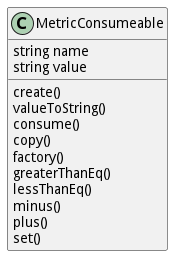

# MetricConsumeable

Consumeable Metric that is consumed when a resource is utilized

## Attributes

* name:string - This is the name of the metric
* value:string - This is the value of the metric

## Associations

No associations

## Methods
* [create() - Create Composite Metric](#action-create)
* [valueToString() - Change to string Metric Consumeable](#action-valueToString)
* [consume() - Consume value from a metric](#action-consume)
* [copy() - Copy Metric](#action-copy)
* [factory() - Create a metric based on the metrictype table](#action-factory)
* [greaterThanEq() - Test greater than or equal to the value passed in](#action-greaterThanEq)
* [lessThanEq() - Test less than or equal to the value passed in](#action-lessThanEq)
* [minus() - Add value to a metric](#action-minus)
* [plus() - Add value to a metric](#action-plus)
* [set() - Add value to a metric](#action-set)

<h2>Method Details</h2>
    
### Action metricconsumeable create

* REST - metricconsumeable/create?name=string&amp;value=string
* bin - metricconsumeable create --name string --value string
* js - metricconsumeable.create({ name:string,value:string })

#### Description
Create Composite Metric

#### Parameters

| Name | Type | Required | Description |
|---|---|---|---|
| name | string |true | Name of the metric |
| value | string |true | Value of the metric |

### Action metricconsumeable valueToString

* REST - metricconsumeable/valueToString?
* bin - metricconsumeable valueToString 
* js - metricconsumeable.valueToString({  })

#### Description
Change to string Metric Consumeable

#### Parameters

No parameters

### Action metricconsumeable consume

* REST - metricconsumeable/consume?value=number
* bin - metricconsumeable consume --value number
* js - metricconsumeable.consume({ value:number })

#### Description
Consume value from a metric

#### Parameters

| Name | Type | Required | Description |
|---|---|---|---|
| value | number |true | Value to consume from the metric |

### Action metricconsumeable copy

* REST - metricconsumeable/copy?
* bin - metricconsumeable copy 
* js - metricconsumeable.copy({  })

#### Description
Copy Metric

#### Parameters

No parameters

### Action metricconsumeable factory

* REST - metricconsumeable/factory?name=string&amp;value=json
* bin - metricconsumeable factory --name string --value json
* js - metricconsumeable.factory({ name:string,value:json })

#### Description
Create a metric based on the metrictype table

#### Parameters

| Name | Type | Required | Description |
|---|---|---|---|
| name | string |true | name of the metric |
| value | json |true | value of the metric |

### Action metricconsumeable greaterThanEq

* REST - metricconsumeable/greaterThanEq?value=object
* bin - metricconsumeable greaterThanEq --value object
* js - metricconsumeable.greaterThanEq({ value:object })

#### Description
Test greater than or equal to the value passed in

#### Parameters

| Name | Type | Required | Description |
|---|---|---|---|
| value | object |true | Value to test against the metric |

### Action metricconsumeable lessThanEq

* REST - metricconsumeable/lessThanEq?value=object
* bin - metricconsumeable lessThanEq --value object
* js - metricconsumeable.lessThanEq({ value:object })

#### Description
Test less than or equal to the value passed in

#### Parameters

| Name | Type | Required | Description |
|---|---|---|---|
| value | object |true | Value to test against the metric |

### Action metricconsumeable minus

* REST - metricconsumeable/minus?value=number
* bin - metricconsumeable minus --value number
* js - metricconsumeable.minus({ value:number })

#### Description
Add value to a metric

#### Parameters

| Name | Type | Required | Description |
|---|---|---|---|
| value | number |true | Value to add to the metric |

### Action metricconsumeable plus

* REST - metricconsumeable/plus?value=number
* bin - metricconsumeable plus --value number
* js - metricconsumeable.plus({ value:number })

#### Description
Add value to a metric

#### Parameters

| Name | Type | Required | Description |
|---|---|---|---|
| value | number |true | Value to add to the metric |

### Action metricconsumeable set

* REST - metricconsumeable/set?value=number
* bin - metricconsumeable set --value number
* js - metricconsumeable.set({ value:number })

#### Description
Add value to a metric

#### Parameters

| Name | Type | Required | Description |
|---|---|---|---|
| value | number |true | Value to add to the metric |

