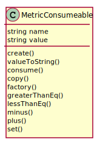

# MetricConsumeable

Consumeable Metric that is consumed when a resource is utilized

## Attributes

* name:string - This is the name of the metric
* value:string - This is the value of the metric

## Associations

| Name | Cardinality | Class | Composition | Owner | Description |
| --- | --- | --- | --- | --- | --- |

## Users of the Model

| Name | Cardinality | Class | Composition | Owner | Description |
| --- | --- | --- | --- | --- | --- |

## Methods

* [create() - Create Composite Metric](#action-create)

* [valueToString() - Change to string Metric Consumeable](#action-valueToString)

* [consume() - Consume value from a metric](#action-consume)

* [copy() - Copy Metric](#action-copy)

* [factory() - Create a metric based on the metrictype table](#action-factory)

* [greaterThanEq() - Test greater than or equal to the value passed in](#action-greaterThanEq)

* [lessThanEq() - Test less than or equal to the value passed in](#action-lessThanEq)

* [minus() - Add value to a metric](#action-minus)

* [plus() - Add value to a metric](#action-plus)

* [set() - Add value to a metric](#action-set)

<h2>Method Details</h2>
    
### Action metricconsumeable create

* REST - metricconsumeable/create
* bin - metricconsumeable create
* js - metricconsumeable.create

Create Composite Metric

| Name | Type | Required | Description |
|---|---|---|---|
| name | string |true | Name of the metric |
| value | string |true | Value of the metric |

### Action metricconsumeable valueToString

* REST - metricconsumeable/valueToString
* bin - metricconsumeable valueToString
* js - metricconsumeable.valueToString

Change to string Metric Consumeable

| Name | Type | Required | Description |
|---|---|---|---|

### Action metricconsumeable consume

* REST - metricconsumeable/consume
* bin - metricconsumeable consume
* js - metricconsumeable.consume

Consume value from a metric

| Name | Type | Required | Description |
|---|---|---|---|
| value | number |true | Value to consume from the metric |

### Action metricconsumeable copy

* REST - metricconsumeable/copy
* bin - metricconsumeable copy
* js - metricconsumeable.copy

Copy Metric

| Name | Type | Required | Description |
|---|---|---|---|

### Action metricconsumeable factory

* REST - metricconsumeable/factory
* bin - metricconsumeable factory
* js - metricconsumeable.factory

Create a metric based on the metrictype table

| Name | Type | Required | Description |
|---|---|---|---|
| name | string |true | name of the metric |
| value | json |true | value of the metric |

### Action metricconsumeable greaterThanEq

* REST - metricconsumeable/greaterThanEq
* bin - metricconsumeable greaterThanEq
* js - metricconsumeable.greaterThanEq

Test greater than or equal to the value passed in

| Name | Type | Required | Description |
|---|---|---|---|
| value | object |true | Value to test against the metric |

### Action metricconsumeable lessThanEq

* REST - metricconsumeable/lessThanEq
* bin - metricconsumeable lessThanEq
* js - metricconsumeable.lessThanEq

Test less than or equal to the value passed in

| Name | Type | Required | Description |
|---|---|---|---|
| value | object |true | Value to test against the metric |

### Action metricconsumeable minus

* REST - metricconsumeable/minus
* bin - metricconsumeable minus
* js - metricconsumeable.minus

Add value to a metric

| Name | Type | Required | Description |
|---|---|---|---|
| value | number |true | Value to add to the metric |

### Action metricconsumeable plus

* REST - metricconsumeable/plus
* bin - metricconsumeable plus
* js - metricconsumeable.plus

Add value to a metric

| Name | Type | Required | Description |
|---|---|---|---|
| value | number |true | Value to add to the metric |

### Action metricconsumeable set

* REST - metricconsumeable/set
* bin - metricconsumeable set
* js - metricconsumeable.set

Add value to a metric

| Name | Type | Required | Description |
|---|---|---|---|
| value | number |true | Value to add to the metric |

