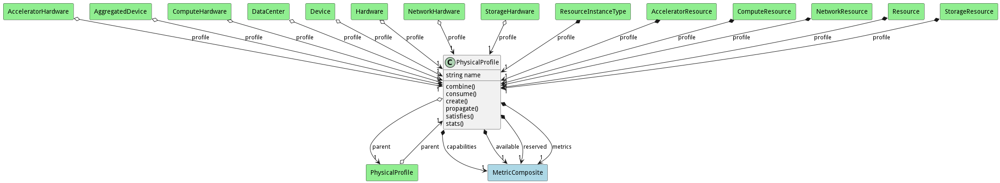

# PhysicalProfile

The Physical Profile contains the capabilities, availability, reserves andmetrics of the element in the physical domain

## Attributes

* name:string - This is the name of the Physical Profile

## Associations

| Name | Cardinality | Class | Composition | Owner | Description |
| --- | --- | --- | --- | --- | --- |
| capabilities | 1 | MetricComposite |  | true | Capabilities of the element |
| available | 1 | MetricComposite |  | true | Availability of the element |
| reserved | 1 | MetricComposite |  | true | Reservations of the element |
| metrics | 1 | MetricComposite |  | true | Metrics of the element |
| parent | 1 | PhysicalProfile |  | false | Parent of the profile for propagation |

## Users of the Model

| Name | Cardinality | Class | Composition | Owner | Description |
| --- | --- | --- | --- | --- | --- |
| profile | 1 | Device | true |  |  |
| profile | 1 | AggregatedDevice | true |  |  |
| parent | 1 | PhysicalProfile |  | false | Parent of the profile for propagation |
| profile | 1 | DataCenter | true |  |  |
| profile | 1 | Hardware | true |  |  |
| profile | 1 | ResourceInstanceType | true | true |  |
| profile | 1 | Resource | true | true |  |
| profile | 1 | AcceleratorHardware | true |  |  |
| profile | 1 | ComputeHardware | true |  |  |
| profile | 1 | NetworkHardware | true |  |  |
| profile | 1 | StorageHardware | true |  |  |
| profile | 1 | AcceleratorResource | true | true |  |
| profile | 1 | ComputeResource | true | true |  |
| profile | 1 | NetworkResource | true | true |  |
| profile | 1 | StorageResource | true | true |  |

## Methods

* [combine() - Combine Physical Profile](#action-combine)

* [consume() - Consume the requirements, part or all of the requirements](#action-consume)

* [create() - Create Physical Profile](#action-create)

* [propagate() - Propagate Physical Profile](#action-propagate)

* [satisfies() - Satisfies the requirements, part or all of the requirements](#action-satisfies)

* [stats() - get the Stats for the physical profile](#action-stats)

<h2>Method Details</h2>
    
### Action physicalprofile combine

* REST - physicalprofile/combine?profile=object
* bin - physicalprofile combine --profile object
* js - physicalprofile.combine({ profile:object })

#### Description
Combine Physical Profile

#### Parameters

| Name | Type | Required | Description |
|---|---|---|---|
| profile | object |true | Profile to add to the current profile |

### Action physicalprofile consume

* REST - physicalprofile/consume?request=object
* bin - physicalprofile consume --request object
* js - physicalprofile.consume({ request:object })

#### Description
Consume the requirements, part or all of the requirements

#### Parameters

| Name | Type | Required | Description |
|---|---|---|---|
| request | object |true | Requirements to satisfy |

### Action physicalprofile create

* REST - physicalprofile/create?parent=object
* bin - physicalprofile create --parent object
* js - physicalprofile.create({ parent:object })

#### Description
Create Physical Profile

#### Parameters

| Name | Type | Required | Description |
|---|---|---|---|
| parent | object |false | Parent to add to the current profile |

### Action physicalprofile propagate

* REST - physicalprofile/propagate?assoc=string&amp;operation=string&amp;value=string
* bin - physicalprofile propagate --assoc string --operation string --value string
* js - physicalprofile.propagate({ assoc:string,operation:string,value:string })

#### Description
Propagate Physical Profile

#### Parameters

| Name | Type | Required | Description |
|---|---|---|---|
| assoc | string |true | Association to propagate |
| operation | string |true | Operation to propagate |
| value | string |true | Value to proagate |

### Action physicalprofile satisfies

* REST - physicalprofile/satisfies?request=object
* bin - physicalprofile satisfies --request object
* js - physicalprofile.satisfies({ request:object })

#### Description
Satisfies the requirements, part or all of the requirements

#### Parameters

| Name | Type | Required | Description |
|---|---|---|---|
| request | object |true | Requirements to satisfy |

### Action physicalprofile stats

* REST - physicalprofile/stats?
* bin - physicalprofile stats 
* js - physicalprofile.stats({  })

#### Description
get the Stats for the physical profile

#### Parameters

No parameters

