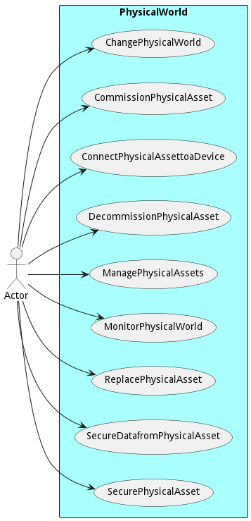
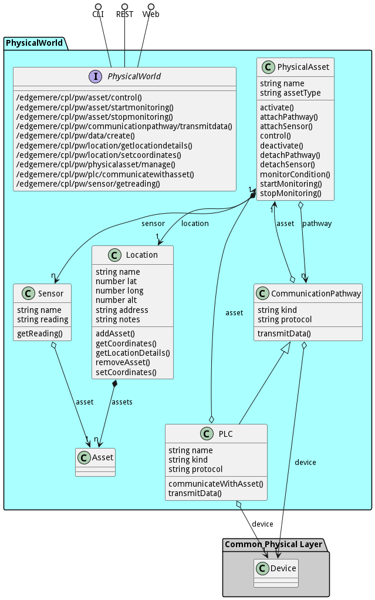

# PhysicalWorld

PhysicalWorld is a package that contains...

## Physical Asset Management

In the realm of physical asset management, understanding the intrinsic value and functionality of assets is paramount. Whether it's machinery, infrastructure, or equipment, assets form the backbone of any operational setup. Here's a detailed exploration of the key concepts and considerations in this domain:

### Importance of Physical Assets

Physical Assets are the lifeblood of an organization, representing tangible resources critical for its operations. Identifying the most crucial assets is fundamental, as they underpin productivity, efficiency, and overall success. Moreover, integrating people into the infrastructure involves recognizing how individuals interact with these assets. This integration ensures that human resources are optimally utilized and aligned with asset management strategies.

### Digitization of Physical Assets

Digitizing the enterprise involves transitioning from traditional, physical processes to digital solutions. This transformation enables seamless integration of physical assets into digital frameworks, facilitating better monitoring, management, and analysis. By bridging the gap between the physical and digital worlds, organizations can unlock new opportunities for efficiency and innovation.

### Characteristics of Physical Assets

- **Sensors**: Physical Assets are equipped with sensors that capture real-world data. These sensors convert physical phenomena into analog signals, which are subsequently digitized for processing and analysis.

- **Communication Pathway**: Establishing a communication pathway is crucial for transmitting data from sensors to digital systems. Whether through wired or wireless connections, this pathway ensures that asset data can be accessed and utilized effectively.

- **Control of the Physical World**: Some assets manipulate the physical world through mechanisms that change position, temperature, electrical current, magnetism, or any other physical characteristic. These assets play a vital role in various industries and processes.

### Types of Physical Assets

1. **No Sensors and No Communication Pathway**: Some assets, like railway switches or compressors, may lack built-in sensors or communication capabilities. In such cases, adding a communication gateway and appropriate sensors is necessary to enable data collection and connectivity.

2. **Sensors with No Communication Pathway**: Physical Assets may have internal sensors that gather data but lack external connectivity. To leverage this data for analysis and decision-making, establishing a communication pathway becomes essential.

3. **Sensor with Communication Pathway**: Ideally, assets should be equipped with both sensors and a communication pathway, allowing real-time data transmission to digital systems for analysis and action.

### PLC (Programmable Logic Controller)

PLCs serve as the bridge between physical assets and digital devices. These controllers facilitate communication, data exchange, and control functions, enabling seamless integration of assets into digital networks.

### Use Cases

- **Monitoring**: Physical Assets can be used to monitor physical processes, conditions, and performance metrics in real-time.

- **Control**: They can also exert control over physical processes, enabling automation and optimization of operations.

- **Connectivity**: Establishing connectivity between physical assets and digital devices enables data exchange, remote monitoring, and control.

- **Management**: Efficient management of physical assets involves tasks such as maintenance, repair, and lifecycle planning.

- **Security**: Securing both the physical assets themselves and the data they generate is critical to prevent unauthorized access, tampering, or data breaches.

By leveraging the capabilities of physical assets and integrating them into digital ecosystems, organizations can enhance operational efficiency, improve decision-making, and unlock new opportunities for innovation and growth.

## Use Cases

The following are the use cases of the PhysicalWorld subsystem. Each use case has primary and secondary scenarios
that are elaborated in the use case descriptions.

* [Change Physical World](usecase-ChangePhysicalWorld)
* [Commission Physical Asset](usecase-CommissionPhysicalAsset)
* [Connect Physical Asset to a Device](usecase-ConnectPhysicalAssettoaDevice)
* [Decommission Physical Asset](usecase-DecommissionPhysicalAsset)
* [Manage Physical Assets](usecase-ManagePhysicalAssets)
* [Monitor Physical World](usecase-MonitorPhysicalWorld)
* [Replace Physical Asset](usecase-ReplacePhysicalAsset)
* [Secure Data from Physical Asset](usecase-SecureDatafromPhysicalAsset)
* [Secure Physical Asset](usecase-SecurePhysicalAsset)

## Users

The following are the actors of the PhysicalWorld subsystem. This can include people, other subsystems
inside the solution and even external subsystems.

* [Actor](actor-actor)

## Interface

The subsystem has a REST, CLI, WebSocket, and Web interface. Use Cases and Scenarios can use any or all
of the interfaces to perform the work that needs to be completed. The following  diagram shows how
users interact with the system.

* [ edgemere cpl pw asset control](#action--edgemere-cpl-pw-asset-control)
* [ edgemere cpl pw asset startmonitoring](#action--edgemere-cpl-pw-asset-startmonitoring)
* [ edgemere cpl pw asset stopmonitoring](#action--edgemere-cpl-pw-asset-stopmonitoring)
* [ edgemere cpl pw communicationpathway transmitdata](#action--edgemere-cpl-pw-communicationpathway-transmitdata)
* [ edgemere cpl pw data create](#action--edgemere-cpl-pw-data-create)
* [ edgemere cpl pw location getlocationdetails](#action--edgemere-cpl-pw-location-getlocationdetails)
* [ edgemere cpl pw location setcoordinates](#action--edgemere-cpl-pw-location-setcoordinates)
* [ edgemere cpl pw physicalasset manage](#action--edgemere-cpl-pw-physicalasset-manage)
* [ edgemere cpl pw plc communicatewithasset](#action--edgemere-cpl-pw-plc-communicatewithasset)
* [ edgemere cpl pw sensor getreading](#action--edgemere-cpl-pw-sensor-getreading)

## Logical Artifacts

The Data Model for the  PhysicalWorld subsystem shows how the different objects and classes of object interact
and their structure.

### Sub Packages

The PhysicalWorld subsystem has sub packages as well. These subsystems are logical components to better
organize the architecture and make it easier to analyze, understand, design, and implement.

### Classes

The following are the classes in the data model of the PhysicalWorld subsystem.

* [CommunicationPathway](class-CommunicationPathway)
* [Location](class-Location)
* [PhysicalAsset](class-PhysicalAsset)
* [PLC](class-PLC)
* [Sensor](class-Sensor)

## Deployment Architecture

This subsystem is deployed using micro-services as shown in the diagram below. The 'micro' module is
used to implement the micro-services in the system. The subsystem also has an CLI, REST and Web Interface
exposed through a nodejs application. The nodejs application will interface with the micro-services and
can monitor and drive work-flows through the mesh of micro-services. The deployment of the subsystem is
dependent on the environment it is deployed. This subsystem has the following environments:
* [local](environment--edgemere-cpl-pw-local)
* [dev](environment--edgemere-cpl-pw-dev)
* [test](environment--edgemere-cpl-pw-test)
* [prod](environment--edgemere-cpl-pw-prod)

## Physical Architecture

The PhysicalWorld subsystem is physically laid out on a hybrid cloud infrastructure. Each microservice belongs
to a secure micro-segmented network. All of the micro-services communicate to each other and the main app through a
REST interface. A Command Line Interface (CLI), REST or Web User interface for the app is how other subsystems or actors
interact. Requests are forwarded to micro-services through the REST interface of each micro-service. The subsystem has
the a unique layout based on the environment the physical space. The following are the environments for this
subsystems.
* [local](environment--edgemere-cpl-pw-local)
* [dev](environment--edgemere-cpl-pw-dev)
* [test](environment--edgemere-cpl-pw-test)
* [prod](environment--edgemere-cpl-pw-prod)

## Micro-Services

These are the micro-services for the subsystem. The combination of the micro-services help implement
the subsystem's logic.

### local

Detail information for the [local environment](environment--edgemere-cpl-pw-local)
can be found [here](environment--edgemere-cpl-pw-local)

Services in the local environment

* web : c_p_web

### dev

Detail information for the [dev environment](environment--edgemere-cpl-pw-dev)
can be found [here](environment--edgemere-cpl-pw-dev)

Services in the dev environment

* web : c_p_web

### test

Detail information for the [test environment](environment--edgemere-cpl-pw-test)
can be found [here](environment--edgemere-cpl-pw-test)

Services in the test environment

* web : c_p_web

### prod

Detail information for the [prod environment](environment--edgemere-cpl-pw-prod)
can be found [here](environment--edgemere-cpl-pw-prod)

Services in the prod environment

* web : c_p_web

## Activities and Flows
The PhysicalWorld subsystem provides the following activities and flows that help satisfy the use
cases and scenarios of the subsystem.

### Messages Handled

The PhysicalWorld subsystem is an event driven architecture and handle several events. The following
events are handled by this subsystem. Please note that this subsystem is not the only subsystem that handles
these events.

| Message | Action | Description |
| --- | --- | --- |
| data.create | Custom Action |  |
| location.create | Custom Action |  |
| location.destroy | Custom Action |  |
| physicalasset.create | Custom Action |  |
| physicalasset.destroy | Custom Action |  |
| physicalasset.updated | Custom Action |  |
| plc.create | Custom Action |  |
| sensor.updated | Custom Action |  |

### Messages Sent

| Event | Description | Emitter |
|-------|-------------|---------|
| communicationpathway.create |  When an object of type CommunicationPathway is created. | CommunicationPathway
| communicationpathway.destroy |  When an object of type CommunicationPathway is destroyed. | CommunicationPathway
| communicationpathway.updated |  When an object of type CommunicationPathway has an attribute or association updated. | CommunicationPathway
| location.create |  When an object of type Location is created. | Location
| location.destroy |  When an object of type Location is destroyed. | Location
| location.updated |  When an object of type Location has an attribute or association updated. | Location
| physicalasset.create |  When an object of type PhysicalAsset is created. | PhysicalAsset
| physicalasset.destroy |  When an object of type PhysicalAsset is destroyed. | PhysicalAsset
| physicalasset.updated |  When an object of type PhysicalAsset has an attribute or association updated. | PhysicalAsset
| plc.create |  When an object of type PLC is created. | PLC
| plc.destroy |  When an object of type PLC is destroyed. | PLC
| plc.updated |  When an object of type PLC has an attribute or association updated. | PLC
| sensor.create |  When an object of type Sensor is created. | Sensor
| sensor.destroy |  When an object of type Sensor is destroyed. | Sensor
| sensor.updated |  When an object of type Sensor has an attribute or association updated. | Sensor

## Interface Details
The PhysicalWorld subsystem has a well defined interface. This interface can be accessed using a
command line interface (CLI), REST interface, and Web user interface. This interface is how all other
subsystems and actors can access the system.

### Action  edgemere cpl pw asset control

* REST - /edgemere/cpl/pw/asset/control?
* bin -  edgemere cpl pw asset control 
* js - .edgemere.cpl.pw.asset.control({  })

#### Description
Controls the state of a physical asset

#### Parameters

No parameters

### Action  edgemere cpl pw asset startmonitoring

* REST - /edgemere/cpl/pw/asset/startmonitoring?
* bin -  edgemere cpl pw asset startmonitoring 
* js - .edgemere.cpl.pw.asset.startmonitoring({  })

#### Description
Starts the monitoring of a physical asset

#### Parameters

No parameters

### Action  edgemere cpl pw asset stopmonitoring

* REST - /edgemere/cpl/pw/asset/stopmonitoring?
* bin -  edgemere cpl pw asset stopmonitoring 
* js - .edgemere.cpl.pw.asset.stopmonitoring({  })

#### Description
Stops the monitoring of a physical asset

#### Parameters

No parameters

### Action  edgemere cpl pw communicationpathway transmitdata

* REST - /edgemere/cpl/pw/communicationpathway/transmitdata?
* bin -  edgemere cpl pw communicationpathway transmitdata 
* js - .edgemere.cpl.pw.communicationpathway.transmitdata({  })

#### Description
Transmit data through a communication pathway

#### Parameters

No parameters

### Action  edgemere cpl pw data create

* REST - /edgemere/cpl/pw/data/create?attr1=string
* bin -  edgemere cpl pw data create --attr1 string
* js - .edgemere.cpl.pw.data.create({ attr1:string })

#### Description
Description of the action

#### Parameters

| Name | Type | Required | Description |
|---|---|---|---|
| attr1 | string |false | Description for the parameter |

### Action  edgemere cpl pw location getlocationdetails

* REST - /edgemere/cpl/pw/location/getlocationdetails?
* bin -  edgemere cpl pw location getlocationdetails 
* js - .edgemere.cpl.pw.location.getlocationdetails({  })

#### Description
Retrieves the details of a location

#### Parameters

No parameters

### Action  edgemere cpl pw location setcoordinates

* REST - /edgemere/cpl/pw/location/setcoordinates?
* bin -  edgemere cpl pw location setcoordinates 
* js - .edgemere.cpl.pw.location.setcoordinates({  })

#### Description
Set the coordinates of a location

#### Parameters

No parameters

### Action  edgemere cpl pw physicalasset manage

* REST - /edgemere/cpl/pw/physicalasset/manage?
* bin -  edgemere cpl pw physicalasset manage 
* js - .edgemere.cpl.pw.physicalasset.manage({  })

#### Description
Interface for managing physical assets

#### Parameters

No parameters

### Action  edgemere cpl pw plc communicatewithasset

* REST - /edgemere/cpl/pw/plc/communicatewithasset?
* bin -  edgemere cpl pw plc communicatewithasset 
* js - .edgemere.cpl.pw.plc.communicatewithasset({  })

#### Description
Communicates with a physical asset through a Programmable Logic Controller (PLC)

#### Parameters

No parameters

### Action  edgemere cpl pw sensor getreading

* REST - /edgemere/cpl/pw/sensor/getreading?
* bin -  edgemere cpl pw sensor getreading 
* js - .edgemere.cpl.pw.sensor.getreading({  })

#### Description
Retrieves the current reading of a sensor

#### Parameters

No parameters

