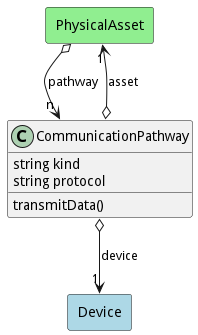

# CommunicationPathway

Description

## Attributes

* kind:string - Type of Communication Pathway
* protocol:string - Protocol used to communicate

## Associations

| Name | Cardinality | Class | Composition | Owner | Description |
| --- | --- | --- | --- | --- | --- |
| asset | 1 | PhysicalAsset | false | false |  |
| device | 1 | Device | false | false |  |

## Users of the Model

| Name | Cardinality | Class | Composition | Owner | Description |
| --- | --- | --- | --- | --- | --- |
| pathway | n | PhysicalAsset | false | false |  |

## Methods
* [transmitData() - Description of the method](#action-transmitData)

<h2>Method Details</h2>
    
### Action communicationpathway transmitData

* REST - communicationpathway/transmitData?attr1=string
* bin - communicationpathway transmitData --attr1 string
* js - communicationpathway.transmitData({ attr1:string })

#### Description
Description of the method

#### Parameters

| Name | Type | Required | Description |
|---|---|---|---|
| attr1 | string |false | Description for the parameter |

