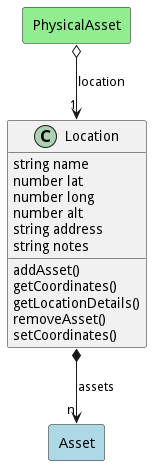

# Location

Description 

## Attributes

* name:string - Name of the Location
* lat:number - Latitude of the Location
* long:number - Longitude of the Location
* alt:number - Altitude of the Location
* address:string - Address of the Location
* notes:string - Address of the Location

## Associations

| Name | Cardinality | Class | Composition | Owner | Description |
| --- | --- | --- | --- | --- | --- |
| assets | n | Asset | false | true |  |

## Users of the Model

| Name | Cardinality | Class | Composition | Owner | Description |
| --- | --- | --- | --- | --- | --- |
| location | 1 | PhysicalAsset | false | false |  |

## Methods

<h2>Method Details</h2>
    

