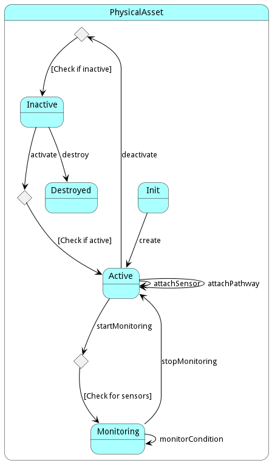

# PhysicalAsset

The PhysicalAsset class in the &#34;pw&#34; package represents a physical asset, with attributes such as name and type of asset, operations like creating, destroying, updating, adding to, removing from, controlling, and monitoring the asset, and associations with location, sensor, and communication pathways.

## Attributes

* name:string - This is the unique identifier for the physical asset.
* assetType:string - This specifies the category or group of the asset.

## Associations

| Name | Cardinality | Class | Composition | Owner | Description |
| --- | --- | --- | --- | --- | --- |
| location | 1 | Location | false | false |  |
| sensor | n | Sensor | true | true |  |
| pathway | n | CommunicationPathway | false | false |  |

## Users of the Model

| Name | Cardinality | Class | Composition | Owner | Description |
| --- | --- | --- | --- | --- | --- |
| asset | 1 | CommunicationPathway | false | false |  |
| asset | 1 | PLC | false | false | Association with PhysicalAsset |

## State Net
The PhysicalAsset has a state net corresponding to instances of the class. Each state transistion will emit an 
event that can be caught with a websocket client. The name of the event is the name of the state in all lower case.
The following diagram is the state net for this class.

| Name | Description | Events |
| --- | --- | --- |
| Init | Initial State | create-&gt;Active,  |
| Active | State when asset is actively in use | deactivate-&gt;Inactive, startMonitoring-&gt;Monitoring, attachSensor-&gt;Active, attachPathway-&gt;Active,  |
| Inactive | State when asset is not in use | activate-&gt;Active, destroy-&gt;Destroyed,  |
| Monitoring | State when asset is being monitored | stopMonitoring-&gt;Active, monitorCondition-&gt;Monitoring,  |
| Destroyed | State when asset is destroyed |  |

## Methods
* [activate() - Activates the physical asset](#action-activate)
* [attachPathway() - Attaches a communication pathway to the physical asset](#action-attachPathway)
* [attachSensor() - Attaches a sensor to the physical asset](#action-attachSensor)
* [control() - Description of the method](#action-control)
* [deactivate() - Deactivates the physical asset](#action-deactivate)
* [detachPathway() - Detaches a communication pathway from the physical asset](#action-detachPathway)
* [detachSensor() - Detaches a sensor from the physical asset](#action-detachSensor)
* [monitorCondition() - Monitors the condition of physical asset](#action-monitorCondition)
* [startMonitoring() - Description of the method](#action-startMonitoring)
* [stopMonitoring() - Description of the method](#action-stopMonitoring)

<h2>Method Details</h2>
    
### Action physicalasset activate

* REST - physicalasset/activate?assetID=string
* bin - physicalasset activate --assetID string
* js - physicalasset.activate({ assetID:string })

#### Description
Activates the physical asset

#### Parameters

| Name | Type | Required | Description |
|---|---|---|---|
| assetID | string | | The unique identifier of the asset to be activated |

### Action physicalasset attachPathway

* REST - physicalasset/attachPathway?assetID=string&amp;pathwayID=string
* bin - physicalasset attachPathway --assetID string --pathwayID string
* js - physicalasset.attachPathway({ assetID:string,pathwayID:string })

#### Description
Attaches a communication pathway to the physical asset

#### Parameters

| Name | Type | Required | Description |
|---|---|---|---|
| assetID | string | | The unique identifier of the asset to which the communication pathway is to be attached |
| pathwayID | string | | The unique identifier of the communication pathway to be attached |

### Action physicalasset attachSensor

* REST - physicalasset/attachSensor?assetID=string&amp;sensorID=string
* bin - physicalasset attachSensor --assetID string --sensorID string
* js - physicalasset.attachSensor({ assetID:string,sensorID:string })

#### Description
Attaches a sensor to the physical asset

#### Parameters

| Name | Type | Required | Description |
|---|---|---|---|
| assetID | string | | The unique identifier of the asset to which the sensor is to be attached |
| sensorID | string | | The unique identifier of the sensor to be attached |

### Action physicalasset control

* REST - physicalasset/control?attr1=string
* bin - physicalasset control --attr1 string
* js - physicalasset.control({ attr1:string })

#### Description
Description of the method

#### Parameters

| Name | Type | Required | Description |
|---|---|---|---|
| attr1 | string |false | Description for the parameter |

### Action physicalasset deactivate

* REST - physicalasset/deactivate?assetID=string
* bin - physicalasset deactivate --assetID string
* js - physicalasset.deactivate({ assetID:string })

#### Description
Deactivates the physical asset

#### Parameters

| Name | Type | Required | Description |
|---|---|---|---|
| assetID | string | | The unique identifier of the asset to be deactivated |

### Action physicalasset detachPathway

* REST - physicalasset/detachPathway?assetID=string&amp;pathwayID=string
* bin - physicalasset detachPathway --assetID string --pathwayID string
* js - physicalasset.detachPathway({ assetID:string,pathwayID:string })

#### Description
Detaches a communication pathway from the physical asset

#### Parameters

| Name | Type | Required | Description |
|---|---|---|---|
| assetID | string | | The unique identifier of the asset from which the communication pathway is to be detached |
| pathwayID | string | | The unique identifier of the communication pathway to be detached |

### Action physicalasset detachSensor

* REST - physicalasset/detachSensor?assetID=string&amp;sensorID=string
* bin - physicalasset detachSensor --assetID string --sensorID string
* js - physicalasset.detachSensor({ assetID:string,sensorID:string })

#### Description
Detaches a sensor from the physical asset

#### Parameters

| Name | Type | Required | Description |
|---|---|---|---|
| assetID | string | | The unique identifier of the asset from which the sensor is to be detached |
| sensorID | string | | The unique identifier of the sensor to be detached |

### Action physicalasset monitorCondition

* REST - physicalasset/monitorCondition?assetID=string
* bin - physicalasset monitorCondition --assetID string
* js - physicalasset.monitorCondition({ assetID:string })

#### Description
Monitors the condition of physical asset

#### Parameters

| Name | Type | Required | Description |
|---|---|---|---|
| assetID | string | | The unique identifier of the asset whose condition is to be monitored |

### Action physicalasset startMonitoring

* REST - physicalasset/startMonitoring?attr1=string
* bin - physicalasset startMonitoring --attr1 string
* js - physicalasset.startMonitoring({ attr1:string })

#### Description
Description of the method

#### Parameters

| Name | Type | Required | Description |
|---|---|---|---|
| attr1 | string |false | Description for the parameter |

### Action physicalasset stopMonitoring

* REST - physicalasset/stopMonitoring?attr1=string
* bin - physicalasset stopMonitoring --attr1 string
* js - physicalasset.stopMonitoring({ attr1:string })

#### Description
Description of the method

#### Parameters

| Name | Type | Required | Description |
|---|---|---|---|
| attr1 | string |false | Description for the parameter |

